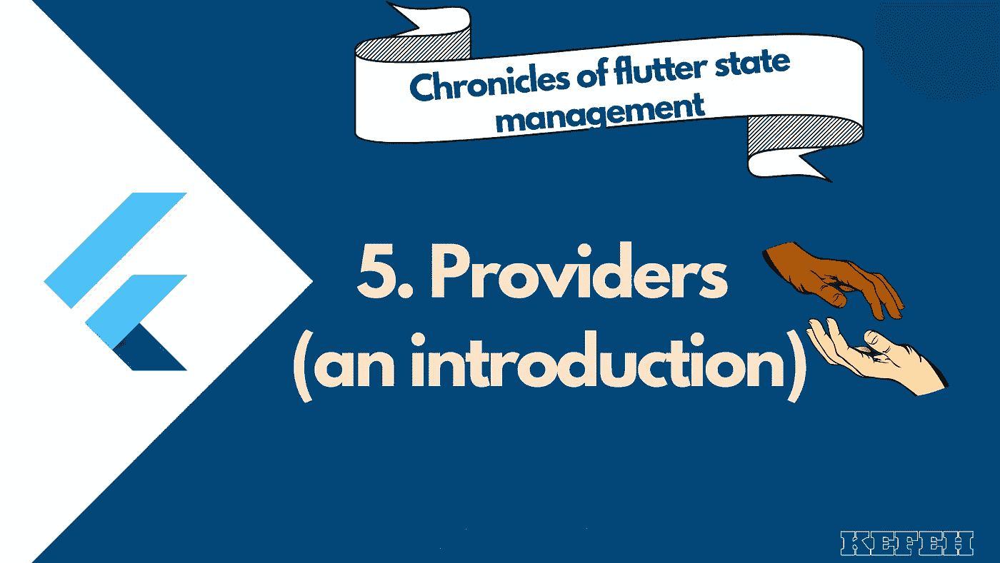
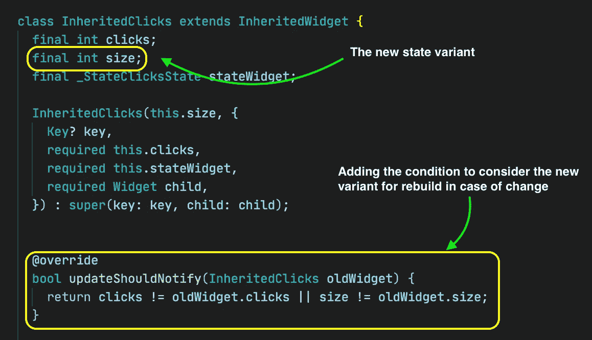
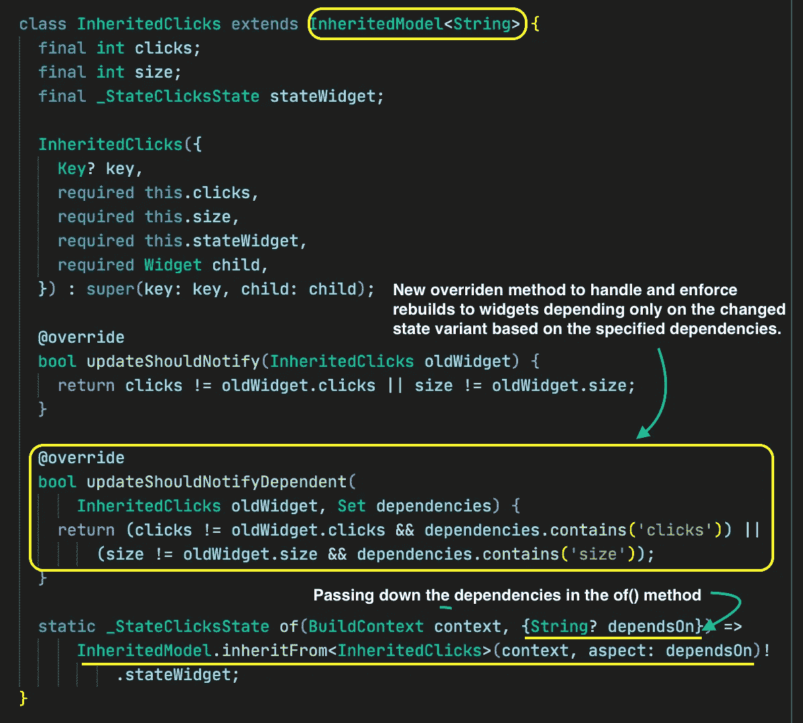
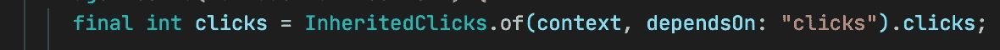
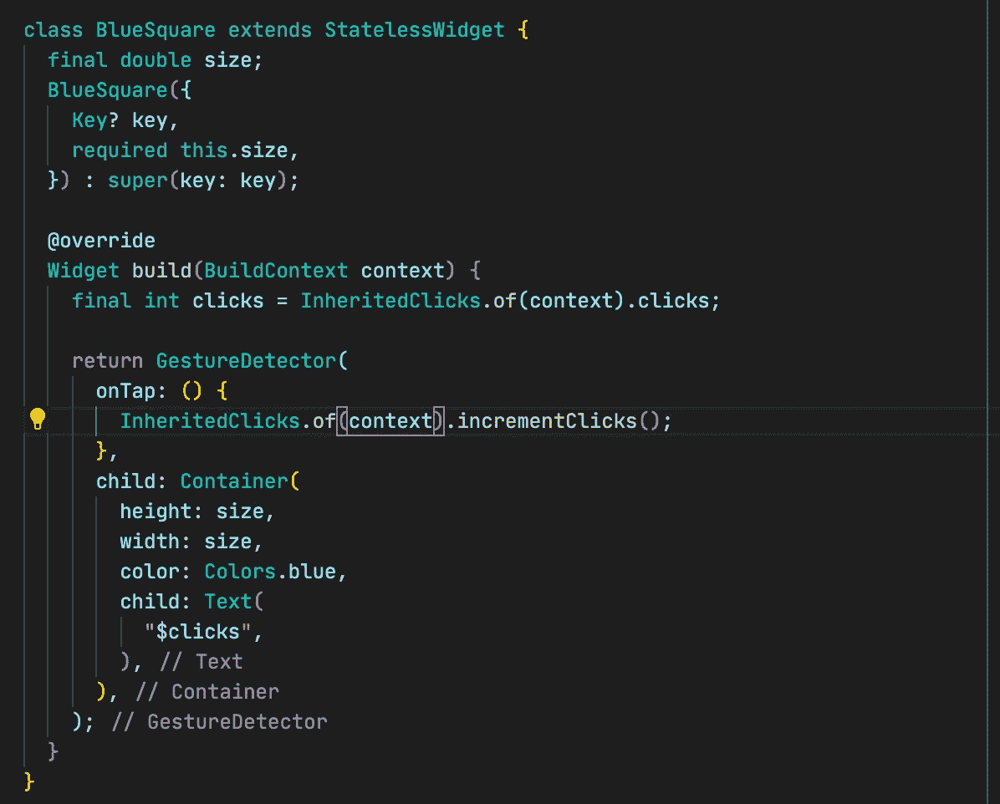
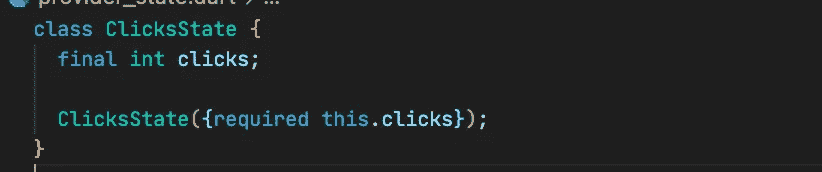
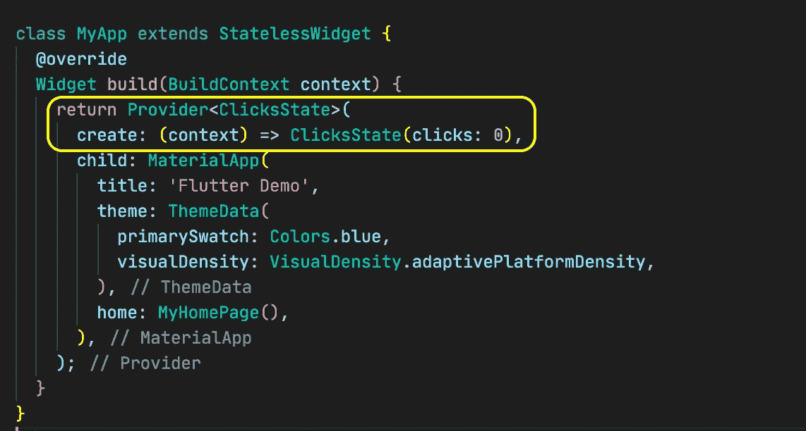
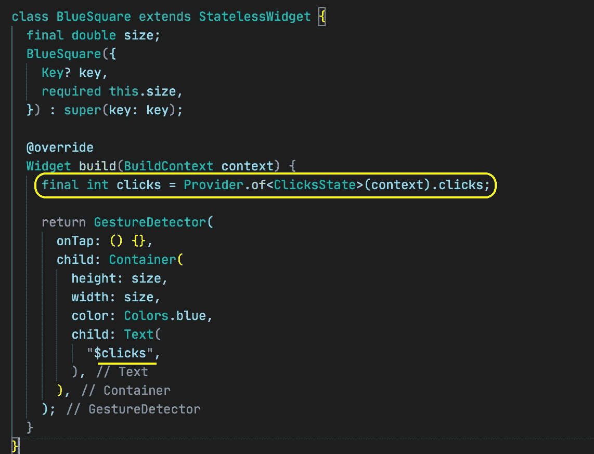

# 提供者(简介)

> 原文：<https://medium.com/geekculture/providers-an-introduction-5b139f58d283?source=collection_archive---------18----------------------->

## 颤振状态管理编年史 6。

如果您一直在跟踪状态管理的进展，直到[继承的小部件](https://kefeh.medium.com/inherited-widgets-bc3110821969)，这里有一个关于它的基本总结

*   我们有一些状态
*   我们有办法提供它或者让所有需要它的小部件都可以使用它
*   我们有一种方法来更新状态，并使用(消耗)状态来触发小部件的重建。

这基本上是一前一后。

新的和多种状态管理方法的发展和存在是程序员希望能够保持良好的软件开发实践的结果，或者是因为不这样做会使代码可读性和可维护性变得乏味，或者仅仅是因为我们希望如此。但是不管怎样，实施这些原则通常是非常重要的，并且是编程最佳实践的核心。

上一次，我们看了继承的小部件，不管它的解决方案有多好，我们都忍不住对有太多样板代码的事实感到畏缩。这些样板文件范围从；显式定义条件，在这些条件下，先前状态值与当前状态值之间的差异将触发消费小部件的重建，从而使整个有状态小部件触发状态封装类(继承的小部件)的重建，如果满足某些条件，则反过来触发消费小部件的重建(真是一个循环)。

> 本质上，继承的小部件只是保存数据的小部件，数据可供包装继承的小部件的小部件和所有小部件的后代引用和使用。继承的小部件还提供了一种方法，当值发生变化时，可以通过这种方法重新构建所有使用它的值的小部件。

当我们查看我们创建的继承小部件时，我们意识到它只包含一个状态变量

***如果我们决定要不止一个呢？***

但从批判的角度来看，如果点击量发生变化，那么消耗独占点击量和独占大小的窗口小部件都将被重新构建，反之亦然，这是我们不希望的，因为这会导致窗口小部件不必要的重新构建。

试图解决这个问题意味着将我们继承的 Widget 依赖换成对一个叫做继承模型的新类的依赖。

并把它作为

> 这只是更多的样板文件，很难理解(我们不希望这样)。要完成简单的事情似乎需要大量的工作和代码。(我不打算深入研究继承模型，它在本文中仅用于表示目的——跨越一个点)。

***那么我们如何用更少的代码达到同样的拟合呢？***

我们使用提供商。

Providers 是作为 InheritedWidget 上的回绕创建的包。它之所以受欢迎，是因为它使用与继承的小部件相同的语法，因此保持了某种程度的一致性。它还有其他优点，因为它解决了

*   有太多的样板代码(既麻烦又难以维护)
*   有太多的嵌套代码，这使得继承的小部件很难分解，可能会令人困惑。
*   嵌套地狱，当我们想要使用或包装一个小部件的继承小部件超过几个时。

因此，让我们看看如何使用这个包，首先提供关于小部件树的数据，然后在后续文章中介绍如何通知更改和触发重建(使用 ChangeNotifiers 和 StateNotifiers)。

Provider 是一个外部的 flutter 包，你需要按照这里的说明[https://pub.dev/packages/provider/install](https://pub.dev/packages/provider/install)进行安装(添加到你的 pubspec.yaml 文件中)

一旦完成，让我们看看如何提供数据。对于上下文，我们有一个 BlueSquare 小部件，它是一个蓝色方块，显示 blue square 对象的所有实例的点击次数，定义为使用继承的小部件。

这里的要点中定义的继承的小部件

为了给我们的 BlueSquare 小部件提供 clicks 变量，让我们首先创建一个“state”类来保存这个值。

对于提供商，我们可以做到

被用作

如上所述，我们可以看到我们的提供者类有一个类型，在这种情况下是我们的“state”类；单击 State 并接受一个 create 参数，该参数只是一个接受 BuildContext 并返回“state”类的对象的函数。

在使用数据时，提供者类有一个<t>()方法，该方法只是在调用它的小部件上方的树中查找 T 的实例，在我们的例子中 T 表示点击状态。一旦找到它，它就访问被请求的数据或信息，从而提供它用来公开的数据。</t>

这种方法在某种意义上是有用的，因为您可以使用提供者在小部件之间传递数据；不需要更改的数据(有时在应用程序的页面之间传递数据或类似的事情)。但是对于我们的情况，我们需要状态改变， ***那么我们该如何着手呢？***

我们将在接下来的两篇文章中看到如何用 ChangeNotifiers 和 StateNotifiers 处理不断变化的状态数据。

我们对 provider 的介绍到此结束，下次再见。