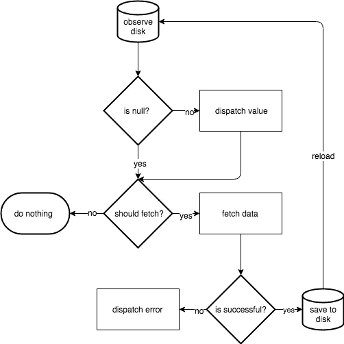

# 使用 NetworkBoundResource 为 Flutter 应用程序提供离线功能

> 原文：<https://medium.com/geekculture/providing-offline-capabilities-to-your-flutter-app-using-networkboundresource-39641dbbe854?source=collection_archive---------6----------------------->

# 背景

距离我写上一篇文章已经有一段时间了。这篇文章是上一篇文章的延伸，在上一篇文章中，我谈到了用于企业 Flutter 应用程序的干净架构。从这篇文章开始，我强烈推荐你先去阅读那篇文章。对你们来说，理解我将在上一篇文章中用到的应用程序设计、插件和术语是很容易的。

[](https://geekysingh.medium.com/clean-architecture-for-enterprise-flutter-application-dc254a71059) [## 用于企业颤振应用的清洁架构

### 背景

geekysingh.medium.com](https://geekysingh.medium.com/clean-architecture-for-enterprise-flutter-application-dc254a71059) 

# 离线功能—简介

人们在移动中使用移动应用。由于移动网络经常不稳定，如果我们的应用程序没有离线工作的能力，每次应用程序用户乘坐地铁或飞机或优步时，我们的应用程序都可能会失去连接，导致令人沮丧的用户体验。

有时，出现网络错误时显示黑屏是不够的。为了获得良好的用户体验，我们应该始终向用户呈现数据。因此，在没有网络连接或网络连接很差的情况下，我们需要向用户显示旧内容，同时等待从网络获取新数据，一旦新数据可用，就应该将其缓存在数据库中。这个新的缓存数据现在应该对用户可用了。

要理解的最重要的一点是，数据库只是事实的唯一来源。无论您将从服务器获得什么数据，都将首先缓存在数据库中，UI 将从数据库中驱动。因此，无论如何，如果您的数据库或数据表发生变化，您的用户界面将会得到通知和更新。

# NetworkBoundResource 它是什么以及它有什么作用

如果你来自 Android 应用程序开发领域，你可能对这个术语很熟悉。Android Jetpack 文章， [**应用架构指南**](https://developer.android.com/jetpack/docs/guide) ，描述了一种通过从本地缓存中检索足够新的数据或从网络加载最新数据来为应用提供数据的算法。



The original NetworkBoundResource algorithm

按照 NetworkBoundResource 算法，我已经编写了类似的代码来在 Flutter 应用程序中提供离线功能。如果您有兴趣查看原始 NetworkBoundResource 类的源代码，那么您可以查看 Google 的 Github 示例 。

我对 NetworkBoundResource 的方法与最初的想法略有不同。我没有将其作为存储库层中的一个类，而是将其定义为 BaseRepository 类中的一个函数( **getNetworkBoundData()** )，所有存储库都可以访问它。根据您的需求，您可以从 BaseRepository 创建单独的代码，并将其放在其他存储库中(例如 BaseNetworkBoundRepository ),以便只有必需的存储库应该扩展离线功能。

注意:对于示例项目，我使用 Retrofit(带 Dio)进行网络调用，并使用 Floor 在本地数据库中保存和检索数据。

# 实施和使用

示例项目使用了以下常用术语:

*   *Dto* —用于表示从服务器接收的数据
*   *实体* —用于表示存储到数据库中的数据或从数据库中检索的数据
*   模型—这用于表示将在 UI 上显示的数据

下面是 getNetworkBoundData 方法的输入和输出的代码片段

```
Stream<Resource<Model?>> getNetworkBoundData<Dto, Entity, Model>(
    {required LoadFromDb<Entity> loadFromDb,
    required CreateNetworkCall<Dto> createNetworkCall,
    required EntityToModelMap<Entity, Model> map,
    required SaveNetworkResult<Dto> saveNetworkResult,
    ShouldRefresh<Entity>? shouldRefresh,
    OnNetworkCallFailure? onNetworkCallFailure}) async* {
...
...
...
}
```

如果您仔细看了上面的代码片段，您应该已经注意到使用这个方法只需要我们提供 4 个函数:

*   *loadFromDb:未来<实体？>函数()* —该方法加载本地保存在数据库中的数据
*   *createNetworkCall:未来< Dto？> Function()* —这里我们将调用一个从服务器获取数据的函数
*   *图:模型？功能(实体？entity)* —这里我们将把从数据库中检索到的数据映射到将返回给调用者的模型类
*   *savenetwork:Future<void>函数(Dto？dto)* —这是我们将使用 DAO 在本地保存我们刚刚从服务器获取的任何数据的地方

还有另外两个可选参数:

*   *shouldRefresh: bool 函数(实体？entity)* —根据从数据库中检索到的数据，这决定了应用程序是否应该从服务器中获取新数据，并更新已经存储在本地设备数据库中的数据。
*   *onNetworkCallFailure:Function(Exception)*—这是我们记录网络故障详情或再次安排网络呼叫的地方

为了在您的 Flutter 应用程序中提供离线功能，您只需要调用这个函数并提供所需的函数。下面是示例项目的代码片段，用于在进行网络调用之前缓存文章并显示它们

```
Stream<Resource<List<ArticleModel>?>> getArticles(bool forceRefresh) {
  */// get always from network in case of force refresh,
  /// otherwise use cached approach to load data* if (forceRefresh)
    return getNetworkData<ArticleResponse, List<ArticleModel>>(
        createNetworkCall: () => _articleService.getArticles(),
        map: (response) =>
            response?.articles.map((e) => e.toModel()).toList());
  else
    return getNetworkBoundData<ArticleResponse, List<ArticleEntity>,
            List<ArticleModel>>(
        loadFromDb: () => _articleDao.getArticles(),
        createNetworkCall: () => _articleService.getArticles(),
        map: (list) => list?.map((e) => e.toModel()).toList(),
        saveNetworkResult: (response) async {
          if (response != null) {
            await _articleDao.saveArticles(
                response.articles.map((e) => e.toEntity()).toList());
          }
        },
        onNetworkCallFailure: (ex) => {print('Network call failed: $ex')});
}
```

如果您仔细查看了上面的代码片段，您应该会注意到我们正在基于 *forceRefresh* 参数进行两个函数调用。在强制刷新的情况下，我们总是进行网络调用并将数据返回给调用者。但是在没有强制刷新的情况下，我们使用缓存的方法首先显示缓存的文章，然后从网络上获取新文章。

# 资源——它是什么，有什么作用

Resource 是保存数据及其状态的通用类。可能有以下 4 种状态:

*   *正在加载* —表示正在加载数据
*   *成功—* 表示数据已成功加载
*   *失败* —表示从网络上取数据时发生数据失败
*   *异常—* 表示从网络获取数据时出现异常

这些状态中的每一个都包含数据信息，这些信息可以用于向用户显示错误消息，也可以用于日志记录。这个类将与 *getNetworkBoundData()* 一起使用来获取数据。

# 网络边界

当 *getNetworkBoundData()* 返回一个数据流时，您可以简单地使用 StreamBuilder 小部件并根据资源的状态构建小部件。为了简化，我在 StreamBuilder 小部件上创建了 *NetworkBoundWidget* 来监听状态并相应地构建小部件。

```
Widget _buildBody(BuildContext context, ArticleListViewModel viewModel) {
  return NetworkBoundWidget<List<ArticleModel>>(
      stream: viewModel.articlesStream,
      child: (context, data) => _buildListView(data, viewModel));
}
```

如您所见，您只需要提供一个流引用来获取数据，并提供一个子部件来显示数据。您还可以根据自己的需求提供其他状态的小部件，如加载、失败和异常。默认情况下，它会显示这些状态的加载程序和错误详细信息。

# 最后的想法

NetworkBoundResource 算法只是一种简化数据缓存逻辑并帮助轻松编写离线优先应用程序的方法。您可以使用您选择的数据库和网络客户机，这并不限制您坚持使用示例项目中使用的选项。

[](https://github.com/GeekySingh/flutter_data_caching) [## GitHub-GeekySingh/flutter _ data _ caching

### 新的颤振应用。这个项目是颤振应用的起点。一些资源让你…

github.com](https://github.com/GeekySingh/flutter_data_caching)