# 使用您自己的 REST API 在 AWS 中提供资源

> 原文：<https://medium.com/geekculture/provision-resources-in-aws-using-your-own-rest-api-cc54b390a71f?source=collection_archive---------6----------------------->


Created by Raktim using Canva

## 如果我能为您提供一个“API”URL，您只需简单地发送一个“POST”请求&它就会开始在 AWS cloud 中提供资源。然后，它会返回您访问所需的信息…

## 嘿，你好…🙌

希望您的云计算之旅愉快。我已经有一段时间没有写了，因为我正在学习许多实现各种想法的新方法&今天我将分享一个令人惊叹的用例。喝杯茶/咖啡&继续阅读…😇

# 问题陈述:

*   创建一个 CloudFormation 模板来自动配置 AWS 上的资源。
*   使用 AWS API Gateway 创建一个 REST API，并用 Lambda 函数连接它。
*   使用 Lambda 函数部署 CloudFormation 堆栈。
*   明确创建相关的 IAM 角色和策略。

听起来很简单，对吧…但没那么简单。😅别担心，因为我知道让你变得简单的最好方法。😎
让我们讨论一下这个用例的一些优先需求…

# 先决条件:

**你显然需要一个 AWS 账户。此外，还需要具备 S3 VPC AWS 的基本知识。我将在这篇博客中讨论 CloudFormation，Lambda & API 网关。**

# 亚马逊 API 网关:

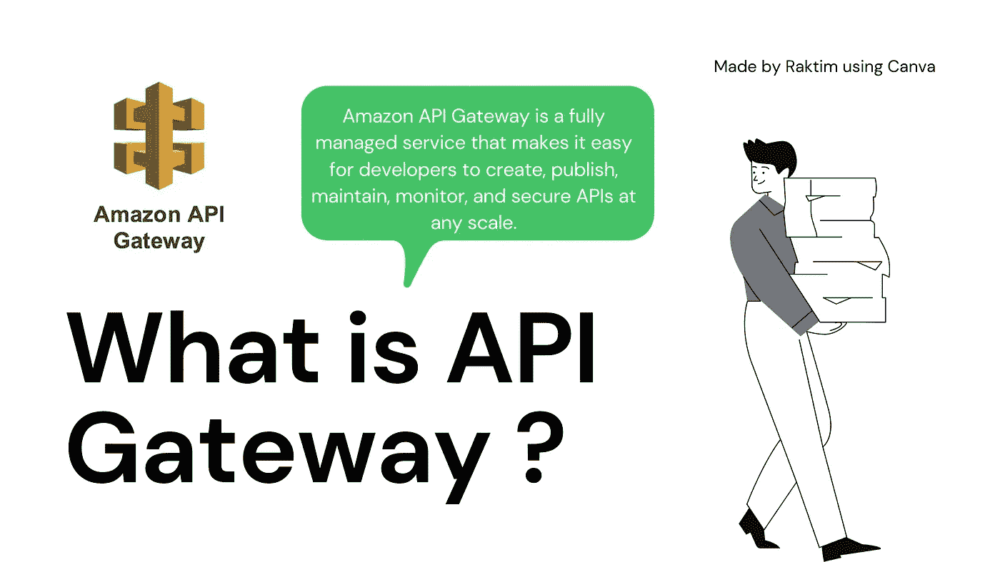

What is API Gateway…

*   **API 的完整形式是应用编程接口** & Gateway 代表一条路径，使用这条路径你可以将你的请求发送到某个位置。 **AWS 提供了一个托管 API 服务，使用它您可以非常容易地创建一个 REST API。**我现在不是在讨论 REST，而是简单地理解 API Gateway 会给你一个我们的客户可以发送请求的 URL。
*   当我们开始设置 API 网关时，您将了解它的功能和工作原理。还有一点需要注意的是，我们将使用 HTTPS API，这意味着我们的客户端将是 Web 客户端，就像您的 Web 浏览器或 Curl command 一样。
*   ***官方文档链接:***[***https://docs . AWS . Amazon . com/API gateway/latest/developer guide/welcome . html***](https://docs.aws.amazon.com/apigateway/latest/developerguide/welcome.html)

# AWS Lambda:

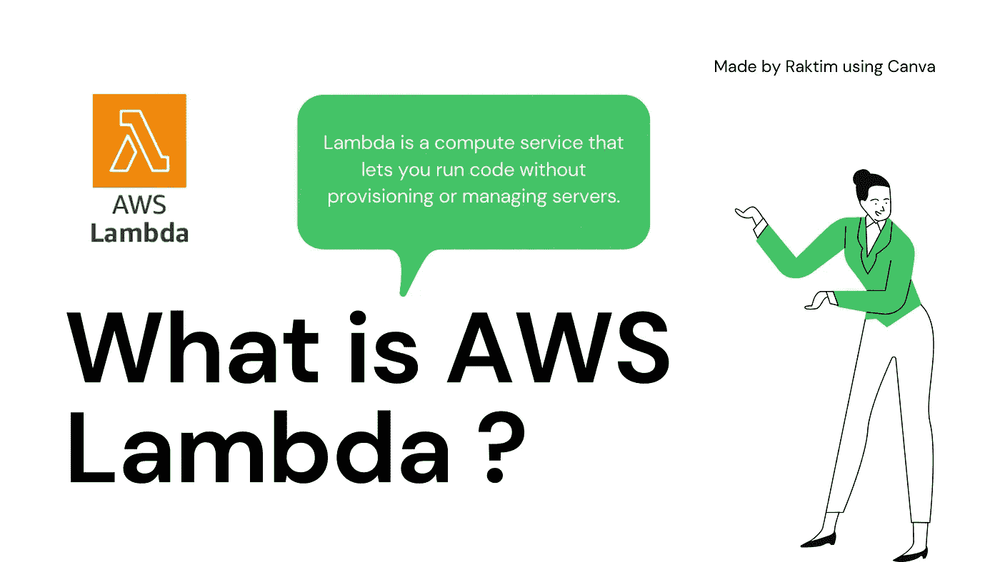

What is Lambda…

*   **Lambda 代表 AWS 中的无服务器功能执行。假设你有一个 python 函数，它给出两个数字，然后返回总和。现在，要运行该功能，您需要一个安装了 python 编译器的操作系统。在这种情况下，云的工作方式非常独特。**
*   你只需要提供你的函数代码给 Lambda 服务&显然你需要告诉它你想要选择哪个运行时。那么 Lambda 将运行函数&将返回输出。这整件事最吸引人的地方在于，你只需要为函数执行的那几秒钟付费。从某种意义上说，它非常经济高效，因为您不需要启动任何类型的虚拟机，也不需要任何类型的存储等。这就是它被称为无服务器服务的原因，这意味着后端服务器由 AWS 管理。
*   ***官方文档链接:***[***https://docs.aws.amazon.com/lambda/latest/dg/welcome.html***](https://docs.aws.amazon.com/lambda/latest/dg/welcome.html)

# 自动气象站云形成:

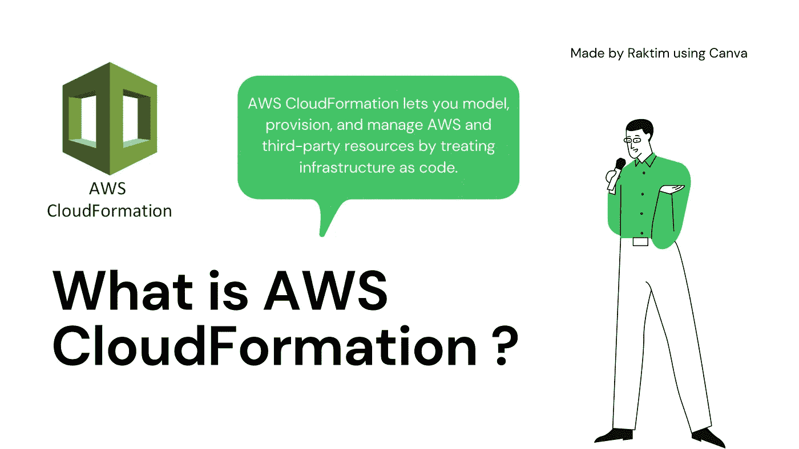

What is CloudFormation…

*   **CloudFormation 是一项允许您实施 IAC(基础设施即代码)所有概念的服务。**我们将编写脚本，也称为 CloudFormation 模板，以自动配置 AWS 上的资源。编写这些代码非常容易，因为有一个称为声明式编程方法的概念，在这里你只需要说出你的需求。
*   Next CloudFormation 知道如何供应这些东西&如果已经供应，那么一旦更新代码，它就知道如何基于最新的代码库修改 AWS 上的资源。你会看到这种编码相对于其他 DSA 编码是多么简单。😅
*   ***官方文档链接:***[***https://docs . AWS . Amazon . com/AWS cloudformation/latest/user guide/welcome . html***](https://docs.aws.amazon.com/AWSCloudFormation/latest/UserGuide/Welcome.html)

# 步骤 1:创建 CloudFormation 模板并在 S3 部署

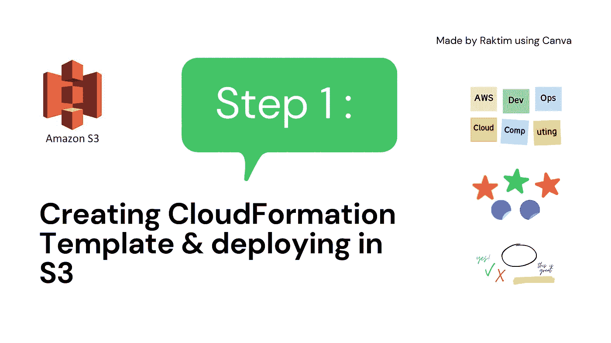

Step 1…

让我们从简单开始，我们将创建一个 CloudFormation 模板，它将在 AWS 中提供一个 VPC。为此，我强烈建议查阅云形成的官方文档。

***官方链接:***[***https://docs . AWS . Amazon . com/AWS cloudformation/latest/user guide/AWS-resource-ec2-VPC . html***](https://docs.aws.amazon.com/AWSCloudFormation/latest/UserGuide/aws-resource-ec2-vpc.html)

我选择了官方文档中提供的例子，它非常容易理解…

```
---
AWSTemplateFormatVersion: "2010-09-09"
Description: Template to provision one VPCResources:
  myVPC:
    Type: AWS::EC2::VPC
    Properties:
      CidrBlock: 10.0.0.0/16
      EnableDnsSupport: 'true'
      EnableDnsHostnames: 'true'
      Tags:
      - Key: stack
        Value: production
```

*   您正在 AWS 中创建一个网络地址为 **"10.0.0.0/16"** 的 VPC。您还为该特定 VPC 启用了**DNS support&DNS hostname**。最后，我们在 VPC 上贴上一个标签。

现在只需将这段代码保存在一个名为—**“cf-resources . YAML”**的文件中。你可以给你的文件起任何名字。

接下来，去亚马逊 S3 &用下面的配置创建一个桶-

*   **桶名:“rak Tim-cf-Bucket”**
*   **地区:【AP-south-1】**
*   **ACL 启用&取消勾选“阻止所有公共访问”。**
*   **启用版本控制&禁用服务器端加密。**

我们可以在 S3 做大量的配置来保护你的代码，但这不是一个关于安全的博客。这就是为什么我要把事情简单化。

接下来，在 bucket &中上传您的 **"cf-resources.yaml"** 文件，确保在上传文件时，您选择了 **"Permissions "来"授予公共读取权限"。**否则 Lambda 将无法通过其公共 URL 使用模板。

复制它的对象 URL。在我的例子中，对象 URL 看起来像这样—[https://rak Tim-cf-bucket . S3 . AP-south-1 . Amazon AWS . com/cf-resources . YAML](https://raktim-cf-bucket.s3.ap-south-1.amazonaws.com/cf-resources.yaml)

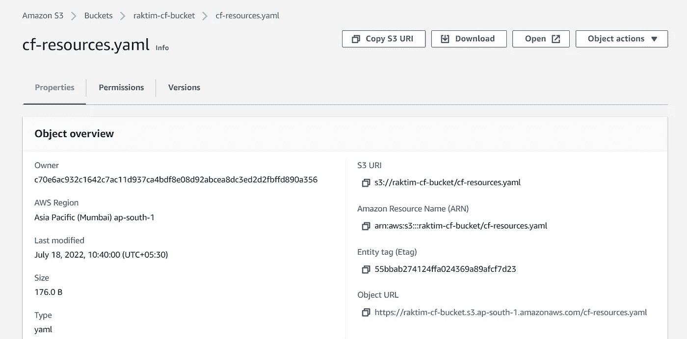

# 步骤 2:创建 IAM 角色

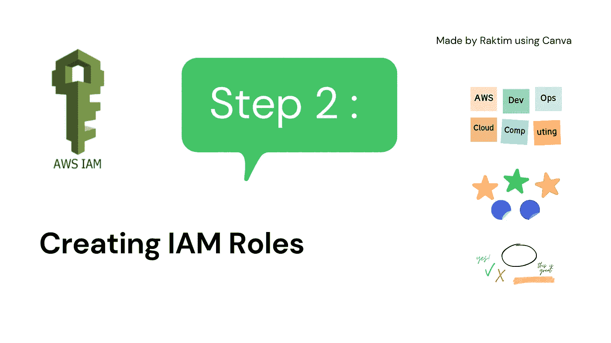

Step 2…

我总是建议不要只是预先写 IAM 角色，因为那永远不会帮助你学习 IAM &安全。首先看看你需要什么样的基本需求来让一个服务完成它的工作。

> **如果你的 Lambda 需要访问 CloudFormation 来部署堆栈，那么只创建有那么大权力的角色。如果 CloudFormation 需要在您的帐户中创建 VPC，则创建具有这些限制的角色。希望你明白我的意思:)**

## Lambda 的角色:

让我们转到 AWS IAM 服务，然后转到→角色，点击**“创建角色”** &按照以下配置…

*   **可信实体类型:AWS 服务**
*   **用例:Lambda**
*   **权限策略:awscloudformationfull access**
*   **角色名称:lambda-cf-role**

最后创建角色。我知道我们在这里给出了**" awscloudformationfull access "**策略，这看起来可能很危险，但是请相信我，因为我们将自己编写 Lambda 代码，所以并没有那么糟糕。此外，我再次强调，这个博客并不主要关注安全性，这就是为什么我不深入讨论这个问题。

## 云形成的作用:

现在我们需要为 CloudFormation 创建一个角色，它将允许 CloudFormation 在 VPC 提供资源。再次为使事情简单，我会给 VPC 完全访问…

*   **可信实体类型:AWS 服务**
*   **用例:云形成**
*   **权限策略:amazonvcpcfullaccess**
*   **角色名称:cf-vpc-role**

创建角色&复制它是 ARN，因为在下一步中我们将使用它。

## 在 Lambda 角色中添加额外策略:

了解 Lambda 函数将创建云结构堆栈的一个非常重要的事情。这意味着 Lambda 也将把**“cf-VPC-role”**附加到堆栈上。这意味着 Lambda 需要额外的权限来将角色传递给堆栈，所以让我们快速地将该策略附加到我们的 Lambda 函数上。

转到您的**“lambda-cf-role”**&，然后在**“权限”**选项卡下点击**“添加权限”→“创建内联策略”**，遵循以下配置…

*   **服务:IAM**
*   **动作:角色传递**
*   **资源:具体&这里给“cf-VPC-role”ARN。**
*   **点击审核策略&给出一个名称，如“lambda-cf-pass-Policy”**

最后，单击创建策略。我们已经完成了 IAM 部分。你可以在截图中看到，我创建了两个角色。

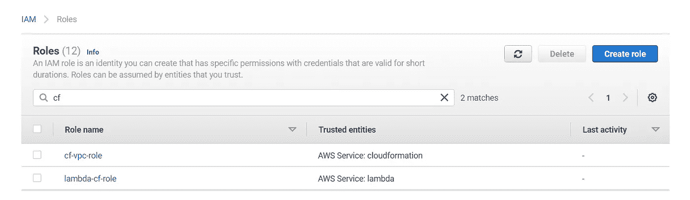

> **注意:我使用的是有管理员权限的 AWS 账户。但是，如果您使用 IAM 帐户，那么您的组织管理员需要为您提供在 IAM 中创建角色以及将这些角色传递给不同服务的权限，就像我们将角色传递给 Lambda 一样。**

# 步骤 3:创建 Lambda 函数

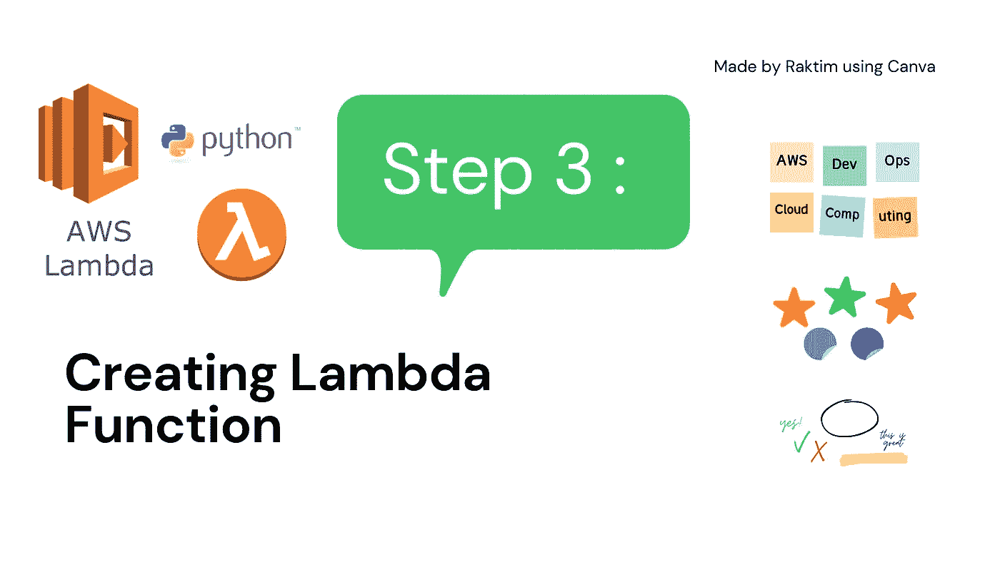

Step 3…

接下来，我们将创建一个 Lambda 函数，它将帮助我们在进行 API 调用时部署 CloudFormation 模板。

转到 AWS Lambda 服务，点击创建功能，并遵循以下配置…

*   **函数名称:cf-deploy-function**
*   **运行时:Python3.9**
*   **架构:x86_64**
*   **执行角色:使用现有角色→ lambda-cf-role**

最后创建函数。现在你可能已经明白了，我们创建了一个 Lambda 函数，它有一个附加的角色，可以进入 CloudFormation &可以在那里做任何事情，而不是在其他服务上。

***现在该是一点点 Python 编码的时候了……***😒

我知道云开发人员编写代码的痛苦，但这是非常非常简单的编码…

```
import boto3def lambda_handler(event, context): thisStackName = str(event[‘StackName’])
 thisClientToken = str(event[‘ClientToken’]) CFClient = boto3.client(‘cloudformation’) response = CFClient.create_stack(
 StackName=thisStackName,
 TemplateURL=’[https://raktim-cf-bucket.s3.ap-south-1.amazonaws.com/cf-resources.yaml'](https://raktim-cf-bucket.s3.ap-south-1.amazonaws.com/cf-resources.yaml'),
 Capabilities=[‘CAPABILITY_NAMED_IAM’],
 RoleARN=’arn:aws:iam::775370324880:role/cf-vpc-role’,
 ClientRequestToken=thisClientToken,
 OnFailure=’DELETE’
 ) return response
```

*   **我们使用 boto3 库来创建堆栈。**现在这里有一件事需要注意，当你将你的 Lambda 与 API Gateway 连接时，那么 API Gateway 会将其收集的数据发送到一个名为 **"event"** 的变量中。这意味着当您要调用 API 时，您还将发送 StackName，然后 python 将使用 **"event"** 参数获取它。您可以给这个变量取任何名字，但是遵循行业标准总是一个好的做法。
*   如果你看到了 **"create_stack"** 方法，那么我们传递的参数真的很简单——比如你的 StackName &是什么，它将从哪里获取模板来部署堆栈。或者，假设哪个 IAM 角色附加到堆栈，如果堆栈创建失败会发生什么等等。
*   现在的大问题是——**什么是 ClientRequestToken？**
*   首先，它只是一个你需要传递的字符串值，它是唯一的。你可以认为这是我们将提供给 CloudFormation 堆栈的元数据，这样一旦客户端向 API 发送请求，比如说客户端令牌值— **“客户端 1234”**，它就会开始创建堆栈。
*   现在，如果客户端再次使用相同的 StackName 发送相同的请求，那么由于 python 是一种命令式语言，它将开始提供堆栈，但是由于云结构的限制，您的每个堆栈都需要自己唯一的名称。所以您的下一个调用将导致一个错误，说“栈名已经存在”。这就是客户端令牌将帮助您使代码幂等的地方。这意味着下一次如果你用相同的 StackName &相同的客户机令牌发送请求，它将返回 200 状态码。

***足够的编码…*** 🤕 ***现在让我们继续我们的云开发之旅。***

将功能代码放入编辑器并部署功能。

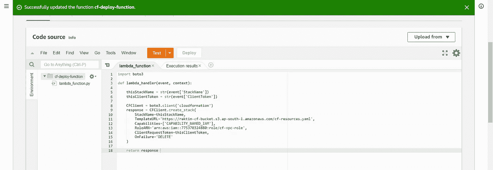

# 步骤 4:创建 API 网关

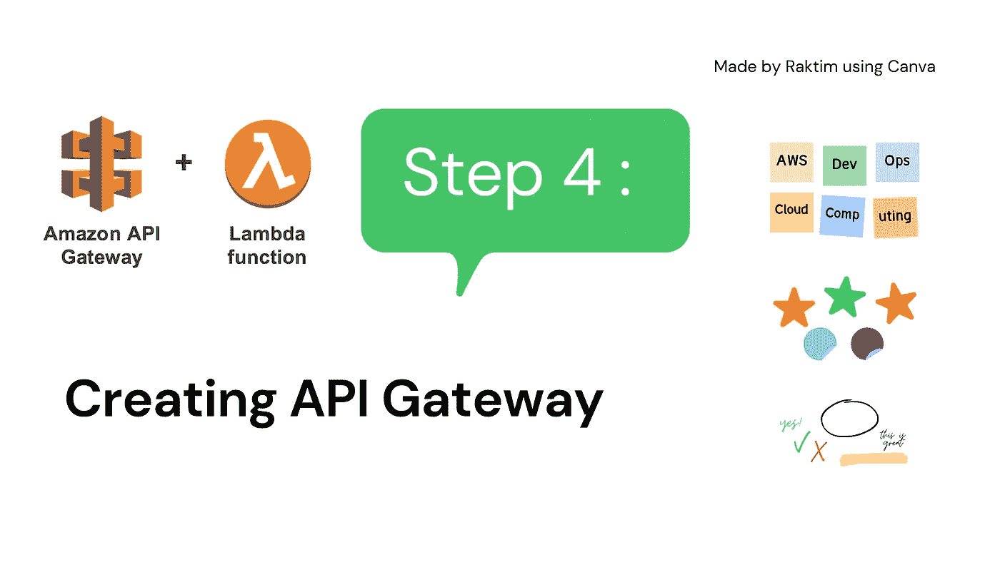

Step 4…

这是整个设置的最后一步。我在一开始就告诉过你，我们将会有一个 REST API，你可以简单地发送一个 POST 请求&它将开始在 AWS 上提供资源。让我们开始设置 API，好吗？

首先，转到 API 网关，用下面的配置创建一个 API…

*   **选择 REST API &然后点击“构建”(不要选择私有的)**
*   **API 名称:cf-lambda-api**
*   **端点:边缘优化**

创建 API，然后点击**“动作”**来设置 POST 方法。

*   **点击创建方法**
*   **从下拉菜单中选择 POST&你会看到它在询问集成类型→选择 Lambda 函数。**
*   **禁用 Lambda 代理集成。**
*   **最后选择你的 lambda 函数名&保存。**

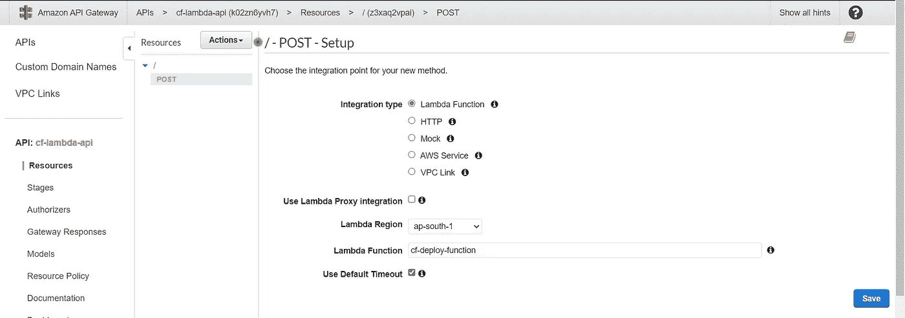

一旦您保存了设置，它将看起来像下面这样—

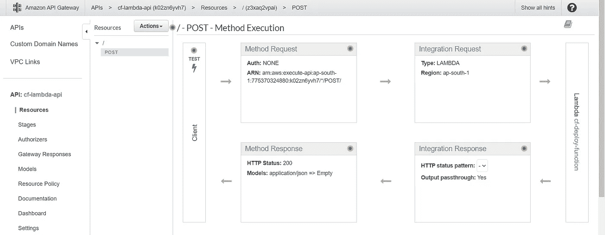

现在我们需要部署我们的 API，但在此之前，我想告诉你一些事情。一旦你部署了 API，世界上的任何人都可以访问它，如果你没有任何东西来保护你的 API，这是很危险的。这就是我们需要使用 API 键的地方，你可以把它看作是访问 API 的一个键。

点击一个**“方法请求”** &将会出现**“需要 API 密钥”**选项，将其更改为 true。

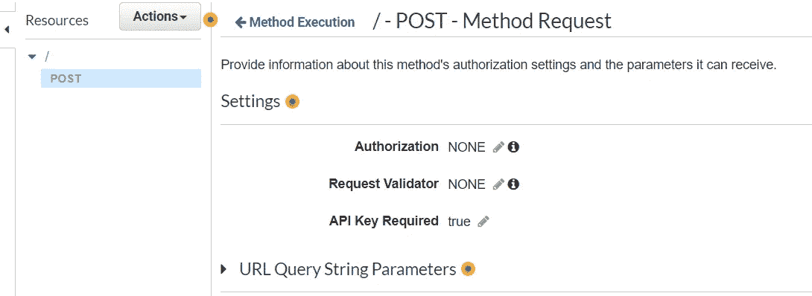

这里你还需要做一件小事，那就是当 Lambda 接收到作为 JSON 值的响应时。我们希望 Lambda 接收完全相同的数据。但是 API Gateway 有很多独特特性，可以在数据发送到 Lambda 之前对其进行修改。这就是为什么点击**“集成请求”** &向下滚动到选项**“映射模板”** →选择该选项到**“当没有定义模板时(推荐)”**。

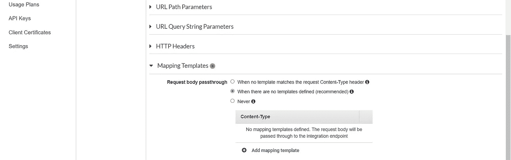

现在我们可以部署我们的 API 了。因此，再次单击**“操作”** → **“部署 API”**。

*   **部署阶段:新阶段**
*   **艺名:产品**

点击**“Deploy”**&您将获得调用 API 的 URL，如下图所示…

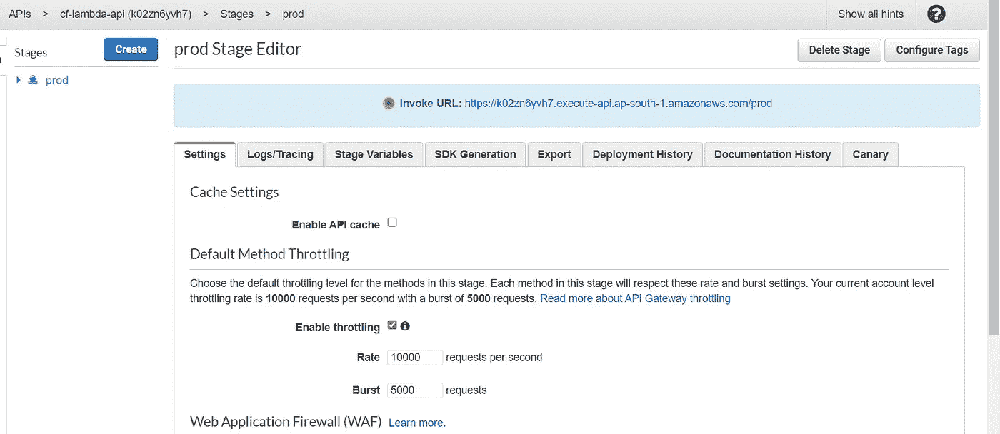

现在请记住，我刚刚说过，我们需要一个密钥来保护我们的 API。为此，我们需要制定一个使用计划。进入**“使用计划”**选项卡&点击**“创建”** &进行以下配置…

*   **名称:cf-lambda-api-usage-plan**
*   **启用节流:速率→10，突发→5**
*   **启用配额:每天 20 个请求**

单击 next &在这里您可以选择 API 阶段，记住，在我们的例子中是**“prod”**阶段。

点击**“添加 API 阶段”→将 API 选择到“cf-lambda-API”**，将阶段选择到**“prod”**&，然后点击检查符号。选择下一步&现在您需要选择 API 密钥…因此只需点击**“创建 API 密钥并添加到使用计划”。**给个名字像**“cf-lambda-API-key”**&保存。最后点击**【保存】**。

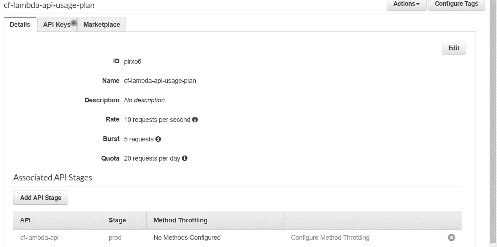

## 完成…🙌

# 测试时间:

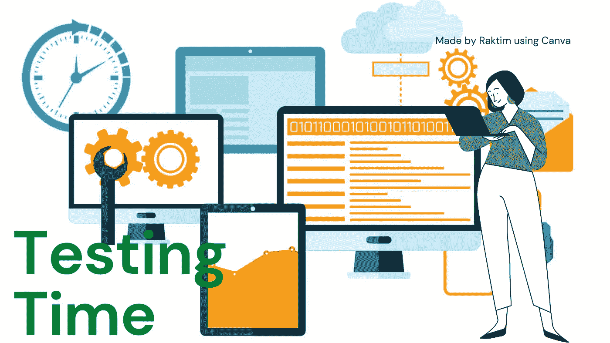

testing…

**你兴奋吗？**如果你真的这么做了，你不仅会学到很多东西，还会明白前端应用程序是如何为我们创建在线实验室的…

但问题是我们如何测试。我已经告诉过你，它是一个 REST API &大多数时候，你的前端应用程序访问这个 URL 来转发客户端请求。但我只是简单地使用了来自**“AWS cloud shell”的**“curl”**命令。你可以使用任何你喜欢的外壳。**

所以命令的结构看起来会像这样—

```
#curl -i -H “x-api-key: TjaV50Z2Q2TTR86y” [https://w5560uqso4.execute-api.ap-south-1.amazonaws.com/prod](https://w5560uqso4.execute-api.ap-south-1.amazonaws.com/prod) -d ‘{“StackName”:”MyStack”,”ClientToken”:”client1234"}’
```

现在你可能会问我从哪里获得 API 密钥，只需进入—**“API 密钥”**选项卡&选择名为**“cf-lambda-API-Key”**的 API 密钥。您将会看到它向您显示了 api 密钥。正在运行命令…🙌

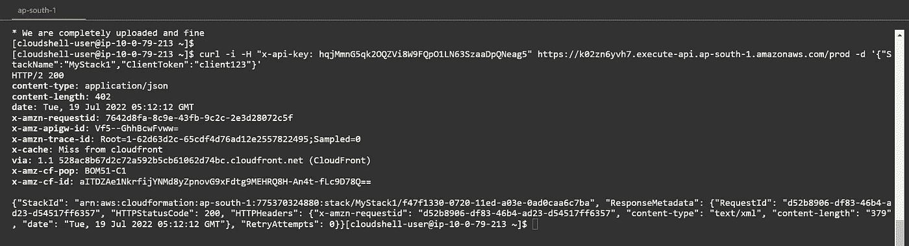

万岁…🔥我们得到了 200 个状态代码输出，这意味着我们能够使用 API 网关与 Lambda 进行通信。

现在我想给你们看两个演示。首先，我修改了堆栈的名称，但是更改了客户端令牌…

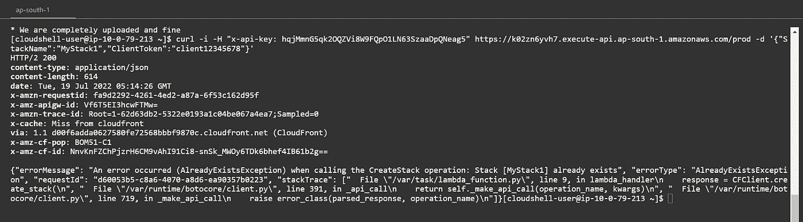

看，显示的是**"堆栈[MyStack1]已经存在"**。这意味着我们之前的命令已经成功地创建了堆栈&,你也不能用相同的名字创建两个不同的堆栈。

接下来，让我们保持客户端令牌不变，但更改堆栈名称…

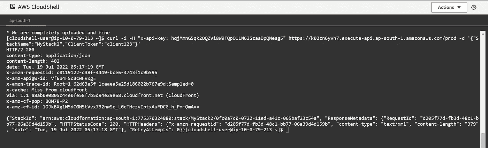

又是 200 状态码。这意味着这个客户端令牌有助于使您的请求幂等…看下面的屏幕截图，我用相同的堆栈名称和相同的客户端访问令牌发送多个请求，但是因为它是幂等的性质，所以它总是返回 200 状态输出…

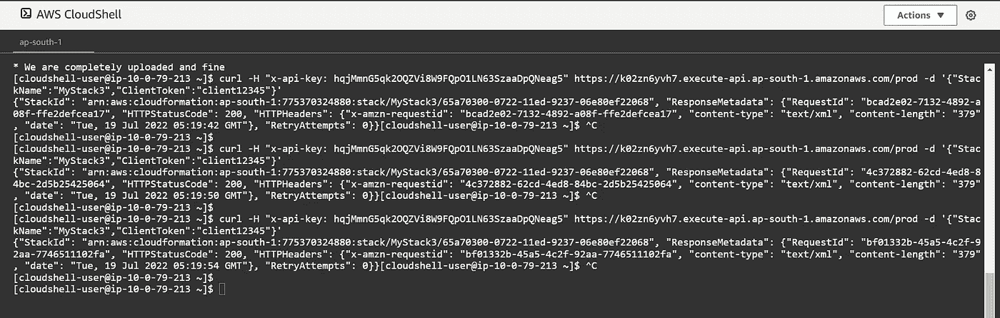

如果你想知道它在 CloudFormation 控制台中是什么样子，这里有一个截图…

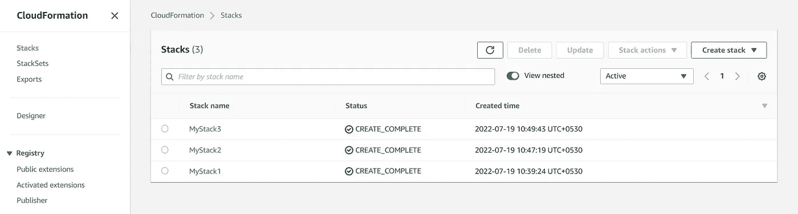

# 未来的可能性:

> 未来充满了可能性，无论你做出一个小小的改变，还是一大堆令人振奋、激动、鼓舞的改变。——**奥普拉·温弗瑞**

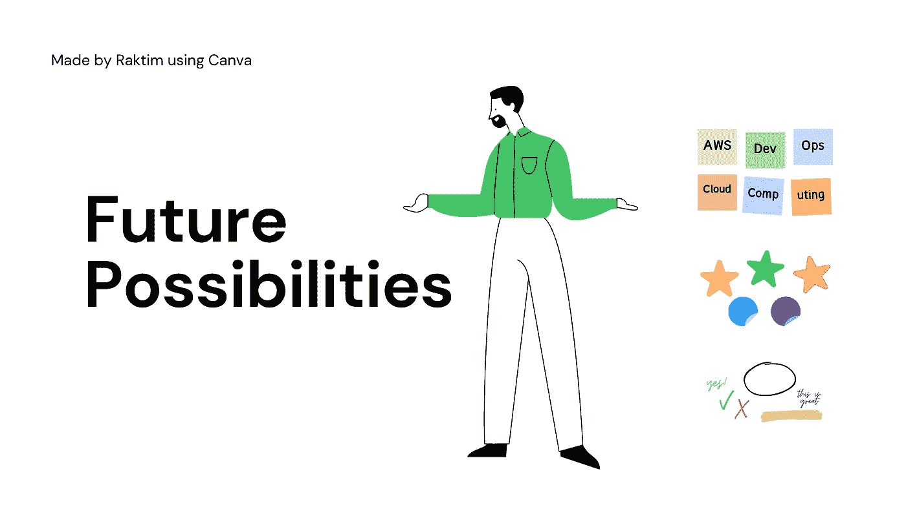

future possibilities…

*   在这个项目中的下一件事，你可以做的是**创建各种 API，为不同的操作附加各种 Lambda 函数，如删除堆栈、修改堆栈等。**
*   你可以做的另一件令人惊奇的事情是**使你的云形成模板参数化。**比方说，你希望你的客户发送 VPC·CIDR 系列产品。然后使用 Lambda 代码将该值参数化&,您可以轻松地输入这些参数。显然，Lambda 将从客户端的 API 网关接收参数值。
*   接下来，您可以创建一些 API，这些 API 可以访问您的堆栈以获取某些数据，然后您可以向您的客户提供这些数据，如 VPC id、子网 id。这些只是例子，在现实世界中，我们通常不会向客户提供内部 id，但我们可以向他们提供某些 URL 来访问他们的实验室。
*   另一件非常关键的事情是 IAM 限制。我知道我在 CloudFormation & VPC 上简单地设置了完全访问权限，但是在现实世界的场景中，我们总是需要提供最少的权限。这就是为什么这些东西你需要不断更新&尽可能缩小权限。
*   最后，我可以再提一个建议，那就是我们正在使用 REST API，这意味着它支持各种其他调用，如 GET、DELETE、PATCH 等。您可以使用它们来构建一个强大的后端。

好了，我相信这个博客到此结束了…有点大，但很有趣…希望你学到了一些独特的东西。请在评论中留下您的反馈，以便我可以与您交谈。

我一直在写关于机器学习、DevOps 自动化、云计算、大数据等方面的博客。所以，如果你想看我以后的博客，请关注我的媒体。您也可以在 LinkedIn 上 ping 我，在下面查看我的 LinkedIn 个人资料…

[](https://www.linkedin.com/in/raktimmidya/) [## Raktim Midya -自由职业者和技术顾问-自由职业者| LinkedIn

### 查看 Raktim Midya 在全球最大的职业社区 LinkedIn 上的个人资料。Raktim 有 4 个工作列在他们的…

www.linkedin.com](https://www.linkedin.com/in/raktimmidya/) 

**感谢大家的阅读。就这样…结束…😊**

