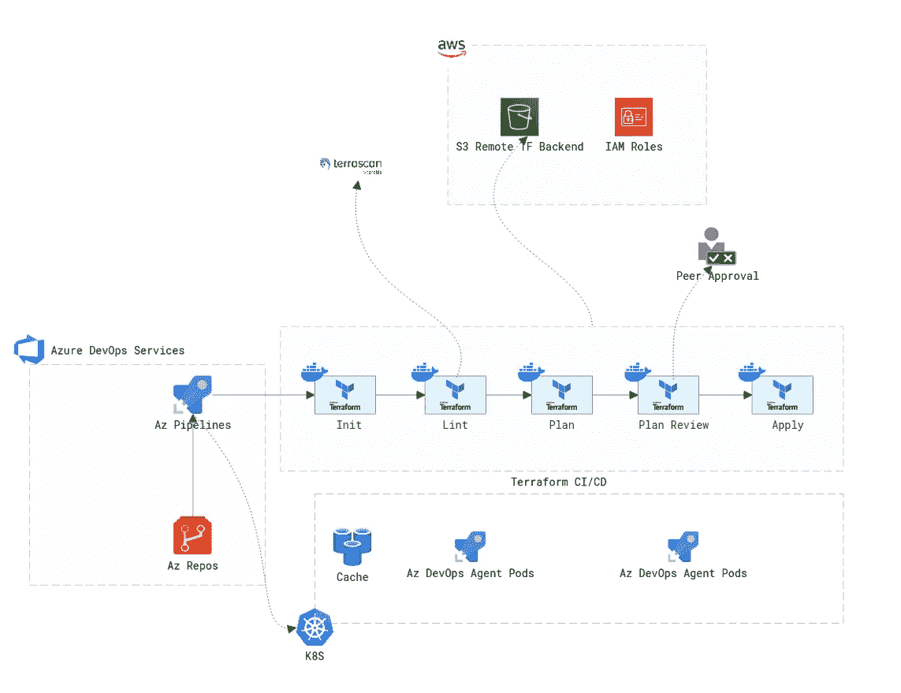

# 使用 Azure DevOps 和 Terraform 在 AWS 上调配资源—第一部分

> 原文：<https://medium.com/geekculture/provision-resources-on-aws-with-azure-devops-and-terraform-part-i-3c0de6d34fc9?source=collection_archive---------2----------------------->

Pipeline Architecture

在本文中，我们将探索使用 Azure DevOps 设置标准 Terraform CI/CD 管道所需的步骤，并利用最佳实践调配 AWS 资源。本文将由三部分组成，第一部分介绍先决条件，第二部分介绍配置，最后一部分重点介绍 CI/CD 部分。我一直在将 CI/CD 原则应用于软件…