# 在 JitPack 上发布您的 Android 库以获得更好的可达性

> 原文：<https://medium.com/geekculture/publish-your-android-library-on-jitpack-for-better-reachability-1c978dde726e?source=collection_archive---------21----------------------->

# 介绍

可重用代码从计算开始就存在了，Android 也不例外。任何库开发人员的主要目标都是简化抽象代码的复杂性，并将代码捆绑起来，供其他人在他们的项目中重用。

android 库是任何 Android 应用程序开发的重要部分之一。我们根据应用需求使用这些，如网络 API(翻新、okhttp 等。)、图像下载和缓存(Picasso、glide)等等。

当一段代码被重复或者可以被重用的时候-

*   在一个类中:我们把它移到一个方法中
*   在应用程序中:我们把它移到一个实用程序类中
*   在多重应用中:我们用它创建一个库

# 什么是 Android 库

Android 库的布局与 Android 应用程序模块的布局相同。创建应用程序所需的任何东西，包括源代码、资源文件和 Android 清单，都可以包含在内。然而，Android 库被编译成 Android Archive (AAR)文件，可以用作 Android 应用程序模块的依赖项，而不是被编译成在设备上运行的 APK。

# 何时创建 Android 库

有特定的时候，你应该选择 Android 库。他们是-

*   当您创建共享通用组件(如事件、实用工具或 UI 模板)的不同应用程序时。
*   如果你正在制作一个有几个 APK 迭代的应用程序，比如免费版和高级版，并且两者的主要元素是相同的。
*   当你想公开分享你的解决方案时，比如一个时髦的加载器，或者有创意的视图(按钮，下拉菜单等等)。)
*   或者当您想要创建和重用或分发一些可以在不同应用程序中使用的通用解决方案时，如缓存、图像下载、网络 API 等。

# 入门指南

要了解如何发布一个 Android 库，我们需要简单讲一下 Android 库的创建。我们还将在一个基本的应用程序流中检查它的使用，并了解如何发布我们的库。

# 创建 Android 库

*   创建新的库模块。

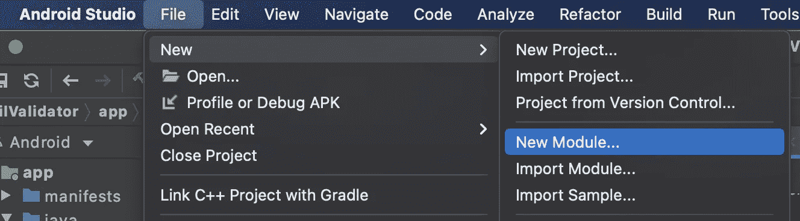

*   选择 Android 库，然后单击下一步。

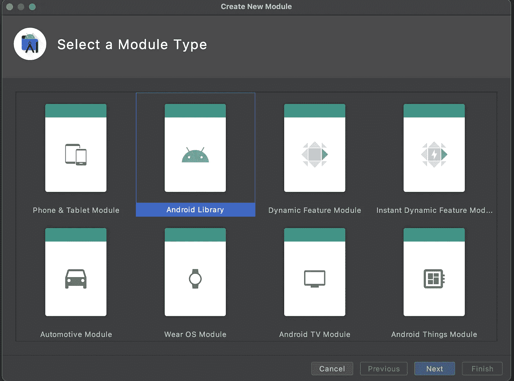

*   输入模块名称。

*   项目结构看起来如下

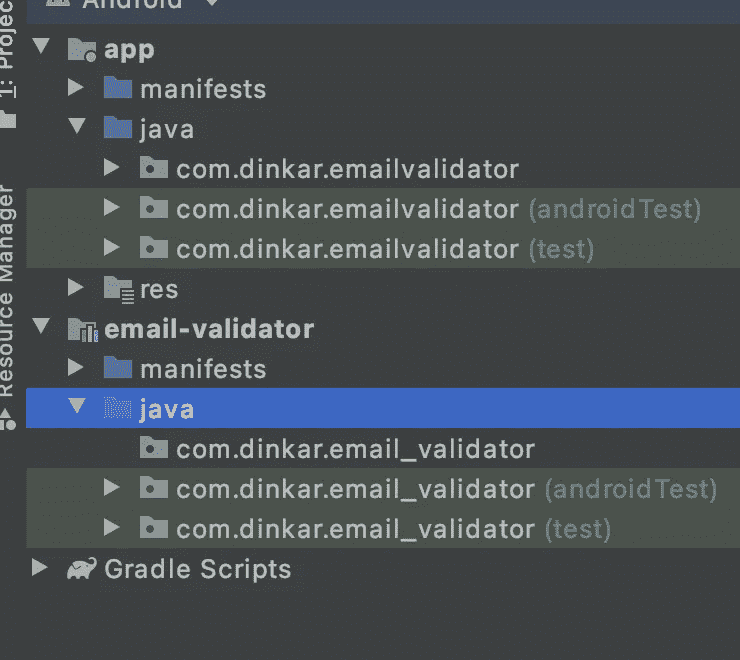

*   让我们在库中创建一个电子邮件验证类。

我们的电子邮件验证库已经准备好了。让我们通过将这个库集成到我们的示例应用程序中来测试它。

# 在我们的应用中添加库

在应用程序模块和同步项目的 build.gradle 的依赖项中添加以下内容

*实施项目(':email-validator')*

现在可以在我们的应用程序中访问该库的 EmailValidate 类，我们可以使用该库的验证 API 来检查电子邮件验证。

我们在示例应用程序中成功地使用了这个库，现在下一步是发布它，让其他人也能使用它。

# 什么是 Jitpack？

JitPack 是一个用于 Java 虚拟机和 Android 项目的独特的包存储库。它按需构建 Git 项目，并提供现成的工件(jar、aar)。

如果您希望您的库对全世界开放，就不需要经过项目构建和上传步骤。您所需要做的就是将您的项目推送到 GitHub，JitPack 会处理剩下的事情。就是这样！

# 为什么是 Jitpack？

Jitpack 优于其他产品的原因是多方面的。他们是-

*   它构建特定的提交或最新的提交，并处理任何分支或拉取请求
*   库 javadocs 是自动发布和托管的
*   您可以跟踪您的下载。维护人员也可以获得每周和每月的统计数据。
*   工件通过全球 CDN 提供，这允许您和您的用户快速下载
*   私有版本仍然是私有的。需要的时候可以分享。
*   自定义域:将工件名称与您的域相匹配
*   Jitpack 可与 Github、GitLab、BitBucket 配合使用

# 出版图书馆

我们需要首先将我们的 Android 项目放入我们的 GitHub 帐户的公共回购中，以继续发布本教程的库。建立一个公共回购，将所有文件推送到我们 GitHub 账户中的回购。

我们现在只能使用这个库，因为库模块只能用于我们的项目。我们必须在 JitPack 上发布这个库，让每个人都可以访问电子邮件验证器库。

# 为 JitPack 构建

*   将 JitPack maven 存储库添加到根级 build.gradle 的存储库列表中

*   通过在库模块的 build.gradle 中添加以下内容，使 maven 能够发布插件

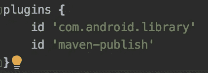

*   下面的代码示例为 AAR 库的发行版生成了一个出版物。将其添加到库模块的 build.gradle 的根级别。

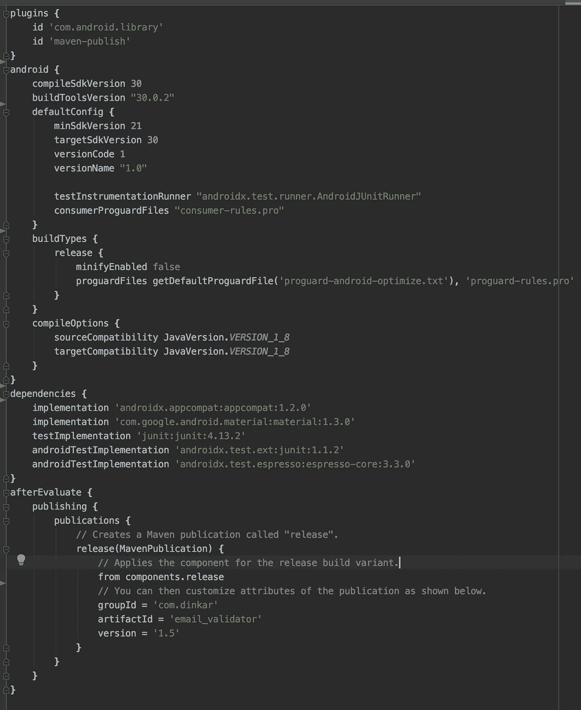

# 检查 Maven 发布插件

让我们检查一下我们所做的所有更改是否在 maven publish 插件中正确配置了。检查您的库是否可以安装到 maven local*($ HOME/. m2/repository)*:

> 在 Android Studio 终端
> 中运行以下命令。/grad Lew publishReleasePublicationToMavenLocal

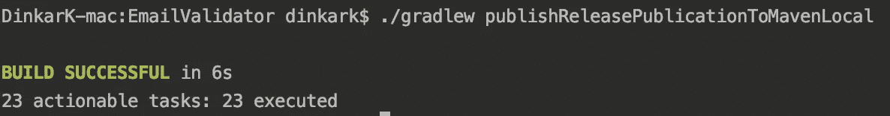

*   让我们看看$HOME/.m2/repository 目录

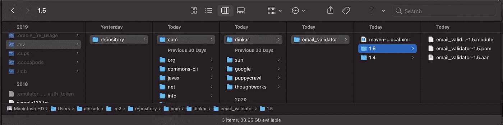

# 在 JitPack 上发布库

*   提交我们在库模块中所做的更改
*   如果前一步一切顺利，你的库就可以发布了！创建一个 GitHub 版本或者添加一个 git 标签就大功告成了！
*   在 GitHub repo 中创建一个发布标签

*   打开[https://jitpack.io/](https://jitpack.io/)并查找你的回购

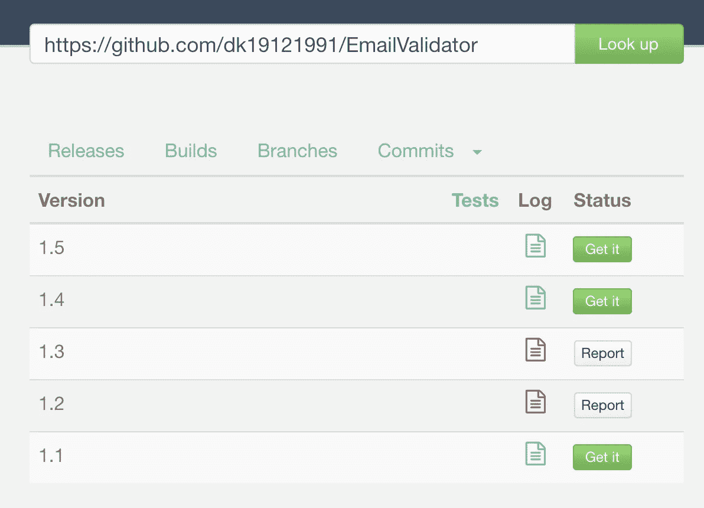

*   如果有任何错误，您可以在“日志”选项卡中查看详细信息，如哪里出错了。例如，我可以检查 1.3 版本的错误

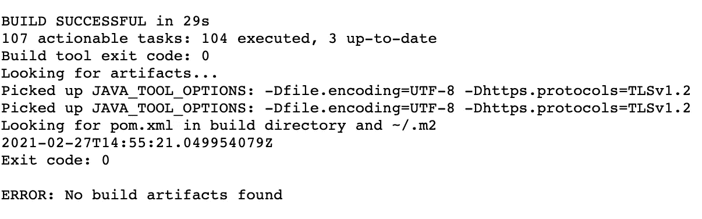

它说构建是成功的，但是当它试图上传工件时，它无处可去，原因是，在 1.3 中，我忘记提交 maven 来发布库模块的 build.gradle 中的设置。

# 安装库

> 为了在任何应用程序中安装该库，我们必须在项目 build . gradle
> maven { URL '[https://JIT pack . io '](https://jitpack.io')}中添加以下内容

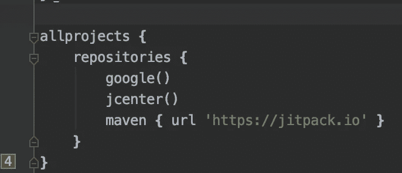

> 在 app 模块 build.gradle
> 实现中添加库依赖' com . github . dk 19121991:email validator:1.5 '

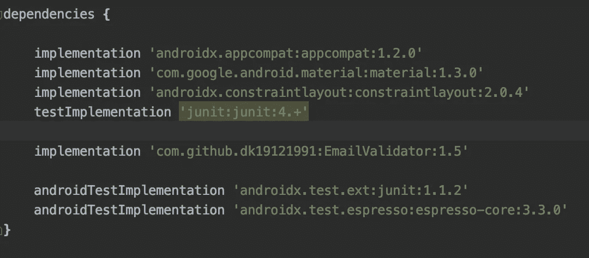

*   同步项目，瞧！我们可以使用应用程序中公开下载的库

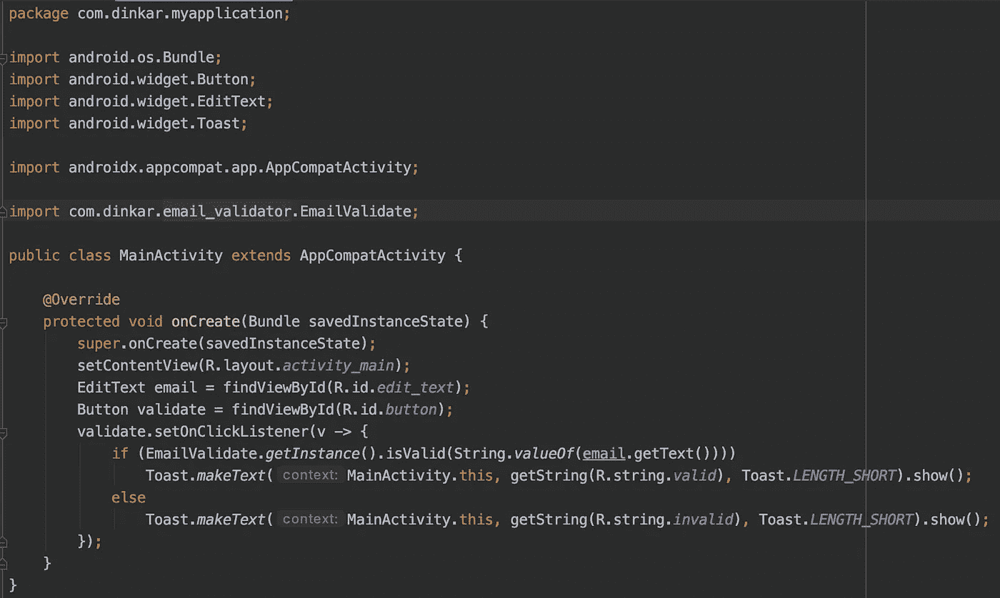

恭喜你！您现在可以发布您的库供公众使用。

更多细节和更深入的观点，你可以在这里找到代码

参考资料:[https://jitpack.io/](https://jitpack.io/)，[https://github.com/jitpack/jitpack.io](https://github.com/jitpack/jitpack.io)

*最初发表于*[*https://www.talentica.com*](https://www.talentica.com/blogs/publish-your-android-library-on-jitpack-for-better-reachability/)*。*