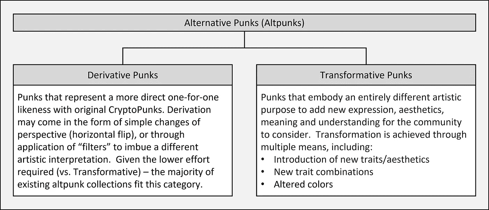
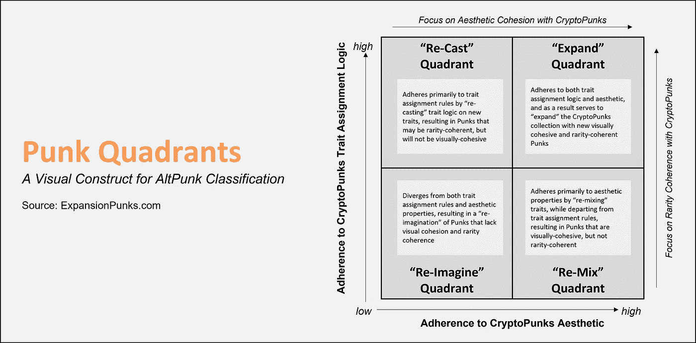
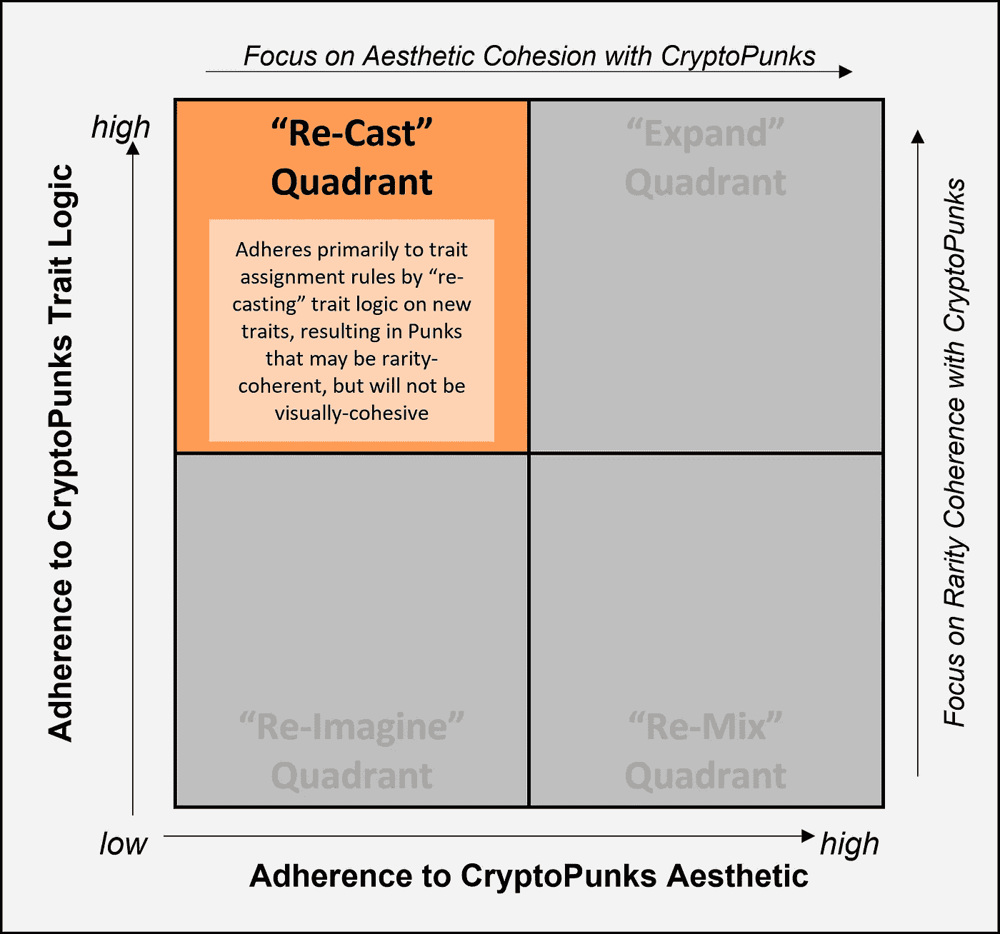
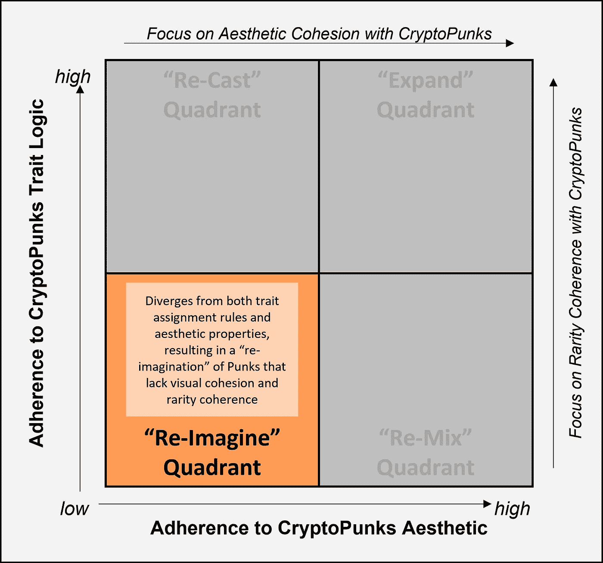
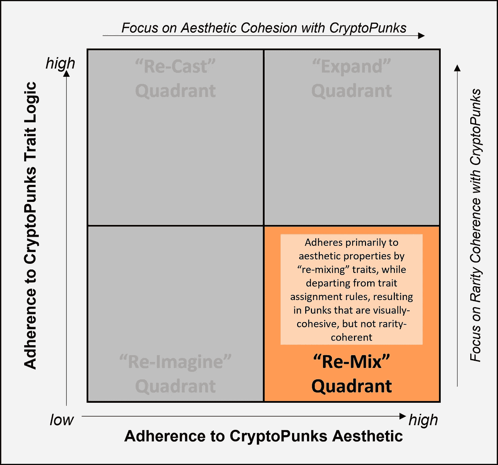
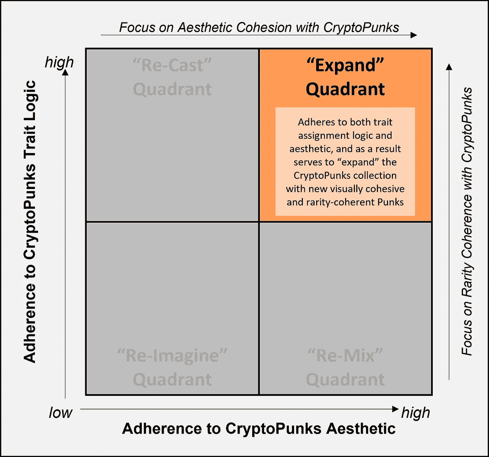

# 朋克象限

> 原文：<https://medium.com/geekculture/punk-quadrants-c002f756531?source=collection_archive---------16----------------------->

> 阿尔特朋克 NFT 头像分类的视觉构造

# TL；速度三角形定位法(dead reckoning)

随着最近加密朋克领域的兴奋和价格的大幅上涨，看到各种受 NFT 头像启发的衍生项目围绕原始加密朋克美学浮出水面也就不足为奇了。本文旨在提供一些在评估这些收藏时可以考虑的观点。类似于 Gartner 的魔力象限方法，它提供了对市场方向和参与者的洞察，引入了一种新的视觉结构(朋克象限),可以根据它绘制各种“另类朋克”系列。应用这种视觉结构对另类朋克系列进行分类，旨在为市场提供一种对潜在资产的差异化视角，从而做出更好的决策。随着市场结构的到位，重点转向 [ExpansionPunks 系列](http://www.ExpansionPunks.com)作为一个独特定位的系列，基于其在 Punk Quadrants 结构中的差异化地位，以及对整个 Punkverse 的生态系统承诺。

# 关键考虑:不是投资建议

快速浏览一下网上交易将会支持这样一种观点，即最初的 CryptoPunks 收藏无疑是 NFT 虚拟空间中最好的保值投资。历史渊源(对不可替代代币标准的影响)、稀缺性(仅限 10K 朋克)和恶名都是推动这种需求的关键因素。然而，这种需求也推动了价格，导致入门价格(发布时为 33 层)使朋克的所有权对许多人来说变得不可能。“部分”所有权的新模式正在出现，应该成为该领域纯粹投资者的考虑因素。但是分散的所有权并不适合所有人；对许多收藏家来说，拥有一个独一无二的代币是很重要的。对于那些超越原始 CryptoPunks 集合的人来说，支持 altpunk 生态系统评估的构建是有价值的。话虽如此——排队免责声明:*本文中的信息和建议不应被视为投资建议。*

# 对 AltPunk 生态系统进行分类

在我们介绍一个视觉构造之前，首先描述一下这个分类练习的范围是很重要的。这一领域现有的和新兴的项目和收藏范围相当广泛。项目采用各种独特的方法来确立其差异化，例如:

●手绘、小批量收集
●基本水平翻转/反射
● 3D 重新解释
●滤镜变换
●深度学习重新混合

最近…

●通过引入新的、以前不存在的朋克，寻求捕捉原始 CryptoPunks 魔术的特质的生成性系列

对于基本的组织，我们首先根据下面的图 1 将这些不同的项目分成两个类别:衍生与变革。

Figure 1: Derivative vs. Transformative Punk Collections

迄今为止，大多数另类朋克系列都属于衍生品类别。最近，我们看到越来越多的转型朋克系列开始浮出水面，证实了对分类框架的需求，以帮助提供市场结构和差异化。

# 朋克象限—概述

朋克象限是一个框架，NFT 头像朋克系列可以在二维矩阵中相对定位。该建筑的尺寸是基于通常被认为是评估 NFT 藏品最关键的决策标准:美学和 T2 稀有度。朋克象限根据项目的“对加密朋克美学的坚持”(x 轴)和“对加密朋克特性分配逻辑的坚持”(y 轴)来评估项目，这与稀有性相关。这两个维度产生了 4 个相互排斥的朋克象限，每个象限的命名都是为了总结这两个维度独特组合的结果:

Figure 2: Punk Quadrants

● **重铸** **象限**——通过在新特征上“重铸”特征逻辑，主要遵守特征分配规则的集合，导致朋克可能稀有连贯，但缺乏视觉凝聚力。

● **重新想象** **象限**——偏离特质分配规则和美学属性的系列，导致缺乏视觉凝聚力和稀有一致性的朋克“重新想象”。

● **重新组合** **象限**——通过“重新组合”特性来主要坚持美学属性的系列，同时背离特性分配规则，产生视觉上有凝聚力但不稀有的朋克。

● **扩展象限** —坚持特质分配逻辑和美学的系列。这种系列用来“扩展”CryptoPunks 系列，使其具有新的视觉凝聚力和稀有一致性。

没有一个象限一定比另一个更好；象限只是作为区分项目的分类工具。投资者和收藏者应该根据自己的意图来决定每个象限的优劣，这也可能是主观的。

让我们仔细看看决定系列在 4 个不同象限中位置的每个维度(轴):

当测量**对 CryptoPunks 美学** (x 轴)的坚持性时，我们考虑各种视觉因素，包括 RGB 颜色精度、特征像素级精度和特征层排序精度。一个系列越是坚持这些因素，与原始 crypto 朋克系列的美学凝聚力就越大。在我们的第一篇文章中，我们详细描述了 RGB 颜色准确性的复杂性，[创建 10K·NFT 头像集——一步一步的](/geekculture/expansionpunks-welcome-to-the-more-inclusive-punkverse-aa77e675bcf5)。

> 首先，多种特征(玫瑰色脸颊、痣、角质边框眼镜、所有 3 种眼影颜色以及其他颜色)是半透明的，并且当层叠在其他特征(例如，肤色)之上时，它们混合以基于作为透明层的不透明度值的函数的两种 RGB 值的混合来创建新的第三种颜色。

为了准确地捕捉 CryptoPunks 集合的原始 RGB 颜色，必须基于多变量数学函数推导出几个半透明特征层。并且给定不同肤色之上的半透明层的可变混合结果，需要非线性模拟/优化函数来精确推导这种半透明层的 RGB 和不透明度值。对各种 altpunk 系列的像素级 RGB 值进行采样，通常会发现特定特征上的微小 RGB 值差异，这表明 RGB 颜色准确性不是该系列的重点。在评估美学坚持性时，特征像素级的准确性也是一个因素。各系列在坚持特定特征方面差异很大——有些甚至为他们的系列引入了全新的特征。最后——特征层排序的准确性也是决定与 trait 朋克美学的凝聚力的一个因素。当以正确的顺序组合时，Altpunk 系列在准确捕捉特定特征如何“隐藏”其他潜在特征的细微差别的能力方面存在很大差异。从广义上讲，大多数系列最终将落在 x 轴中点的左侧，因为在像素级完美细节中再现 crypto 朋克美学的复杂性。

在评估一个集合的**对 crypto Punk 特征分配逻辑** (y 轴)的遵守情况时，我们测量一个集合在遵守规则方面的精度，该规则管理在原始 crypto Punk 集合中对 Punk“类型”的特征分配。在原始的 CryptoPunks 逻辑中有各种各样的特质组合规则，这些规则在 altpunk 项目中经常被忽略。一个明显的例子是飞行员头盔+眼睛特征故障——朋克同时具有飞行员头盔特征和任何眼睛特征(例如，眼影或任何类型的眼镜)。我们称之为故障，因为飞行员头盔已经有了一套集成的护目镜，原始的幼虫实验室特征分配逻辑确保了没有任何带飞行员头盔的朋克会有与飞行员护目镜冲突的眼睛特征。在最初的 CryptoPunks 集合中存在多个这样的隐藏特征分配规则，并且大多数变革性的 altpunk 集合在其生成方法中没有考虑这种逻辑。这不一定是项目的疏忽——在这种情况下，坚持特征分配逻辑可能不是收集的重点。尊重原始的 crypto 朋克特征概率是集合坚持特征分配逻辑的另一个功能。原始系列中的特定特征旨在体现稀有性，如无檐帽、焊接护目镜等。多个转换集合在其生成过程中忽略了这种稀有性因素，导致集合缺乏与原始 crypto 朋克集合的稀有性一致性。最终，逆向工程，记录，然后将这种层次的特性分配逻辑编程到一个集合的生成过程中是复杂的，所以看到大多数变革性的 altpunk 项目跌破 y 轴中点进入重新想象/重新混合类别并不奇怪。

# 朋克象限:示例

> 作者注:我们决定不在本节点名具体的 altpunk 系列，而是鼓励您在评估现有和即将推出的系列时应用朋克象限维度。

## 重铸象限:

Figure 3: The Re-Cast Quadrant

一般来说，大多数“衍生朋克”集合可以在**重铸象限**中找到，因为它们通常继承原始朋克集合作为主要输入，从而固有地尊重所有特性分配逻辑，将它们放在朋克象限构造的 y 轴维度上的较高位置。然而，这种衍生系列通过视觉修改(如滤镜、透视翻转和 GAN 建模)严重偏离了 CryptoPunks 美学，从而导致美学适合度的 x 轴维度的位置较低。目前，这是奥特朋克空间中人口最密集的区域。

## 重新想象象限:

Figure 4: The Re-Imagine Quadrant

随着 NFT 头像空间的增长，许多基于 24x24 像素朋克概念的系列现在进入市场。为了与众不同，他们利用了原始 CryptoPunks 系列的组件(例如，基本脸原型、帽子、发饰)并引入了各种新特征，这使他们在审美坚持的 x 轴维度上处于中间偏左的位置。考虑到新特性的多样性，通常会替换其他 CryptoPunks 特性，集合遵守原始特性分配规则(y 轴)的能力也天生较低，导致此类集合被放置在左下角**重新想象** **象限**。

## 重新混合象限:

Figure 5: The Re-Mix Quadrant

最近，新的项目正在启动，试图只使用原始的密码朋克特征来重建新的朋克，将他们放在审美 x 轴维度的中心右侧。从表面上看，这样的项目感觉非常类似于我们自己的扩张朋克努力。然而，在对这些集合进行更仔细的检查后，很明显他们更关注审美维度而不是特征分配维度，因为在他们的集合中多种特征逻辑缺失是显而易见的。这将这些集合放置在 y 轴中点的下方，在右下方的**重新混合象限中。**事实上，大多数收藏家可能永远不会意识到这些特征分配的差异，因为它们很微妙。但是随着时间的推移，花在特征稀有性和组合数据上的时间越多，这些缺失就会变得越明显。同样——这样的集合本身是有效的——如果集合不追求与原始群体的稀有性一致性，那么对特征分配逻辑的低坚持性并不是负面的。

## 展开象限:

Figure 6: The Expand Quadrant

我们假设 [ExpansionPunks 系列](http://www.ExpansionPunks.com)是**扩展象限**中的唯一一个系列，成功实现了朋克象限结构两个维度的高度契合。正如[在我们的第一篇文章](/geekculture/expansionpunks-welcome-to-the-more-inclusive-punkverse-aa77e675bcf5)中详述的那样，我们已经通过感知哈希算法证明了我们可以将所有 10K 原创密码朋克重新制作为原物的逐个像素精确克隆，从而充分验证了我们的特征层库的美学准确性。这是 5.76 米(24x24x10K)的 RGB 和不透明度值的精确像素匹配！有趣的事实——你在[crypto 朋克浏览器](https://expansionpunks.com/explorer)中看到的朋克实际上是我们为了验证引擎而生成的像素完美的克隆体。除了美学——我们还逆向工程了原始 crypto 朋克系列固有的隐藏特征分配逻辑。隐藏在 CryptoPunks 逻辑中的潜在特征组合限制已被记录并应用于 [ExpansionPunks 集合](http://www.ExpansionPunks.com)，以确保排除此类特征限制。

# 扩展 Punkverse

正如多个现有和新兴的另类朋克系列所证明的那样，朋克乐队正在以新系列的形式发展，这些新系列跨越了**重新组合**、**重新塑造**、**重新想象**以及现在的**扩展象限**。随着区块链和 NFT 的景观继续发展，更多的人将进入这个领域。Punkverse 的扩张是不可避免的。

拥有“资料片”修改器意味着对加密朋克社区的高度责任感。通过一种尊重和尊重原创精神的扩展方法，ExpansionPunks 具有独特的特性组合，而不会牺牲美学凝聚力和特性稀有性与原始 CryptoPunks 系列的一致性。管理这些维度的平衡是推出扩展系列的基础，该系列尊重并提升了原始系列。

负责任的扩张包括选择有限的审美和特征组合，目的和意图与 CryptoPunks 时代精神一致。 [ExpansionPunks collection](http://www.ExpansionPunks.com) 旨在通过解决原始 CryptoPunks collection 中无意中导致排斥的微妙偏见，将 Punkverse 扩展为一个更具代表性、多元化和包容性的社区。例子包括赋予女性以微笑/皱眉来表达情感的权力，使跨性别特征的获取民主化，重要的是，引入新的、多样化的**非二元**朋克，以更包容越来越多选择不认同二元性别的个人(甚至组织)。我们相信 CryptoPunks 社区将支持这一使命，让每个人在这个新的区块链技术前沿感到受欢迎、受重视和被代表。

扩张朋克的承诺超越了个人朋克，还包括整个朋克的平台和体验。随着像 [PunkExplorer](https://expansionpunks.com/explorer) 这样的新功能被构建来支持[扩张朋克集合](http://www.ExpansionPunks.com)，它们也将被追溯配置来支持加密朋克集合。这种方法将确保积极、持续地关注整个 Punkverse 的发展。最终，我们希望通过一个更加多样化和包容的扩展 Punkverse，再加上一个动态探索更广阔 Punkverse 的新体验， [ExpansionPunks](http://www.ExpansionPunks.com) 将作为社区的添加剂被接受，为整个空间带来更多的意识和需求。

# 保持联系

请加入我们的 [Discord](https://discord.gg/kTNcWfYfbv) 和 [Twitter](https://twitter.com/ExpansionPunks) 以了解更多信息，保持联系，并以团结一致的方式支持我们拓展 Punkverse 的使命。