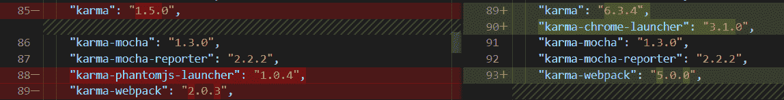
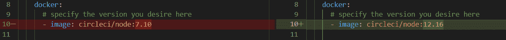
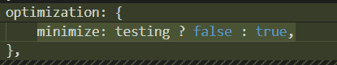

# 木偶师，无头铬和 CircleCI

> 原文：<https://medium.com/geekculture/puppeteer-headless-chrome-and-circleci-1438d90a2357?source=collection_archive---------16----------------------->

在这篇文章中，我想介绍一个我在更新旧的回购协议时遇到的问题。在这种情况下，我正在让它在 CircleCi 版本 2 上工作。更具体地说，是从“karma-phantomjs-launcher”:“1 . 0 . 4”到“karma-chrome-launcher”:“3 . 1 . 0”的迁移。


Photo by [Christina @ wocintechchat.com](https://unsplash.com/@wocintechchat?utm_source=unsplash&utm_medium=referral&utm_content=creditCopyText) on [Unsplash](https://unsplash.com/s/photos/web-browser?utm_source=unsplash&utm_medium=referral&utm_content=creditCopyText)

这包括将 karma 从 1.5.0 更新到 6.3.4，将 karma-webpack 从 2.0.3 更新到 5.0.0，并添加了 puppeter 10 . 1 . 0。



在我的本地 windows 环境中，一切看起来都很好，但是当推送到我的远程 GitHub repo 时，出现了更多的问题，导致我需要:

将 docker 映像从节点:7.10 更新到节点:14.1。



然后把我的 node-sass 从 4.12.0 更新到支持 node v14 的 6.0.1(虽然我的本地是 v12.16.2)。

就在我认为我是安全的时候，我在 Webpack 编译之后遇到了几个错误，第一个是:

```
08 07 2021 17:17:42.889:ERROR [launcher]: Cannot start ChromeHeadless/home/circleci/repo/node_modules/puppeteer/.local-chromium/linux-884014/chrome-linux/chrome: error while loading shared libraries: libnss3.so: cannot open shared object file: No such file or directory
```

# 解决方法:

在我的 CircleCI 配置中，在我的 npm install 命令之后添加这一行。

```
run: sudo apt-get install gconf-service libasound2 libatk1.0–0 libc6 libcairo2 libcups2 libdbus-1–3 libexpat1 libfontconfig1 libgbm-dev libgcc1 libgconf-2–4 libgdk-pixbuf2.0–0 libglib2.0–0 libgtk-3–0 libnspr4 libpango-1.0–0 libpangocairo-1.0–0 libstdc++6 libx11–6 libx11-xcb1 libxcb1 libxcomposite1 libxcursor1 libxdamage1 libxext6 libxfixes3 libxi6 libxrandr2 libxrender1 libxss1 libxtst6 ca-certificates fonts-liberation libappindicator1 libnss3 lsb-release xdg-utils wget
```

# 该修复程序解释道:

在谷歌上搜索了一下之后，我了解到虽然在 windows 上安装 npm 会安装上面列出的 puppeteers 依赖项，但 CircleCi 项目是在 linux 上运行的，需要一个额外的步骤才能运行。希望这能帮助任何遇到这个问题的人。

# 奖金:

虽然您可能不会遇到这种情况，但我发现在我的 CircleCi 项目的构建和测试步骤中，Webpack 的缩小文件给我带来了问题，因此在我的测试中添加一个停止缩小的条件似乎效果不错。

