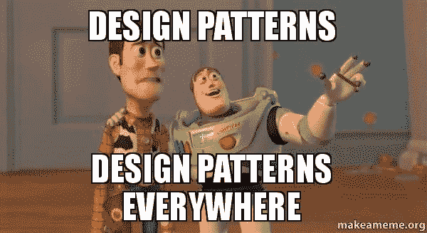
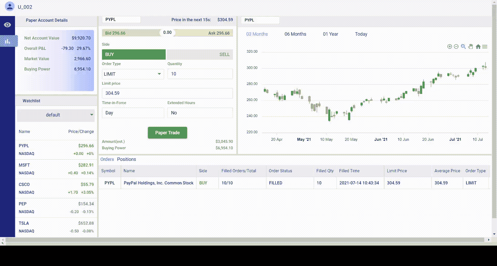

# 使用 Spring Boot、WebSocket 和 Angular 的可观察设计模式推送订单通知

> 原文：<https://medium.com/geekculture/push-notification-for-order-placed-using-observable-design-pattern-with-spring-boot-websocket-9203874f3ebb?source=collection_archive---------1----------------------->

> 老实说，我正准备放弃做这个特性，因为一位高级 Java 开发人员告诉我,“可观察模式”主要适用于移动和嵌入式应用程序，不适用于 web，web 环境是无状态的。但在完成聊天功能后，这给了我一些信心，我在 Observable pattern + WebSocket 上又试了一次，幸运的是它成功了..



这个功能在我的股票交易项目中，当另一个交易者刚刚购买了一只股票时，它会通知交易者。



我在考虑两种方法来制作这个功能:

*   **短轮询**:创建一组新买入的股票，存储在后端。前端将通过使用 setInterval()每隔 05 分钟向后端发送请求来获得这个更新的集合。
*   **可观察模式+ WebSocket:** 使用可观察模式观察任何新订单，并使用 WebSocket 自动从服务器向客户端发送通知，而无需调用 HTTP 请求。

**短期投票:**这不是一个有效的方法。这样做有几个明显的缺点:大量的请求会消耗服务器资源，如果数据不经常更新，大多数请求会返回空值。

**可观察模式+ WebSocket:** 这就是我要找的，我会在本帖中解释。

首先，我将创建一个 PropertyChangedEventArgs <t>:</t>

```
@AllArgsConstructor
public class PropertyChangedEventArgs<T>{
    public T source; (1)
    public String userId; (2)
    public String symbol; (3)
}
```

(1):对源的引用
(2)，(3):正在被改变的信息

这包含了一些关于特定属性更改的信息，它是在 T 类型的对象上，在我的例子中 T 是一个控制器(OrderControllerImpl)。我之所以使用泛型，是因为我想让它尽可能灵活。

然后我需要创建一个观察者界面

```
public interface Observer<T> {
    void handle (PropertyChangedEventArgs<T> args);
}
```

“Observer”是一个希望由任何对观察 t 类型对象感兴趣的人实现的接口。在我的例子中，是 OrderWSController 实现了 Observer 接口来观察 OrderControllerImpl 中的变化(创建了一个新订单)。

为什么 OrderWSController 是一个观察者而不是另一个类？是因为 OrderWSController 负责使用 WebSocket 而不是 HTTP 请求从服务器向客户端发送数据(通知)。

下面是我实现观察者接口的方法:

```
@Controller
public class OrderWSController implements Observer<OrderControllerImpl> {
    private final SimpMessagingTemplate simpMessagingTemplate;

    @Autowired
    DailyService dailyService;

    @Autowired
    OrderService orderService;

    OrderControllerImpl orderController;

    public OrderWSController(SimpMessagingTemplate simpMessagingTemplate, OrderControllerImpl orderController){
        this.simpMessagingTemplate = simpMessagingTemplate;
        this.orderController = orderController;
        this.orderController.subscribe(this); (1)
    };

   @Override  (2)
    public void handle(PropertyChangedEventArgs<OrderControllerImpl> args) {
        String message = args.userId + " has just purchased " + args.symbol;
        this.simpMessagingTemplate.convertAndSend("/queue/new-order", message);
    } 
}
```

(2)每当有人实际执行一些更改(创建订单/购买股票)时，它将从 PropertyChangedEventArgs(userId，symbol name)获取更改信息，然后立即将其发送给订阅“/queue/new-order”端点的客户端。

(1) OrderWSController 将 OrderControllerImpl 注入到它的类中，并让 OrderControllerImpl 使用 subscribe()将 OrderWSController 添加为它的一个观察者。下面的课程将详细解释这个想法。

接下来，我将创建一个可观察的类

```
public class Observable<T>{

   (1) public List<Observer<T>> observers = new ArrayList<>(); 

   (2) public void subscribe(Observer<T> observer) {
        this.observers.add(observer); 
    }

   (3) protected void notifyObservers(T source, String userId, String symbol) {
        for (Observer<T> o : observers) {
            o.handle(new PropertyChangedEventArgs<T>(source, userId, symbol));
        }
    } 
}
```

(1)正在观察变化的所有 T 型观察者的列表。在本例中，它是 OrderWSController。
(2)在当前观察者列表中添加一个新的观察者。我在前面还解释了如何将 OrderWSController 添加到当前观察者列表中
(3)通知所有的观察者关于变更的信息。

下面是如何在 OrderControllerImpl 中使用这个可观察的类:

```
@RestController
@RequestMapping("/order")
**public class OrderControllerImpl extends Observable<OrderControllerImpl>** implements OrderController {
    @Autowired
    private OrderService orderService;

    @Autowired
    private ResponseFactory responseFactory;

    @PostMapping
    public ResponseEntity<?> createNewOrder(@RequestBody OrderDto order) {
        try{
            Order saved = orderService.save(order);

 **if(saved.getOrderSide().name() =="BUY"){
                notifyObservers(this, saved.getUser().getUserId(), saved.getSymbol().getSymbol());** 
            }

            return responseFactory.success(saved);
        }
        catch(IllegalArgumentException ex){
            throw new BadRequestException(ex.getMessage());
        }
        catch(Exception ex){
            throw new InternalServerException("Unable to create new order.");
        }
    }
}
```

最后，在我的 Angular 应用程序中，我需要订阅端点，并在有新订单时通知用户。

```
ngOnInit(): void {
  this.initializeWebSocketConnection();
}

initializeWebSocketConnection(): any {
  ***console***.log('connected to ws ...');

  const ws = new SockJS(this.serverUrl);

  this.stompClient = Stomp.over(ws);

  const that = this;

  this.stompClient.connect({}, (frame) => {
    that.stompClient.subscribe(`/queue/new-order`, (order) => {
      let userId = order.body.split(" ")[0];
      if (this.auth.readToken().userId != userId) {
        this.snackBar.open(order.body, "", {
          duration: 3000,
          verticalPosition: "top",
          horizontalPosition: "center"
        });
      }
    });
  }, (err) => {
    ***console***.log(err);
  });
}
```

你可以在这里找到我的源代码。

然而，我仍然不确定这是否是一个最优解。请随时给我反馈，我洗耳恭听。

**如果你喜欢这篇文章，请鼓掌**👏**并分享出来，让别人也能找到！**😄。