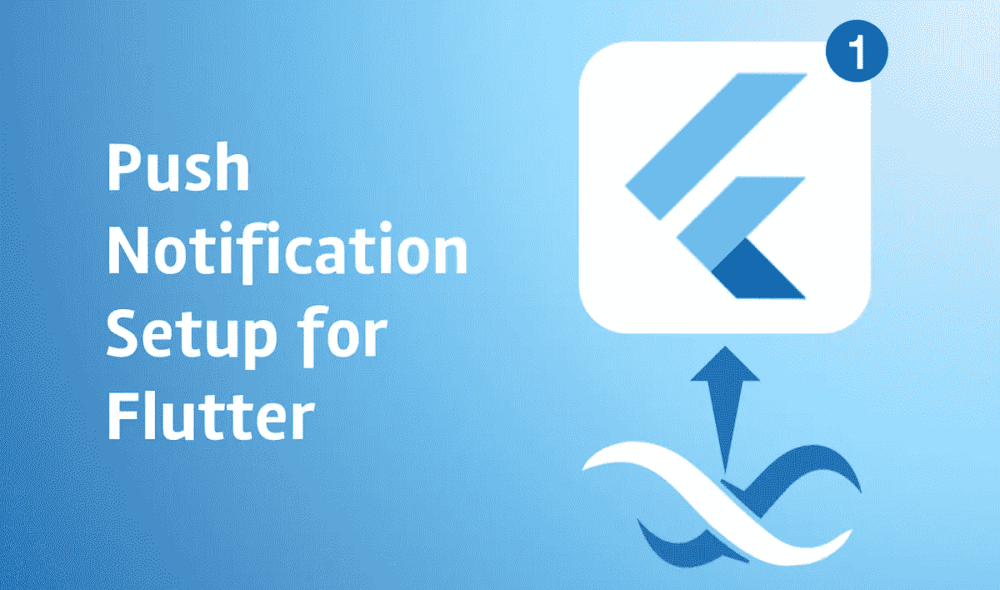
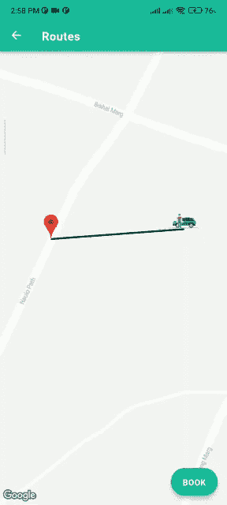
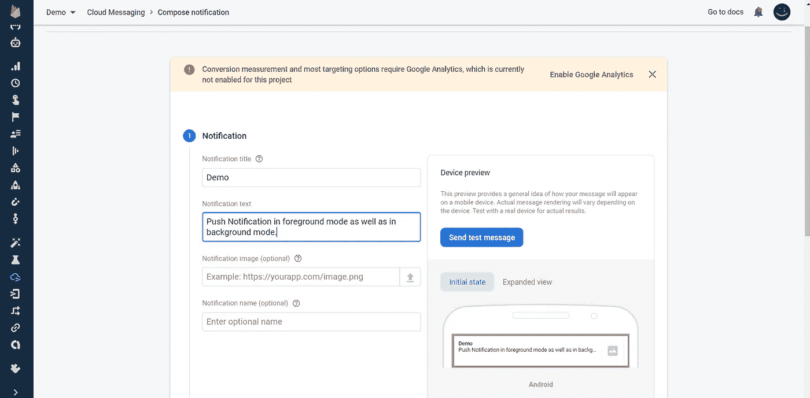
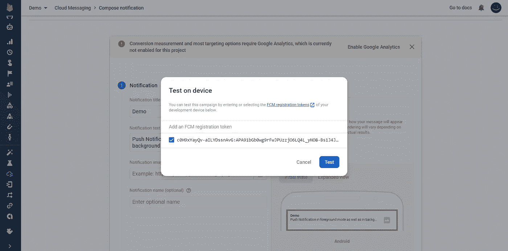

# 使用 Firebase 在后台和前台推送通知

> 原文：<https://medium.com/geekculture/push-notification-in-flutter-in-background-as-well-as-foreground-using-firebase-1e6e7ecad292?source=collection_archive---------0----------------------->



在 Flutter 应用中，我们需要集成**推送通知**。虽然我们成功地集成了它，但有时当应用程序不运行或在后台打开时，我们在发送推送通知时会遇到问题或应用程序崩溃。因此，我们将在 flutter 中集成使用 firebase 的推送通知，它可以在所有状态下工作:前台、后台，甚至是应用程序关闭时(不运行)。此外，如果您想在点击推送通知后将通知重定向到应用程序中某个页面，这里的[是](https://lakshydeep-14.medium.com/on-tap-push-notification-redirect-to-corresponding-screen-in-flutter-9f184068e4f8)链接。

开始吧:)



Notification in Foreground as well as in Background.

> **消防基地和推送通知设置**

# 第一步

*   为您的应用程序创建 firebase 项目，并在 android/app 文件夹中添加 **googleservices.json** 文件。
*   在你的 flutter 项目中安装 [firebase_messaging](https://pub.dev/packages/firebase_messaging) 和 [firebase_core](https://pub.dev/packages/firebase_core) 。

```
firebase_messaging: ^8.0.0-dev.14
firebase_core: any
```

*   像往常一样，在 **build.gradle** (应用级和 android 级)文件中设置 firebase 初始化。
*   对于推送通知，在应用程序级 build.gradle 文件中的依赖项下添加下面一行(*有时我们会面临多索引问题，因此最好在 defaultConfig{}* )
    **下的 defaultConfig:**

```
multiDexEnabled true
```

**依赖关系下:**

```
...
dependencies{
...
**implementation ‘com.google.firebase:firebase-inappmessaging-display:19.1.5’
implementation 'com.android.support:multidex:1.0.3'**
...
}
```

# 步骤二(在当前版本中不需要。请跳过这一步。)

**在 Android/app/src/main/kotlin(*简单说就是你看到 MainActivity.kt 文件的地方在那个文件夹*里创建 Application.kt 文件，复制粘贴下面的代码:**

```
package **<your_package_name>**import io.flutter.app.FlutterApplication
import io.flutter.plugin.common.PluginRegistry
import io.flutter.plugins.firebase.messaging.FlutterFirebaseMessagingBackgroundService
import io.flutter.plugins.firebase.messaging.FlutterFirebaseMessagingPluginclass Application: FlutterApplication(), PluginRegistry.PluginRegistrantCallback {
 override fun onCreate() {
super.onCreate()FlutterFirebaseMessagingBackgroundService.setPluginRegistrant(this)
}
override fun registerWith(registry:PluginRegistry) {
FlutterFirebaseMessagingPlugin.registerWith(registry?.registrarFor(“io.flutter.plugins.firebasemessaging.FirebaseMessagingPlugin”))
}
}
```

# 第三步

在您的 pubspec.yaml 文件中添加[**flutter _ local _ notifications**](https://pub.dev/packages/flutter_local_notifications)**包**

```
flutter_local_notifications:
```

# **第四步**

**在 Android/app/src/main/RES/Android manifest . XML 中添加以下行**

```
<application
  android:name=".Application"
  ...>
  <activity
     ....>
       .....
       <intent-filter>
         <action android:name="FLUTTER_NOTIFICATION_CLICK"/>
         <category android:name="android.intent.category.DEFAULT"/>
       </intent-filter>
  </activity>
...
</application>
```

> ****到目前为止，推送通知已完成，现在我们将转到
> 编码部分。****

# **步骤五**

**在 main.dart 文件的 main 函数中添加这几行。**

```
WidgetsFlutterBinding.ensureInitialized();
await Firebase.initializeApp();
```

# **第六步**

**创建一个页面，并通过分别导入这些包来初始化 firebase_messaging 和 flutter_local_notifications。**

```
import ‘package:firebase_messaging/firebase_messaging.dart’;import ‘package:flutter_local_notifications/flutter_local_notifications.dart’;// create an instance 
FirebaseMessaging messaging = FirebaseMessaging.instance;
FlutterLocalNotificationsPlugin fltNotification;
```

# **步骤七**

**在这里，我们编写了在终端中获取 fcm_token 的代码，这样我们就可以在 firebase 项目中的云消息下使用这些令牌，我们已经在第一步中创建了这个项目。**

```
void pushFCMtoken() async {
  String token=await messaging.getToken();
  print(token);
}
```

# **第八步**

**在这一步中，我们编写代码来接收通知格式和设置。**

```
void initMessaging() { var androiInit = AndroidInitializationSettings(‘@mipmap/ic_launcher’);//for logo var iosInit = IOSInitializationSettings(); var initSetting=InitializationSettings(android: androiInit,iOS:
   iosInit); fltNotification = FlutterLocalNotificationsPlugin(); fltNotification.initialize(initSetting); var androidDetails =
   AndroidNotificationDetails(‘1’, ‘channelName’, ‘channel 
    Description’); var iosDetails = IOSNotificationDetails(); var generalNotificationDetails =
   NotificationDetails(android: androidDetails, iOS: iosDetails);FirebaseMessaging.onMessage.listen((RemoteMessage message) {     RemoteNotification notification=message.notification;
   AndroidNotification android=message.notification?.android;
   if(notification!=null && android!=null){
     fltNotification.show(
       notification.hashCode, notification.title, notification.
       body, generalNotificationDetails);
}
});
}
```

# **步骤九**

**最终代码将是:**

```
import ‘package:firebase_messaging/firebase_messaging.dart’;import ‘package:flutter/material.dart’;import ‘package:flutter_local_notifications/flutter_local_notifications.dart’;class Demo extends StatefulWidget {
@override
_DemoState createState() => _DemoState();
}class _DemoState extends State<Demo> {
FirebaseMessaging messaging = FirebaseMessaging.instance;
FlutterLocalNotificationsPlugin fltNotification;void pushFCMtoken() async {
String token=await messaging.getToken();
print(token);
//you will get token here in the console
}
@overridevoid initState() {
 super.initState();
 pushFCMtoken();
 initMessaging();
}
@overrideWidget build(BuildContext context) {
return Scaffold(
 backgroundColor: Colors.white,
 body: Center(child: Text(“Flutter Push Notifiction”),),);
}void initMessaging() {var androiInit = AndroidInitializationSettings(‘@mipmap/ic_launcher’);var iosInit = IOSInitializationSettings();var initSetting = InitializationSettings(android: androiInit, iOS: iosInit);fltNotification = FlutterLocalNotificationsPlugin();fltNotification.initialize(initSetting);var androidDetails =AndroidNotificationDetails(‘1’, ‘channelName’, ‘channel Description’);var iosDetails = IOSNotificationDetails();var generalNotificationDetails =NotificationDetails(android: androidDetails, iOS: iosDetails);FirebaseMessaging.onMessage.listen((RemoteMessage message) {RemoteNotification notification=message.notification;AndroidNotification android=message.notification?.android;if(notification!=null && android!=null){fltNotification.show(notification.hashCode, notification.title, notification.body, generalNotificationDetails);}});}}
```

**当您运行此代码时，您将在控制台中获得 fcm_token，然后复制该令牌并执行以下步骤:**

# **步骤十**

**打开 firebase 项目，转到云消息部分，编写通知标题和正文，如下所示:**

****

**如上图，点击**发送短信，**你会得到如下图:**

****

**在这里粘贴 fcm_token(您在前面的步骤中从终端复制的内容)并点击**测试**按钮。
因此，在所有这些步骤之后，你会在手机中收到通知，要么应用程序处于运行状态，要么在后台运行，要么被关闭。如果你想打开那个通知，那么[这里的](https://lakshydeep-14.medium.com/on-tap-push-notification-redirect-to-corresponding-screen-in-flutter-9f184068e4f8)就是所有的步骤。**

**最后，推送通知起作用了，你可以在未来的应用中使用这个功能。
谢谢:)**

**关注我[这里](https://www.facebook.com/Flutter-Motivation-with-Lakshydeep-104972618552227/)了解更多更新。**

**欲了解更多信息，请购买书籍"**让自己成为软件开发人员:让我们深入了解 Flutter & MNCs** " [购买](https://www.amazon.com/dp/B09NNXNT6X/ref=sr_1_1?keywords=make+yourself+the+software&qid=1639582180&sr=8-1)。**

****

**继续编码，继续学习，然后继续赚钱
给予反馈**