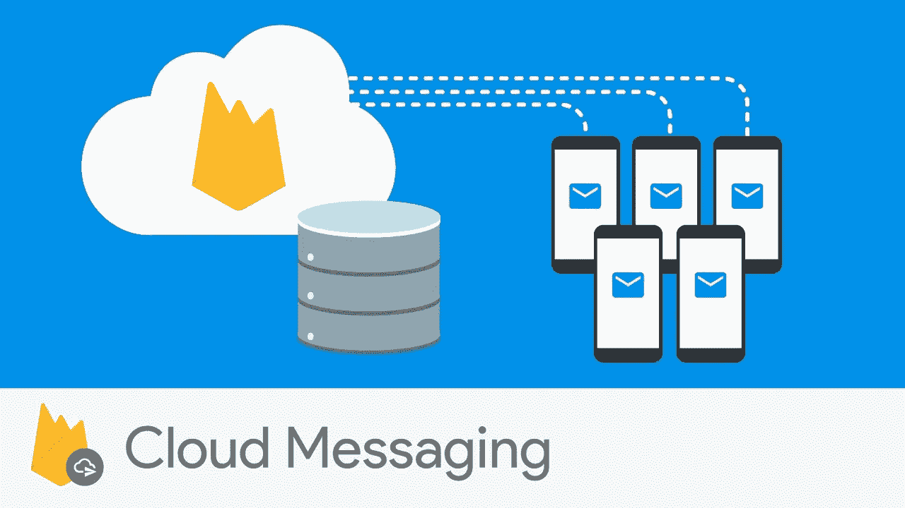
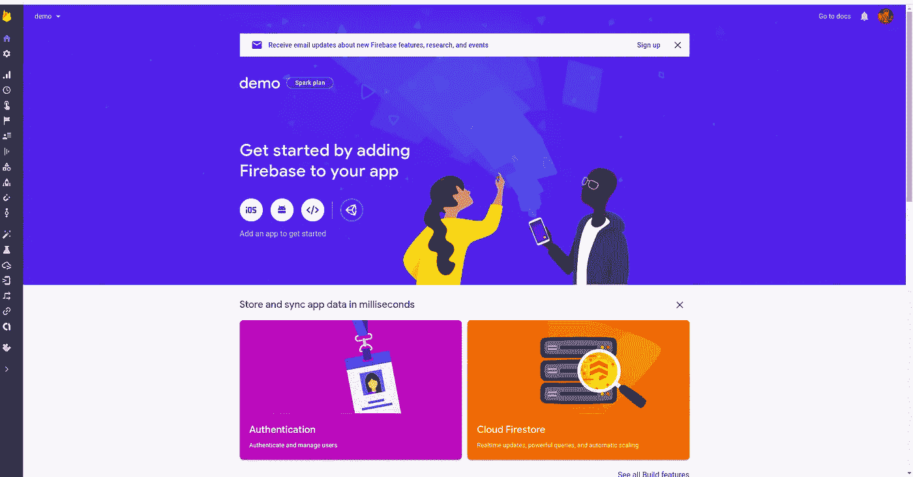
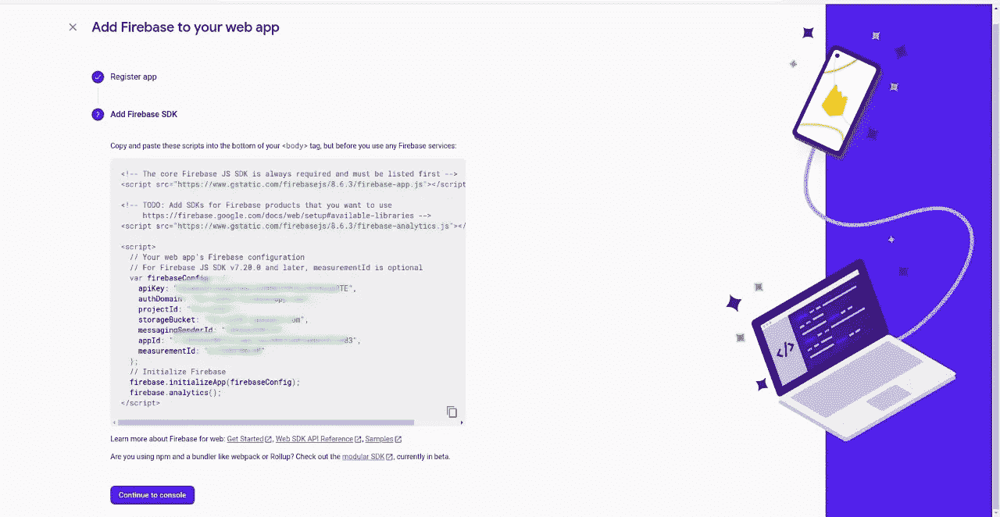
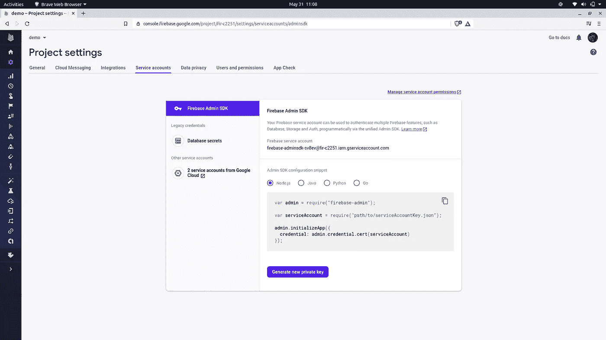
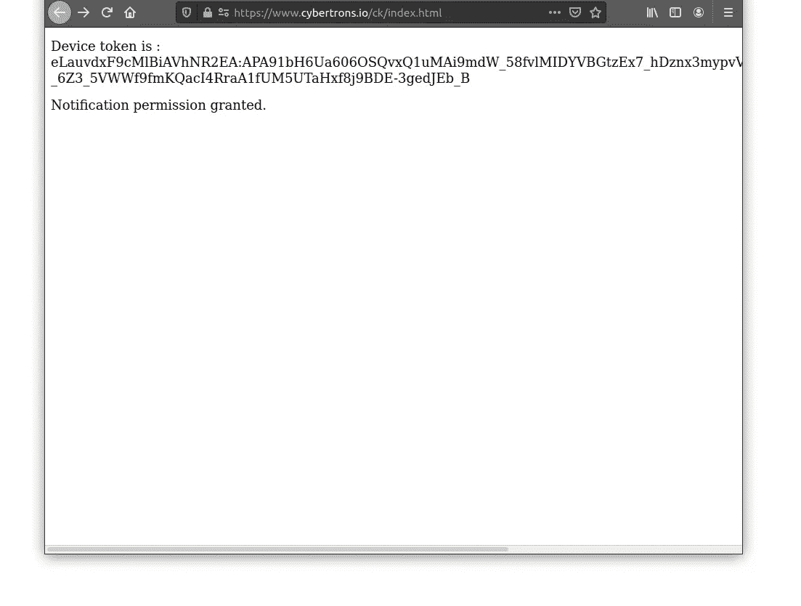
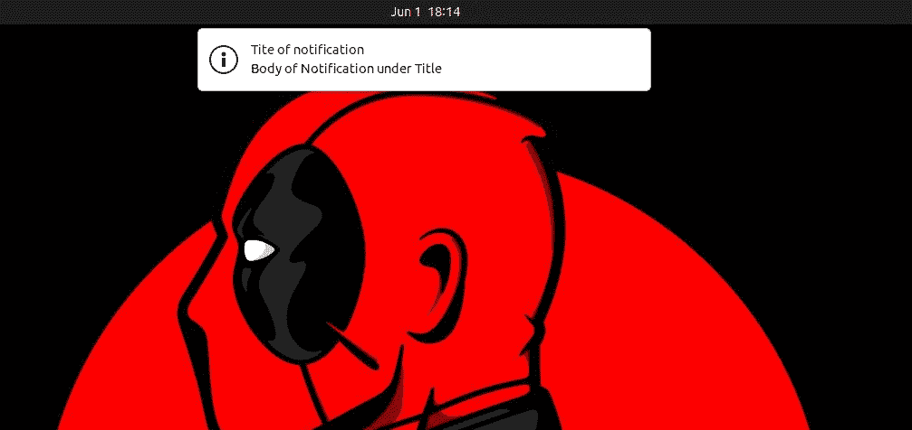

# 使用 Firebase 云消息推送通知

> 原文：<https://medium.com/geekculture/push-notifications-with-firebase-cloud-messaging-2cb67871179?source=collection_archive---------8----------------------->

如果你不被用户遗忘，生意会更好。与客户保持联系的一种创新方式是发送推送通知。Firebase 提供各种服务，其中之一就是推送通知。这是我在 [***虚拟赛伯龙有限公司***](http://cybertrons.in/) ***做项目时学到的。*** 我们将学习当网站在后台时，如何使用 FCM(Firebase cloud messaging)从 NodeJs 服务器向 web 客户端发送推送通知。

步骤如下:

## 1.在 Firebase 控制台上注册

所以第一步是在 Firebase 控制台上注册我们的项目。为了通过 FCM 实现消息传递，我们必须在 Firebase 上注册与项目相关的每个应用程序或网站。您可以在这里 *注册您的项目 [*。*
(如果您没有登录，那么请使用您的 google 帐户登录。)](https://firebase.google.com)*

在这里，我们将创建一个 web 应用程序来发送消息。

After creating project concole looks like this.

在此之后，当您选择 web 应用程序选项并注册您的 web 应用程序时，firebase 会给出一个配置代码来开始使用它。记住这个代码包含了你的 AppId 等重要凭证。所以如果你想的话，你可以复制它，但是不要担心，这些凭证以后也可以被访问。

## 2.在客户端编码服务

为了在客户端创建服务，我们必须至少创建三个文件，即:一个基本的网页，一个消息服务工作者(Javascript 文件)和一个 manifest.json 文件。

让我们创建一个显示 ***注册令牌*** 的基本网页。每个用户或应用程序都有一个唯一的注册令牌，以便专门发送消息，index.html 文件如下所示。(注意，它包含 firebase 控制台在您注册 web 应用程序时给出的启动代码，因此您只需更改凭证。)

contents of index.html

将下面的代码复制到 firebase 消息传递服务工作文件中。将文件命名为 firebase-messaging-sw.js

让我们创建 manifest.json 文件。

因此，我们已经完成了 web 应用程序客户端推送通知的编码。

## 3.从后端向网站发送通知。

您可以通过多种方式发送通知，例如借助 firebase 提供的服务，在终端中使用 curl 命令，通过 postman API 发送 get 请求，或者创建后端服务。
我们将使用 Node.js 创建一个后端服务来发送消息，这样您只需提供一个注册令牌就可以自动完成这个过程。在动手编写代码之前，首先在您的环境中安装软件包“firebase-admin”。

installing Firebase-admin in your node environment.

配置代码必须从 firebase 控制台下载。首先进入你的项目，然后点击项目设置选项，该选项出现在一个齿轮的标志旁边。在“转至服务客户”部分，您会看到如下屏幕:

service account page under project settings.

现在创建一个 Javascript 文件，比如 index.js(您可以复制服务帐户页面上的起始代码，也可以从下面给出的参考中复制代码。)
然后点击生成新的私钥按钮，提示您下载一个带有私钥的文件。这个文件应该放在保存 index.js 的同一个文件夹中。现在让我们编写 index.js 文件。

index.js file for sending messages from Back end.

瞧啊。！
发送通知的每个编码步骤现在都已完成。你要做的最后一件事就是发送信息。

## 4.发送消息。

现在，您必须做的第一件事是在本地主机或在线托管这 3 个客户端文件。在那里，网页将要求您允许通知。
在你允许通知权限之后，注册令牌会显示在网页上。
类似这样的:

现在复制这个注册令牌，并将其粘贴到 index.js 中的 registration token 变量中。现在运行 index.js 文件。你会得到一个类似这样的通知:

A notification came when app was in background :)

您可以在 firebase 文档 [starter 文件中寻找进一步的描述。希望这篇博客对你有所帮助！
感谢阅读，愿代码与你同在。](https://github.com/firebase/quickstart-js/blob/e66ca9175db42053dc7edeeca3b1117ab6e41e19/messaging/index.html)