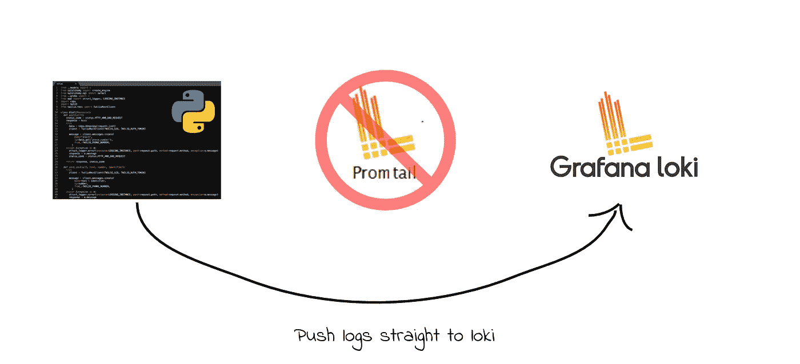
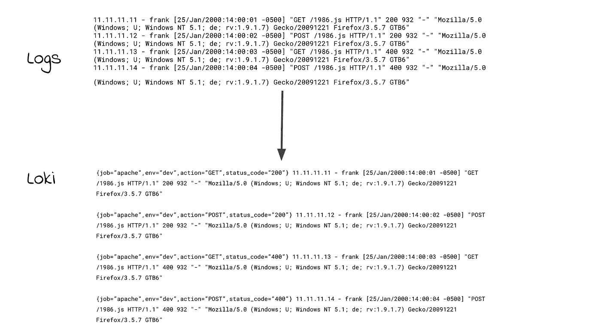
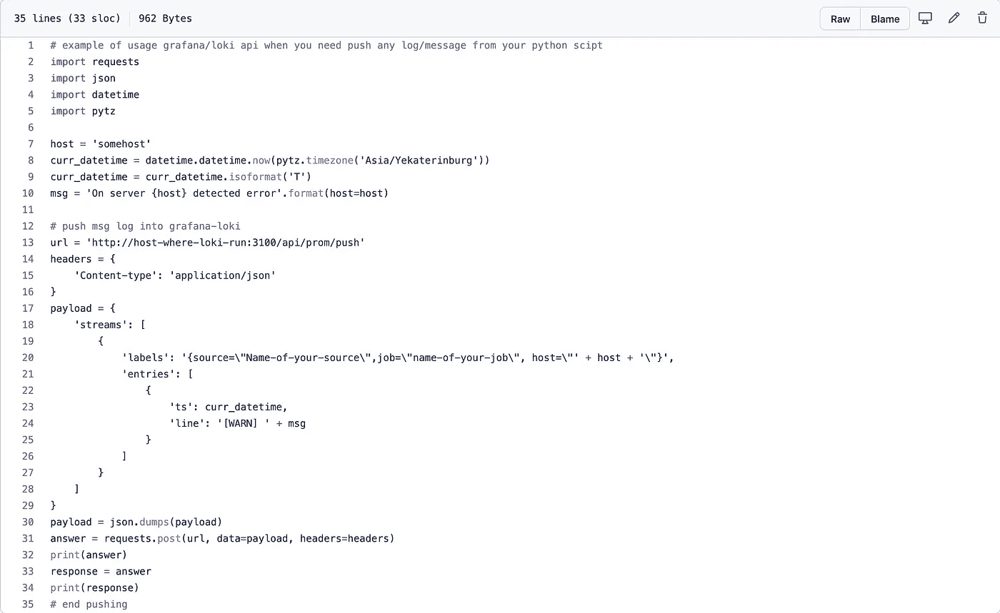
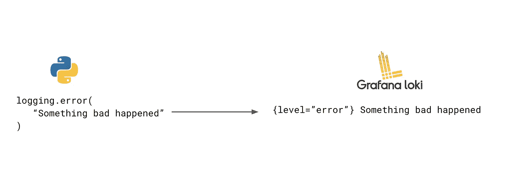
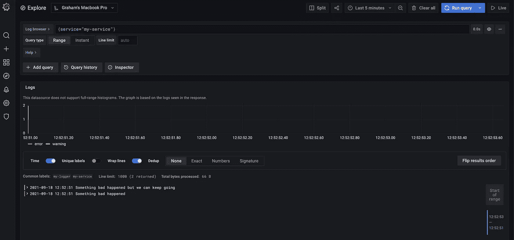
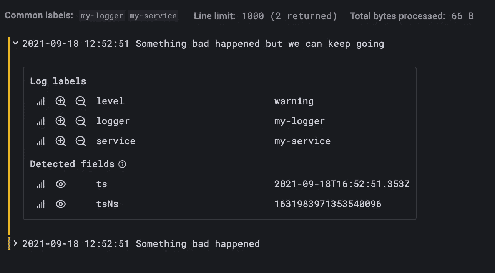
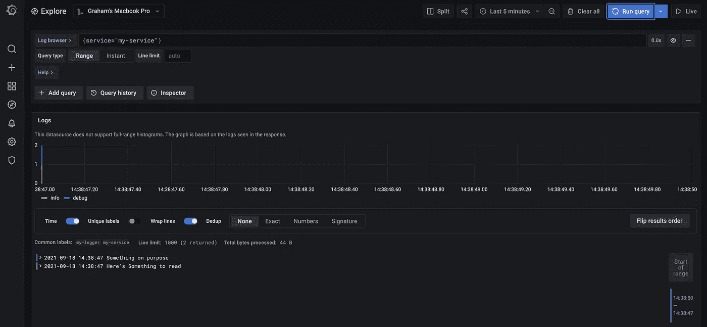
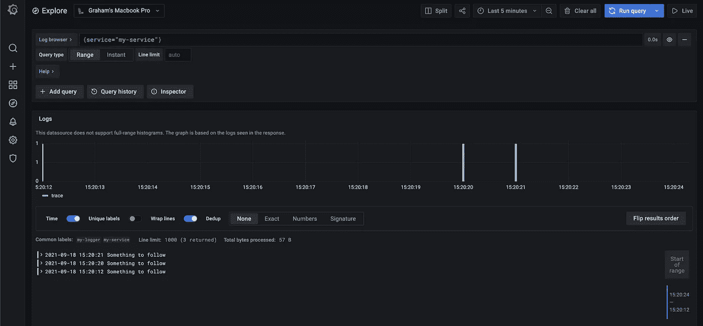
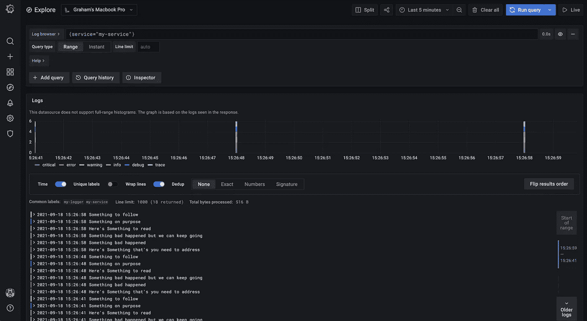

# 不使用 Promtail 将日志推送到 Loki

> 原文：<https://medium.com/geekculture/pushing-logs-to-loki-without-using-promtail-fc31dfdde3c6?source=collection_archive---------1----------------------->

如果您曾经使用过 Loki 进行日志分析，那么您可能对 Promtail 很熟悉。Promtail 是一个可爱的助手，它从你的机器上抓取日志目标，并把它们推送到 Loki。



然而，正如您可能知道的，Promtail 只能被配置为**从文件、pod 或日志**中抓取日志。但是，如果您有一个必须将日志直接发送到 Loki 的用例，该怎么办呢？例如，想象一下，如果我们可以使用 Python 的内置日志模块直接从我们的程序向 Loki 发送日志。原来我也有同样的需求，这就是我解决它的方法。



# 先决条件

*   您已经创建了一个 Loki 实例，并准备好将日志推送到该实例
*   您已经设置了 Grafana，并且知道使用 LogQL 查询日志的基本知识
*   您的机器上安装了 Python，并且有一些脚本编写经验

# 概观

首先，我会注意到 Grafana Loki 确实列出了一个[非官方的 python clien](https://github.com/sleleko/devops-kb/blob/master/python/push-to-loki.py) t，可以用来将日志直接推送到 Loki。然而，我不推荐使用它，因为它非常简单，你可能很难把你的标签转换成 Loki 要求的格式。



[https://github.com/sleleko/devops-kb/blob/master/python/push-to-loki.py](https://github.com/sleleko/devops-kb/blob/master/python/push-to-loki.py)

幸运的是，有人已经解决了我们的问题，它被称为 [python-logging-loki 库](https://github.com/GreyZmeem/python-logging-loki)。本质上，它是一个开源解决方案，使您能够使用 Python 的[日志包](https://docs.python.org/3/library/logging.html)将日志直接发送到 Loki。



其工作方式是通过[将一个名为“LokiHandler”的处理程序](https://docs.python.org/3/library/logging.html#handler-objects)附加到您的日志实例。每次使用模块级函数(例如 logger.error)，LokiHandler 直接向 [Loki HTTP API](https://grafana.com/docs/loki/latest/api/) 发送一个 POST。它还抽象出必须正确格式化 Loki 的标签。

# 初始设置

首先，使用 pip 安装 python logging loki 包。

```
pip install python-logging-loki
```

现在，我们导入两个主要的依赖对象:logging 和 logging_loki。然后我们用参数初始化 Loki 处理程序对象；我们的 Loki 数据源的 URL，以及我们使用的版本。如果您使用的是 Loki ≥ 0.0.4，请使用版本 1。对于 URL，重要的是附加到主机的路径是由 Loki HTTP API 公开的推送端点(/loki/api/v1/push)。

```
import logging
import logging_lokilogging_loki.emitter.LokiEmitter.level_tag = "level"# assign to a variable named handler 
handler = logging_loki.LokiHandler(
   url="http://loki:3100/loki/api/v1/push", version="1",
)# create a new logger instance, name it whatever you want
logger = logging.getLogger("my-logger")
```

如果您使用 Grafana 来可视化日志指标，第 4 行非常重要。默认情况下，LokiEmitter 的 level 标记设置为“severity”。但是，Grafana 中的所有日志查询都会自动显示带有“level”的标记(您将在后面看到这一点)。这个[问题是在 Github](https://github.com/GreyZmeem/python-logging-loki/issues/17) 上提出的，应该使用“级别”而不是“严重性”。但是另一个用户用我们在第 4 行中的代码提供了一个变通方法。

# 让我们做一些记录

现在我们有了 LokiHandler 设置，我们可以将它作为一个处理程序添加到 Python 的日志对象中。

```
logger.addHandler(handler)
```

每次我们调用日志功能时，Loki 处理器都会自动将带有正确标签的日志流推送到 Loki。如果你想给 Loki 发送额外的标签，你可以在调用函数时把它们放在“标签”对象中

```
# now use the logging object's functions as you normally wouldlogger.error(
   "Something bad happened",

   extra={"tags": {"service": "my-service"}},
)logger.warning(
   "Something bad happened but we can keep going", extra={"tags": {"service": "my-service"}},
)# extra={"tags": {"service": "my-service", "one": "more thing"}}
```

现在转到 Grafana 实例，使用其中一个标签查询日志。此外，您可以看到一个配色方案被应用到每个日志行，因为我们之前将 level_tag 设置为“level ”, Grafana 正在使用它。



接下来，如果您单击您的一个日志行，您应该看到由 LokiHandler 应用到流的所有标签。



# 让我们尝试一些其他的功能…但是等等。

现在，如果您真的很渴望，您可能已经尝试过调用函数 logger.info()或 logger.debug()，如下所示:

```
logger.info(
   "Here's Something to read",
   extra={"tags": {"service": "my-service"}},
)logger.debug(
   "Something on purpose",
   extra={"tags": {"service": "my-service"}},
)
```

然而，如果你去检查格拉夫纳他们不在那里！？您没有在仪表板中看到日志的原因是由于 Python 的日志模块中的一种现象，称为**基于级别的过滤。**这是[在 Github](https://github.com/GreyZmeem/python-logging-loki/issues/20) 上提出的另一个问题。

来自 RealPython 的 Brad Solomon 对日志模块的架构进行了深入分析，解释了为什么会出现这种情况。简而言之，Python 的日志级别只是一个映射到整数值的类似枚举的结构。

```
CRITICAL = 50
ERROR = 40
WARNING = 30  <--- default level
INFO = 20
DEBUG = 10
NOTSET = 0# this will return the currently set level
logger.getEffectiveLevel()
```

现在，日志记录对象的默认日志级别设置为 WARNING。这意味着任何低于警告值的值都不会通过。这就是为什么我们看不到调试和信息日志，但我们可以看到警告、错误或严重错误。

# 容易解决的问题

幸运的是，我们只用一行代码就可以解决这个问题。在实例化日志记录对象后，请正确放置:

```
logger.setLevel(logging.DEBUG)
```

这样做的目的是为这个处理程序设置调试阈值(10)。因此，现在任何不如 DEBUG 严重的日志消息都将被忽略。

尝试再次运行您的程序，然后在 Grafana 中查询您的日志。您现在应该可以看到信息和调试日志。



# 添加您自己的日志级别

如果您浏览 Python 的日志记录文档，您会注意到只为错误、警告、信息和调试提供了函数。但是如果您的应用程序需要更多的日志级别呢？例如，“详细”或“跟踪”。

首先，我们必须告诉日志记录对象我们想要添加一个名为“TRACE”的新名称。日志记录有一个名为 addLevelName()的内置函数，它接受两个参数:*级别*和*级别名称*。

```
logging.addLevelName(15, "TRACE")
```

请记住，由于我们将日志级别设置为 debug，如果我们希望它通过，它的值必须大于 10。接下来，我们必须创建一个处理跟踪日志的函数。

```
def trace(self, message, *args, **kws):
   if self.isEnabledFor(15):
   # Yes, logger takes its '*args' as 'args'.
   self._log(15, message, args, **kws)logging.Logger.trace = trace
```

然后，我们动态地将它添加到日志记录对象中。现在，在我们的代码中，我们可以像这样调用 logger.trace():

```
logger.trace(
   "Something to follow",
   extra={"tags": {"service": "my-service"}},
)
```

然后我们可以在 Grafana 中查询它，并看到颜色方案被应用于跟踪日志。



# 最终计划

这是本文涵盖的完整程序。随意改装它来满足你的伐木需要。感谢阅读！



Bonus: rainbow logs!