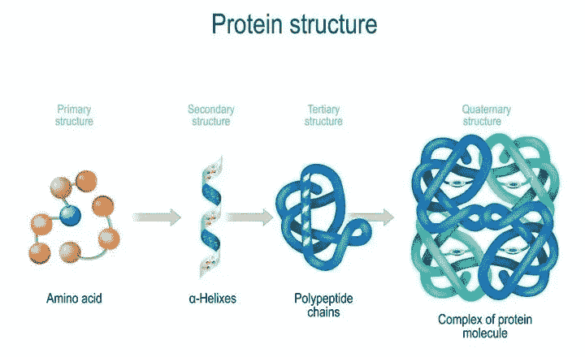
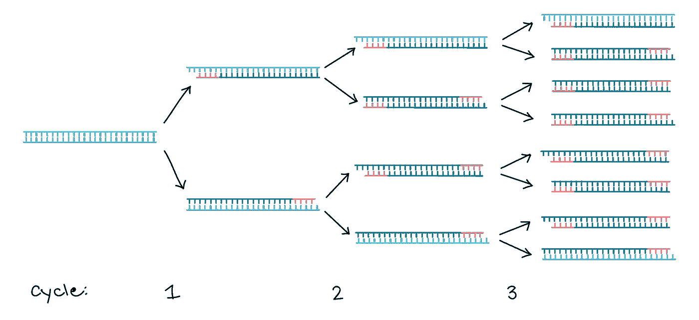
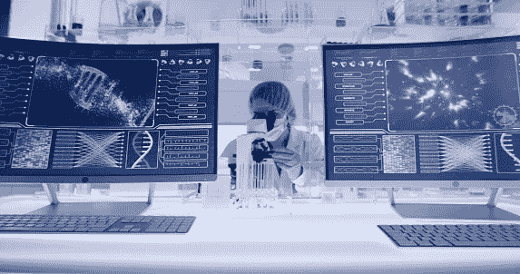

# 推动进化的极限

> 原文：<https://medium.com/geekculture/pushing-the-limits-of-evolution-e8614339d9e4?source=collection_archive---------20----------------------->

## 蛋白质工程导论

职业体育是一个令许多人兴奋的领域。每周，数百万球迷打开电视或者去世界各地的体育馆支持他们的球队。不同的运动队之间有许多激烈的竞争:职业棒球大联盟中的波士顿红袜队和纽约扬基队，足球中的利物浦队和曼彻斯特联队，以及各种其他著名的竞争者。

自从最初的竞争:细菌对病毒首次出现以来，诸如此类的竞争就一直在进行。两人继续在一场赌注巨大的游戏中对峙:生存。失去的细菌或病毒可以经历持续的自然选择过程，这是进化的关键原则之一。无法在其他生物体中生存或不适合其环境的病毒或细菌链将会灭绝，只有最强壮的生物体将会继续存在。

20 世纪 80 年代初，经过数十亿年的进化和复杂生物的发展，著名科学家艾伦·弗什特爵士和格雷格·温特爵士有了一个绝妙的想法。他们可以通过编辑他们的遗传物质来创造可能不是自然进化产物的新的生物体变种，从而控制生物体的进化。这项技术被称为蛋白质工程。

## 目录

1.  什么是蛋白质工程？
2.  流行的方法，如诱变，以及如何使用 PCR 来执行
3.  对不可预测性和不准确性的担忧
4.  为解决这些问题而开发的改变游戏规则的技术
5.  蛋白质工程如何有潜力改变世界
6.  关键要点

## 什么是蛋白质工程？

蛋白质工程是生物技术的一个领域，它使科学家能够利用 DNA 重组(rDNA)技术和分子设计创造出天然不存在的新蛋白质。它目前在生物制药领域有最有用的应用，但它在各种领域也有许多有用的用例。

蛋白质工程有三个主要领域:间接、替代和从头酶工程。Indels 是蛋白质遗传密码中碱基的插入或删除，它们要么在蛋白质中插入一个以前根本不存在的新方面，要么在不替换它的情况下消除蛋白质的一个方面。Indels 用于改变蛋白质的功能、生物物理特性或底物特异性(蛋白质结合特定离子或分子的能力)等因素。

替换包括从蛋白质中取出遗传物质，然后在它的位置上放入新的东西，这通常是在科学家希望保留蛋白质的一般功能但稍微改变其执行细节时使用的(即编辑荧光蛋白为不同的颜色，但不改变它是荧光的事实)。

最后，蛋白质工程的第三种主要类型是从头(翻译成“从零开始”)酶工程。酶是植物、动物和微生物细胞中产生的蛋白质，能加速化学反应。从头酶工程是最具挑战性的蛋白质工程方法。它本质上只是简单地从零开始合成酶，并简单地用于尝试制造具有不太强烈的预定方向感的新蛋白质。

蛋白质工程非常依赖于蛋白质的自然折叠。蛋白质有许多不同的形状，通常看起来像长长的三维曲线(想想卷曲的薯条)。蛋白质的形状是在一个称为生物合成的过程中自然形成的，在这个过程中，一系列的反应酶形成了蛋白质。蛋白质折叠的形状会受到许多外部因素的影响，如温度、pH(酸度)、盐水平和其他因素的存在。科学家已经能够通过在活的有机体之外进行蛋白质的生物合成来开发新的蛋白质。

Source: ResearchGate

蛋白质工程中最大的挑战之一(主要是在 indels 和替换的情况下)是确保蛋白质不会因为基因材料的改变而断裂。如果缺乏执行力，或者初始蛋白质和最终产品之间的差异太大，蛋白质可能会完全断裂。为了防止这种情况，在编辑蛋白质时需要大量的测试和非常仔细的精确度。此外，确保最终产物蛋白质在基因水平上与初始蛋白质非常相似(在 indels 的情况下，不要添加或删除太多，确保编辑的遗传物质与替换中删除的相对相似)可以降低蛋白质断裂的可能性，因此科学家也致力于实现这一目标。

## 流行的方法，如诱变，以及如何使用 PCR 来执行

如前所述，使用 rDNA 技术进行蛋白质工程，该术语包括利用酶(加速化学反应的蛋白质)来工程化新蛋白质的技术。根据修饰的目的和程度，有多种不同的方法用于修饰蛋白质。

蛋白质工程技术的最大类型之一是诱变，一种用于突变基因、蛋白质和生物体的技术。这是一个自然发生的过程，但通常是通过实验室技术实现的。三种主要类型的诱变是随机的(产生各种各样的蛋白质变体，但它们可能是无用的)，集中的/定点的(在非常特定的位点进行工程设计，但获得有功能的蛋白质的几率较低)，和基于重组的(发现工程设计的蛋白质的多样性，以了解它们为什么不同)。

有不同的方法可用于实现诱变，但每种方法的基础是从初始蛋白质合成一个短 DNA 引物(DNA 中的单链核酸)(经历一系列化学反应)来补充突变的 DNA，以便它能与从不同基因外包的 DNA 杂交。

通常，无论蛋白质工程技术是否是一种诱变，它都是使用聚合酶链式反应(简称 PCR)来进行的。这个术语可能听起来很熟悉，因为它也是一种用于进行 COVID 测试的技术。PCR 的工作方式是，一小段 DNA 序列被复制多次，直到它被指数级放大，使其更加可见。这使得检测 COVID 变得更容易，因为病毒脱落分子在大量发现时更容易检测，这在蛋白质工程中很有用，因为科学家能够更好地研究蛋白质的遗传物质，并制定最精确的行动计划，以获得更高的执行成功概率。

Polymerase chain reactions repeatedly copy a sequence of DNA. Image Source: Khan Academy

与其他基于 DNA 的方法相比，PCR 处理高度复杂结构的能力确实较弱，但它也更容易实施，这也是它如此受欢迎的部分原因。

此外，有许多计算技术为科学家提供了通过计算实现蛋白质工程的能力。这些技术相当容易使用，并以更方便和有效的方式模拟了现实生活中工程蛋白质的体验。

蛋白质被工程化(或者蛋白质工程被尝试)之后，就到了评估结果的时候了。蛋白质工程的成功率从 1/1000 到 1/1000 万不等，因此有许多不同的执行可能性(遗传物质的哪一部分改变了，改变了多少，在替换过程中编辑了哪种外部物质，等等。)必考。

因此，确定实验的哪些产品是有效的(如果有的话)可能是一个漫长的过程。首先，对蛋白质进行筛选，以查看每种蛋白质的结果。然后，如果任何蛋白质已经显示出可能成功的迹象，它们被从更大的组中选择出来用于额外的测试和/或观察。

## 对不可预测性和不准确性的担忧

虽然蛋白质工程有令人难以置信的潜力，但必须承认在该领域仍然存在问题和障碍，以全面地看待这项技术。

首先，也许是最重要的，蛋白质工程通常是完全不可预测的。成功制造出一种蛋白质的可能性极小，这种蛋白质既不会在加工过程中断裂，又能获得想要的功能(如果有的话)，成功率从千分之一到千万分之一不等。

许多科学家将他们的职业生涯奉献给该领域，希望开发能够在大规模工程和筛选蛋白质的技术，因为成功工程蛋白质的概率非常低。技术已经开发出来(将在下一节中概述！)，但是蛋白质工程的不确定性仍然常常是一个障碍。

第二，虽然计算蛋白质工程技术可以更容易使用，但是已经发现它们缺乏准确性，并且在执行相同任务时与体内蛋白质工程的成功率没有相关性。该技术只是显示了在不考虑实际准确率的情况下如何执行某些任务，这意味着在寻找蛋白质工程技术成功可能性的洞察力时，该技术不是一个非常有价值的工具。

显然，尽管蛋白质工程显示出巨大的前景，并且在某些情况下已经能够产生巨大的影响，但是仍然有很大的障碍使得它的成功并不一致。也就是说，许多人致力于开发能够解决这些障碍的技术，以提高流程的效率。

## 为解决这些问题而开发的改变游戏规则的技术

首先是麻省理工学院设计的一个机器人模型,用于在定向进化的情况下加速筛选蛋白质样本和选择有希望的样本的过程(制造蛋白质的许多变体，以查看哪些最有效/有用)。

该模型挑选出在显微镜下识别的哺乳动物细胞，这些细胞表达了科学家们正在寻找的多种特定属性，并在短短几个小时内筛选了超过 10 万个蛋白质样本，方法是使用多种不同的标准对它们进行评估，这些标准将优化蛋白质相对于初始蛋白质的价值。

这项技术特别是在执行定向进化时非常有用，因为机器人技术的使用使得筛选数十万种蛋白质的过程远比人类能够做到的更有效，并且其自动化的性质充当了一个常数，消除了以前人为错误的潜在因素。

Screening each individual protein manually can be incredibly time consuming, but technology can perform screenings far more efficiently. Image Source: Unsplash

另一种用于优化蛋白质工程的伟大技术是生物传感器。生物传感器是用于检测生物物理特性的分析设备，其结合了生物成分和物理化学检测器。这使得它们对于监测蛋白质非常有用。来自中国生物反应器工程国家重点实验室的一组科学家设计了一种基于[酶的生物传感器](https://www.pnas.org/content/118/13/e2101618118)，用于监测和工程蛋白质内的蛋白质稳定性。

蛋白质稳定性是蛋白质中非常需要的特性，基于其不可预测和非自然的性质，在工程蛋白质中实现这一特性是具有挑战性的。科学家的生物传感器的工作方式是将感兴趣的蛋白质插入到他们专门设计的基于酶的生物传感器中，该生物传感器形成稳定的荧光化合物，然后将它们的稳定性与蛋白质结合，从而增加蛋白质的稳定性。

这对所有类型的蛋白质都有用，但对工程蛋白质尤其有用，因为它们通常不稳定，增加它们的稳定性可以帮助它们保持完整和有效地发挥功能。

此外，由于蛋白质工程的计算模型已被证明在预测工程蛋白质样品的成功率方面是无效的，在过去的一年中，已经有一些小组致力于将机器学习整合到能够进行这种预测的计算模型中。

一群来自佛罗里达大学的机器学习专家设计了 [ECNet](https://www.nature.com/articles/s41467-021-25976-8) (进化上下文集成神经网络)，这是一种旨在预测特定工程蛋白质的功能而不是简单地展示执行的工具。这具有不可思议的潜力，因为计算方法的更高效率和可及性与成功设计的蛋白质的精确预测相结合，这种结合将使蛋白质的效率成倍提高，风险更低。

## 蛋白质工程如何有潜力改变世界

总之，蛋白质工程是一项具有巨大潜力和各种机会产生巨大影响的技术。它可以帮助数百万患者获得更个性化和更有效的医疗护理，优化皮革和纸张等产品，通过制造更多可生物降解的材料来极大地改善环境，并将进化的极限扩展到以前无法想象的程度。

确实存在一些挑战，这些挑战阻碍了该技术目前发挥其全部潜力，但是随着大规模测试的继续进行和辅助技术的发展，边界继续被推进，该领域的挑战被克服。科学和技术领域继续蓬勃发展，正如我们所知，蛋白质工程正处于改变世界的技术前沿。

## 关键要点

1.  蛋白质工程是生物技术的一种技术和形式，使科学家能够在重组 DNA 技术的帮助下创造出天然不存在的新蛋白质。
2.  蛋白质工程功能的三个主要方面是插入(从已有蛋白质中插入和删除)、替换(从已有蛋白质中替换遗传物质片段)和从头酶工程(从零开始构建全新的蛋白质)。
3.  蛋白质工程是基于赋予蛋白质形状的天然折叠。当寻找在替换情况下匹配良好的蛋白质时，具有相似折叠和氨基酸模式的其他蛋白质更有可能被成功编辑，因为它们与被替换的遗传物质差异较小。
4.  诱变是蛋白质工程中的标准方法，通常用作基础。这三种类型的诱变是随机的、定点/聚焦的和基于重组的。
5.  就执行而言，聚合酶链式反应(PCR)是执行诱变或其他技术的流行方式。他们对一段遗传物质进行多次复制，以成倍增加其可见性。与基于 DNA 的方法相比，它们获得高度复杂结构的能力较弱，但也更容易实施。
6.  蛋白质工程在生物制药和医疗保健、可持续发展、食品、化妆品等许多领域有着有益的应用。它优化蛋白质的特性使它对优化各种材料非常有用，它对精确医疗也很有帮助。
7.  该领域的两个大问题是蛋白质工程的高度不可预测性和使用计算方法时工程蛋白质缺乏可预测性。
8.  出于这些考虑，也有许多科学家致力于创造技术来克服这些挑战，并通过机器人模型、生物传感器、机器学习算法和其他尖端技术工具来最大限度地提高蛋白质工程过程的效率。
9.  尽管由于某些原因，蛋白质工程还不够完美，但它具有不可思议的潜力，可以在各种行业产生巨大的积极影响。

非常感谢你阅读我的文章，我希望你喜欢它！我叫刘冰·博恩施泰因，今年 15 岁。我对神经科学和生物技术的分支充满热情，尤其是当它们涉及到治疗神经疾病时。我很乐意在 LinkedIn 或 Twitter 上联系你，或者你可以在 rainabornstein@gmail.com 联系我，与我交谈或合作。我等不及收到你的来信了！