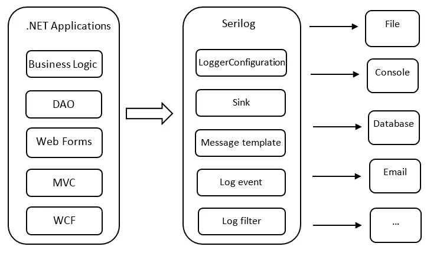
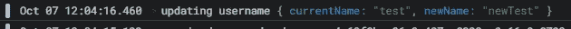
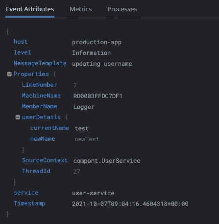

# 通过 Serilog 接收器将您的日志推送到 Datadog

> 原文：<https://medium.com/geekculture/pushing-your-logs-to-datadog-through-serilog-sink-77f0f26de53?source=collection_archive---------5----------------------->

整合你的。NET 核心应用程序与 Serilog 和 Datadog，有很大的能见度在你的代码中发生了什么。


Image by [Randy ORourke](https://unsplash.com/@taylor655ce) on [Unsplash](https://unsplash.com/)

## 什么是 Serilog？

Serilog 是一个**结构的**和便携式日志框架，用于将诊断日志记录到文件、控制台和其他地方的**。**

**结构化日志记录通过将事件捕获过程与其向最终用户的传输和呈现分离开来，提高了搜索和分析代码的效率和可伸缩性。它们被视为一组带有时间戳的键/值属性，而不是将日志视为一系列文本行。例如，考虑这两行之间的差异:**

```
# text
2021-10-07 09:05:37 [INF] UsersController:GetUserDetails#45 getting details for user with ID 16
# structured
time=2021-10-07 09:05:37, level=INF, service=UsersController, method=GetUserDetails, line_num=45, content=details for user with ID 16
```

**如果我们仔细检查第二个日志，我们会意识到它实际上是一个 JSON。所以让我们把它改写成一个:**

```
{
  "time": "2021-10-07 09:05:37",
  "level": "INF",
  "service": "UsersController",
  "method": "GetUserDetails"
  "line_num": 45,
  "content": "details for user with ID 16"
}
```

**像 [Datadog](https://www.datadoghq.com/) 这样的工具可以帮助我们高效地显示、分析和搜索结构化日志。**

**Serilog 使用一个称为“汇点”的概念，将日志路由到不同的目的地。这些接收器允许将日志发送到文本文件、数据库或基于云的监控平台，如 Datadog。下图直观地展示了水槽的工作原理:**

****

**Image by [codeproject](https://www.codeproject.com/Articles/1041816/Serilog-An-Excellent-Logging-Framework-Integrated)**

## **将 Serilog 与集成。网络核心**

**首先，安装 Serilog。将包加载到你的应用中。**

```
dotnet add package Serilog.AspNetCore
```

**接下来，让我们为我们的应用程序设置 JSON 添加一个基本配置:**

```
{
  "Serilog": {
    "Using": [ "Serilog.Sinks.Console" ],
    "MinimumLevel": {
      "Default": "Information",
      "Override": {
        "Microsoft": "Warning",
        "System": "Error",
        "AWSSDK": "Warning"
      }
    },
    "WriteTo": [
      {
        "Name": "Console",
        "Args": {
          "formatter": "Serilog.Formatting.Compact.CompactJsonFormatter, Serilog.Formatting.Compact"
        }
      }
    ],
    "Enrich": [ "WithThreadId", "WithMachineName" ]
  },
  "Datadog": {
    "url": "https://http-intake.logs.datadoghq.eu"
  }
}
```

**现在不要关心细节，我们稍后会提供详细的解释。**

**现在，让我们为 Datadog 日志包添加 Serilog 接收器:**

```
dotnet add package Serilog-Sinks-Datadog-Logs
```

**为了将 Serilog 集成到我们的应用程序中，我们使用了`UseSerilog`方法。在`Program.cs`文件中，插入以下内容:**

```
public static IWebHostBuilder CreateWebHostBuilder(string[] args) =>
    WebHost.CreateDefaultBuilder(args)
        .UseSerilog()
        .UseStartup<Startup>();
```

**现在我们将在我们的`Startup.cs`文件中配置数据狗接收器:**

```
var datadogConf = new DatadogConfiguration(configuration.GetValue<string>("Datadog:url"));
logger = logger.WriteTo.DatadogLogs(
    _vaultService.GetSecret("DatadogApiKey"),
    service: "development-backend",
    host: Environment.GetEnvironmentVariable("DD_HOST") ?? "production",
    configuration: datadogConf
);
```

**`Datadog:url`是数据狗 API URL(例如[https://http-intake . logs . data dog HQ . eu)，](https://http-intake.logs.datadoghq.eu),)我们从我们的保险库中获取 API 密钥。**

**此外，我们添加了以下[丰富器](https://github.com/serilog/serilog/wiki/Enrichment)来使我们的日志更加详细:**

```
using System.Runtime.CompilerServices;
using Serilog;

namespace company;

/// <summary>
/// This class is used to enrich the default Serilog fields.
/// For example, we can add the method's name, and the exact line number from
/// which the log is executed.
/// </summary>
public static class LoggerExtensions
{
  public static ILogger Enrich(this ILogger logger,
    [CallerMemberName] string memberName = "",
    [CallerLineNumber] int sourceLineNumber = 0)
  {
    return logger
      .ForContext("MemberName", memberName)
      .ForContext("LineNumber", sourceLineNumber);
  }
}
```

**我们使用这个 enricher 来查看日志中的源代码行号和成员名称。**

**最后，我们需要安装以下软件包:**

```
SeriLog.Enrichers.Environment
Serilog.Enrichers.Thread
Serilog.Formatting.Compact
```

## ****使用记录器****

**下面是一个使用记录器的示例:**

```
public class UserService : IUserService
{
    private static readonly ILogger Logger = Log.ForContext(MethodBase.GetCurrentMethod().DeclaringType).Enrich();

    public async Task<HttpResponseMessage> UpdateUserName(string userName)
    {
        Logger.Information("updating username {@userDetails}", 
            new { currentName = context.GetUserName(), newName = userName });
        // ...
    }
}
```

**在 Datadog 中，我们应该看到类似这样的内容:**

****

**Datadog**

****

**Datadog**

**上述 JSON 的所有字段都可以通过 Datadog 仪表板定制，并在单独的列中查看，这使得您的重要日志非常详细且可定制。**

****总结****

**通过利用 Serilog 接收器，您可以将结构化日志发布到 Datadog，提供一个集中的平台来分析、监视和搜索应用程序中的事件。向 Datadog 发送日志的能力可以提高应用程序的可见性和控制力，从而更容易实时识别和解决问题。这将提高应用程序的可靠性和性能，并带来更好的用户体验。**