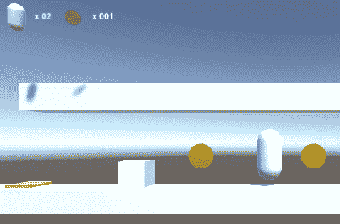
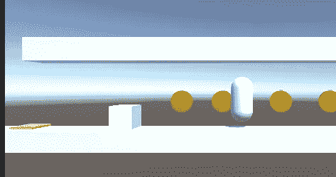
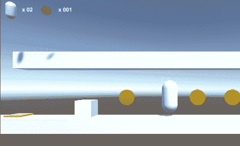
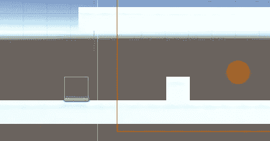

# 拼图—推动物体

> 原文：<https://medium.com/geekculture/puzzles-pushing-object-aeedb6f82ef3?source=collection_archive---------10----------------------->

**目标**:完成一个推盒子的游戏

在本教程中，我们将让角色**将一个盒子**(白色)推到一个压力垫(黄色)上，以便触发和产生效果。这是一个简单的学习逻辑的方法，但是只需要一点点努力就可以扩展到更复杂的行为。

为了推动盒子，它必须携带一个碰撞器(不是触发器)和一个刚体组件。

我**冻结了旋转**，所以箱子只会在被推动时滑动，而不会滚动。

首先，我们必须在`OnControllerColliderHit()`中添加一个案例，以检测与具有特定标签的对象的碰撞:*可移动*。

我们将`hit`参数传递给执行实际推送的方法。

因为盒子有一个刚体组件，我们可以**设置它的速度**属性来模拟一次推动。由于这只会在碰撞时发生，所以影响会很大。应用的速度遵循一个简单的公式，包括角色的速度(`moveDirection`)和盒子的质量(质量越大，移动越慢)。

现在让我们用一个专用脚本来处理压力垫的行为。

压力垫有一个盒子碰撞器，作为触发器。

当带有*可移动*标签的盒子进入触发器并停留在其中时，我们检查压力垫和盒子之间的距离，这是评估它们之间重叠的简单方法。当有足够的重叠时，我们使盒子“*不可移动*”:我们改变它的标签并冻结位置。我们通过禁用网格渲染器来使压力垫消失，就好像盒子压了它一样。

因此，该框将变为绿色，并会出现一条消息。

