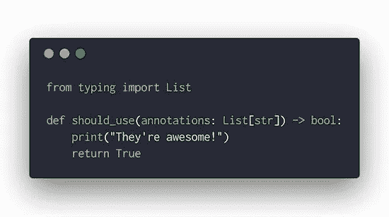

# Pydantic，特殊的雪花，和有毒的自我重要性

> 原文：<https://medium.com/geekculture/pydantic-special-snowflakes-and-toxic-self-importance-be0f2d88b26?source=collection_archive---------15----------------------->

## 开源/ Python 社区

## 发脾气不是合作。

## 我的 Python 打字史

我已经做了 5 年多的全职 Python 开发人员。这是我的第一语言，我喜欢它。大约 4 年前，我过渡到了 Python 3.7，从那以后，我一直致力于开源。Python 的类型系统最让我兴奋的一点是，它能够在运行时以一种标准静态类型语言无法实现的方式来描述和强制类型。在我迁移到 3.7 之后不久，我发布了自己的运行时类型分析库:[典型的](http://python-typical.org)。

在我发布第一版《典型化》后不久，我的一个同事给我看了《Pydantic》。它出现在与我自己的图书馆相似的时间线上，自然我很好奇。那时我们两个库的主要区别是，我的库主要关注的是加强函数注释，而 Pydantic 主要关注的是定义数据模型。这是一个包含电池的图书馆，几乎可以满足你的所有需求，我非常尊重他们为让人们的生活更轻松所做的工作。

## 评估 Pydantic 的实施

我评估了 Pydantic，从它的实现中学到了很多。我学到的第一件事就是永远不要用 Pydantic 的方式来建造图书馆。我很乐意承认这通常是一个深奥的问题和个人品味的问题，但我认为它导致了真正的问题，创造了持续不断的痛苦，以支持。

Pydantic 的运行时类型分析和类型转换实现的问题是，它试图与 Python 并行地构建自己的类型系统。这从类本身实际上是如何构建的开始。通过在元类上全押，Pydantic 劫持了 Python 本身定义的自然类结构。这意味着几件事:

1.  如果你想使用 Pydantic，你必须在任何地方使用它，并且你必须采用它的类型系统(例如，所有东西都必须是 Pydantic BaseModel)。
2.  与许多 Python ORMs 一样，您定义的“类”在行为和检查上与普通类甚至数据类有着根本的不同。(只有关键字的参数、没有定义的签名、用于 IDE 或静态类型分析的自定义插件等。)
3.  Pydantic 试图模仿流行的接口(例如，数据类)，但它并不真正与 Pydantic 的类型系统一起工作，[导致了许多问题](https://github.com/samuelcolvin/pydantic/issues?q=is%3Aissue+dataclass)。

撇开深奥的原因不谈，我承认 Pydantic 很受欢迎，它帮助人们做他们的工作，所以我对这个库并没有什么不满，我个人并不关心它的实现。

## 有毒的自我重要性与可疑的实施相冲突

几天前，当 Pydantic 的作者提交了一个关于[推迟注释评估(PEP 563)](https://www.python.org/dev/peps/pep-0563/) 的延迟特性的问题时，我的态度发生了变化。在[第 2678 期](https://github.com/samuelcolvin/pydantic/issues/2678)中，Pydantic 的维护者大胆断言，PEP 563 中引入的变化将从根本上打破运行时类型分析的整个生态系统。

**这是一个错误的论断。**我对 Pydantic 中的相关问题进行了审核，发现只有一个案例我的库不支持，[我花了大约 2 个小时写了大约 40 行代码解决了这个问题](https://github.com/seandstewart/typical/releases/tag/v2.1.3)。我在自己的代码中使用 PEP 563 注释已经一年多了，并对自己的库做了一些修改，以确保支持不断向前发展。总的来说，延迟评估极大地提高了我支持复杂用例的能力，比如递归或自引用类型。

Pydantic 一直等到 Python 3.10 测试版发布前几天才公开一个问题(在它自己的问题板上！)作为其社区的行动号召。自从 PEP 被引入和接受以来，Pydantic 一直致力于支持它，但从未联系 SC 或 PEP 的作者来传达其关注点并与他们合作解决问题。如果它担心 PEP 563 和 Python 3.10，它应该在过去的 2 年里主动与 SC 沟通，而不是在发布截止日期前几天公开发难并迫使 SC 完全改变路线。

协作不是这样的。这就是你讨厌与之共事的那个妄自尊大的开发人员总是为所欲为的方式。跟风助长了这种有害的(而且经常被容忍的)行为。

## 摇着尾巴的狗

不幸的是，[对话现在被 Pydantic 的抱怨所主导](https://mail.python.org/archives/list/python-dev@python.org/thread/ZBJ7MD6CSGM6LZAOTET7GXAVBZB7O77O/), Pydantic 积压多年的与支持 PEP 563 相关的问题看起来像是绝对的证据，表明当现实非常不同时，运行时分析被这个特性严重削弱。我不反对 CPython 的核心开发者和 SC 选择延迟这个特性——这是他们唯一的选择。但是 Pydantic 做了一个深思熟虑的选择，按下紧急按钮，放了一把火，而不是与图书馆所依赖的人合作。[这位 Reddit 用户总结得很好](https://www.reddit.com/r/Python/comments/mrp6is/pep_563_pep_649_and_the_future_of_pydantic_and/gupfxli?utm_source=share&utm_medium=web2x&context=3):

> 看到这个首先想到的是
> 
> *有人从 pydantic/fast api 与核心开发者交流过这个问题吗？*
> 
> 这不是一个突然冒出来的问题。自 2018 年以来，这一问题在 pydantic 已经为人所知，许多罚单已经归档并正在处理，但似乎像打地鼠一样反复出现，无法得到满意的解决。
> 
> Colvin 本质上就像一个经理一样，试图在最后一刻阻止一个主要的发布，因为在发布被冻结之前不久，它以他们已经知道多年的方式破坏了他们的项目*。走吧。我们都不得不面对来自管理层的压力，那么我们为什么要把这种压力强加给自己呢？？*

我希望我们能够在不严重阻碍 Python 发展的情况下继续前进。我们现在有了一个先例，对此我们需要非常谨慎。