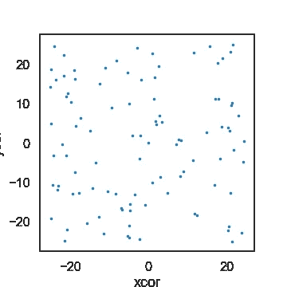
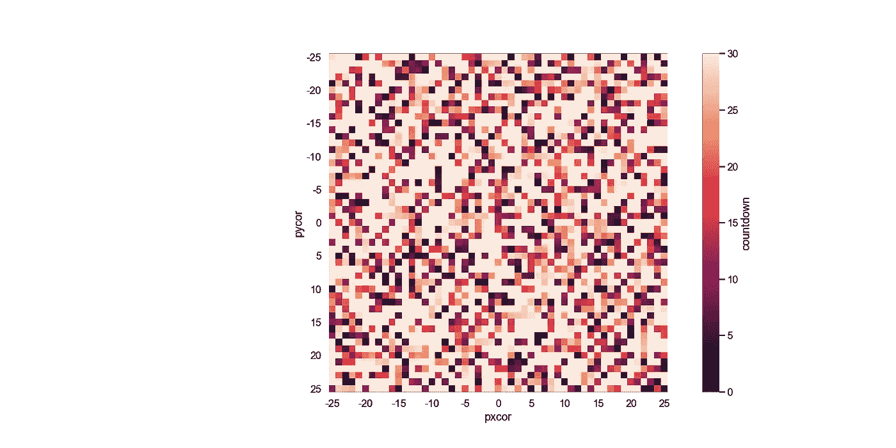
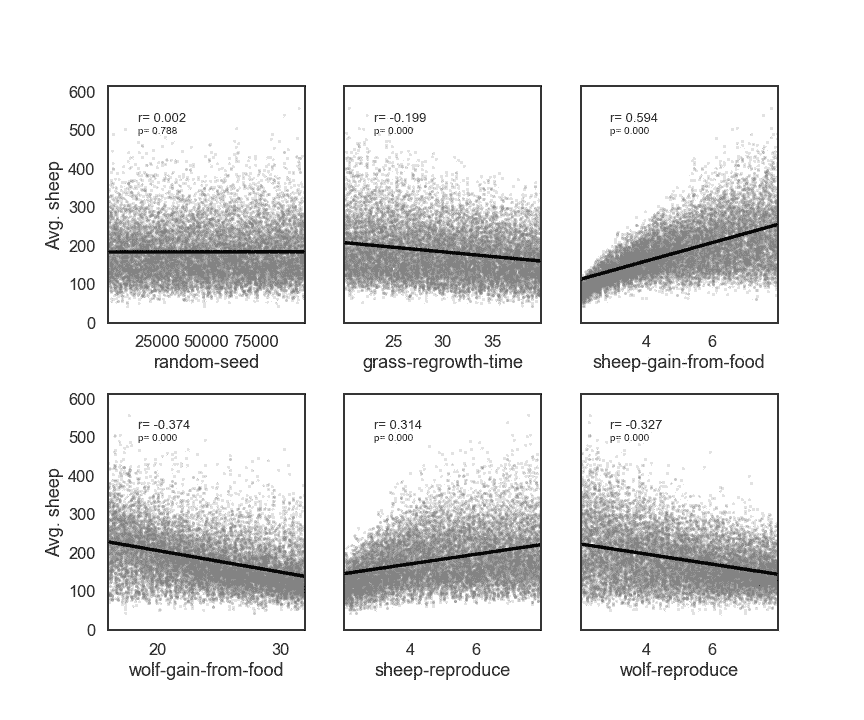
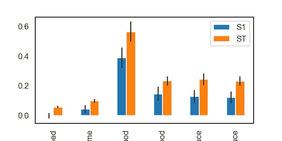
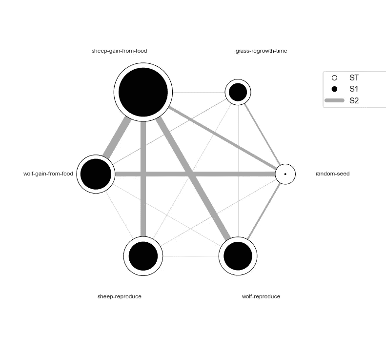

# PyNetlogo 教程

> 原文：<https://medium.com/geekculture/pynetlogo-tutorial-ea3146188561?source=collection_archive---------28----------------------->

PyNetlogo 是一个 python 包，用于将 Netlog 链接到 Python。最新版本是 0.3。我不认为在 0.3 版本发布后它得到了很好的管理。有以下三个重要网页:

[论文:PyNetLogo:用 Python 链接 NetLogo](http://jasss.soc.surrey.ac.uk/21/2/4.html)
[PyNetLogo 主页](https://pynetlogo.readthedocs.io/en/latest/)
[PyNetLogo Github](https://github.com/quaquel/pyNetLogo)

还有一个:
[我的 PyNetlogo 教程](https://www.youtube.com/watch?v=qLBzT85Z-aM)

# 安装和虚拟环境

我强烈建议为新的包创建一个虚拟环境。JPype 包在 Pyhton 3.8 或更老版本中更稳定。

```
conda create -n netlogo-env python=3.8# For JPype
conda install -c conda-forge jpype1

# For PyNetLogo
pip install pynetlogo
```

# 导入库

```
import pandas as pd
import numpy as np
from scipy import stats
import matplotlib.pyplot as plt
import seaborn as sns
import pyNetLogo sns.set_style('white')
sns.set_context('talk')%matplotlib inline
```

# 从 Netlogo 模拟中获取数据:`.command`和`.report`

```
# open Netlogo
netlogo = pyNetLogo.NetLogoLink(gui=True)# Load the Model
netlogo.load_model('C:/Program Files/NetLogo 6.1.1/.../Wolf Sheep Predation.nlogo')# Setup and Choose  model-version = "sheep-wolves-grass"
netlogo.command('setup') # Get the coordinates of agents(sheep) from Netlogo
x = netlogo.report('map [s -> [xcor] of s] sort sheep')
y = netlogo.report('map [s -> [ycor] of s] sort sheep') # Make a plot
fig, ax = plt.subplots(1)
ax.scatter(x, y, s=4)
ax.set_xlabel('xcor')
ax.set_ylabel('ycor')
ax.set_aspect('equal')
fig.set_size_inches(5,5)
plt.show()
```



# 使用`.command`或`.repeat_report`重复模型模拟

```
# Run 100ticks 
netlogo.command('repeat 100 [go]')# or# Run 100 ticks and Report 'count wolves'
netlogo.repeat_report(['count wolves'], 100, go='go')
```

# 将数据导入 Netlogo 模型:`.write_NetLogo_attriblist`

```
# ex_data is a pandas DataFrame having three columns : col1, col2, and col3.
ex_data[['col1','col2','col3']]# Import the data to col1, col2 and col3 attributes of the 'breed'
netlogo.write_NetLogo_attriblist(ex_data[['col1','col2','col3']], 'breed')
```

# `.patch_report`不起作用。

为了从补丁中获取数据，我们需要使用`.patch_report`。但是它给出了一个错误信息。或者，我用`.report`。

```
# Error
countdown_df = netlogo.patch_report('countdown')# Alternative way
countdown_df=netlogo.report('map [s -> [countdown] of s] sort patches')# Reshape for 51 by 51 square
countdown_df=countdown_df.reshape(51,51) # Convert to DataFrame
countdown_df = pd.DataFrame(countdown_df) # Change index and column names
countdown_df.columns=[list(range(-25,26))]
countdown_df.index=[list(range(-25,26))]# Make a plot
fig, ax = plt.subplots(1)
patches = sns.heatmap(countdown_df, xticklabels=5, yticklabels=5,
                      cbar_kws={'label':'countdown'}, ax=ax) 
ax.set_xlabel('pxcor')
ax.set_ylabel('pycor')
ax.set_aspect('equal')
fig.set_size_inches(20,10)
plt.show()
```



# 导出补丁数据和更改补丁数据:`.to_excel`和`.patch_set` >

```
countdown_df.to_excel('countdown.xlsx')netlogo.patch_set('countdown', countdown_df.max()-countdown_df)
```

# 敏感性分析—使用 SALib

我认为 PyNetlogo 网站需要更新敏感性分析部分，因为**代码不起作用**。 **SALib** 有两个视图用于分析。一个叫`Direct view`，一个叫`Load balanced view`。我找不到一个替代方法来使用网站所使用的后者。在本教程中，我使用 **SALib 直接视图**方法进行灵敏度分析。

导入两个函数用于采样和分析。

```
from SALib.sample import saltelli
from SALib.analyze import sobol
```

1.  确定参数及其范围

```
problem = {
  'num_vars': 6,
  'names': ['random-seed',
            'grass-regrowth-time',
            'sheep-gain-from-food',
            'wolf-gain-from-food',
            'sheep-reproduce',
            'wolf-reproduce'],
  'bounds': [[1, 100000],
             [20., 40.],
             [2., 8.],
             [16., 32.],
             [2., 8.],
             [2., 8.]]
  }
```

1.  使用`saltelli`采样功能设置采样参数

```
n = 1000
param_values = saltelli.sample(problem, n, calc_second_order=True)# We can get 14,000 parameter sets.
```

1.  使用参数设置运行`Target model`

```
# Definition for simulation def simulation(experiment): #Set the input parameters
    for i, name in enumerate(problem['names']):
        if name == 'random-seed':
            #The NetLogo random seed requires a different syntax
            netlogo.command('random-seed {}'.format(experiment[i]))
        else:
            #Otherwise, assume the input parameters are global variables
            netlogo.command('set {0} {1}'.format(name, experiment[i])) netlogo.command('setup')
    #Run for 100 ticks and return the number of sheep and wolf agents at each time step
    counts = netlogo.repeat_report(['count sheep','count wolves'], 100) results = pd.Series([counts['count sheep'].values.mean(),
                         counts['count wolves'].values.mean()],
                         index=['Avg. sheep', 'Avg. wolves']) return results
```

对于**并联**

```
# DO NOT RUN this in the Jupyter Notebook# Run it in the Terminal
# I choose 8,but you can choose 4 ipcluster start -n 8import ipyparallel as ippclient = ipp.Client()  # client - setup
client.ids
```

使用**直接查看**

```
# Allow direct view to use all engines
direct_view = client[:] # For Parallel Engine access
import os
direct_view.push(dict(cwd=os.getcwd()))
direct_view.push(dict(problem=problem))# Run Engines
%%px # Load the Netlogo modelimport os
os.chdir(cwd)import pyNetLogo
import pandas as pdnetlogo = pyNetLogo.NetLogoLink(gui=True)
netlogo.load_model('Wolf Sheep Predation_pynetlogo.nlogo') # Run the Model with parallel Enginesresults = pd.DataFrame(direct_view.map_sync(simulation, param_values))# Make Plots for the results
import scipyfig, ax = plt.subplots(2, 3, sharey=True)y = results['Avg. sheep']for i, a in enumerate(ax.flatten()): 
    x = param_values[:,i]            

    sns.regplot(x=x, y=y, ax=a, ci=None, color='k',scatter_kws={'alpha':0.2, 's':4, 'color':'gray'}) 

    pearson = scipy.stats.pearsonr(x, y)
    a.annotate("r= {:.3f}".format(pearson[0]), xy=(0.15, 0.85), xycoords='axes fraction',fontsize=13) 
    a.annotate("p= {:.3f}".format(pearson[1]), xy=(0.15, 0.8), xycoords='axes fraction',fontsize=10) 

    if divmod(i,3)[1]>0:                 
        a.get_yaxis().set_visible(False)

    a.set_xlabel(problem['names'][i])
    a.set_ylim([0, 1.1*np.max(y)])      

fig.set_size_inches(12,10,forward=True)fig.subplots_adjust(wspace=0.2, hspace=0.3)
plt.show()
```



1.  **灵敏度分析**使用`Sobol`功能
2.  Sobol 函数生成三个指标:
    **【S1】**:单参数对产出方差的贡献。
    单参数→输出。
    T5【S2】T6:两个参数的交互→输出。
    **ST** :一个或多个参数→输出。

```
Si = sobol.analyze(problem, results['Avg. sheep'].values, calc_second_order=True, print_to_console=True)
```

为 **S1** 、**圣**、 **S2** 制作数据帧。

```
# For S1 and STSi_filter = {k:Si[k] for k in ['ST','ST_conf','S1','S1_conf']}
Si_df = pd.DataFrame(Si_filter, index=problem['names']) # For S2
Si2_filter = {k:Si[k] for k in ['S2', 'S2_conf']} 
Si2_df = pd.DataFrame(Si2_filter['S2'], columns=problem['names'],index=problem['names'])Si2_conf = pd.DataFrame(Si2_filter['S2_conf'], columns=problem['names'],index=problem['names'])
```

为 **S1** 和**圣**制作剧情

```
fig, ax = plt.subplots(1)indices = Si_df[['S1','ST']]
err = Si_df[['S1_conf','ST_conf']]indices.plot.bar(yerr=err.values.T, ax=ax) fig.set_size_inches(8,4)
plt.show()
```



为所有指数绘图

```
import itertools
from math import pi#sobol_indices = Sidef normalize(x, xmin, xmax):
    return (x-xmin)/(xmax-xmin)def plot_circles(ax, locs, names, max_s, stats, smax, smin, fc, ec, lw, 
                 zorder):
    s = np.asarray([stats[name] for name in names])
    s = 0.01 + max_s * np.sqrt(normalize(s, smin, smax))

    fill = True
    for loc, name, si in zip(locs, names, s):
        if fc=='w':
            fill=False
        else:
            ec='none'

        x = np.cos(loc)
        y = np.sin(loc)

        circle = plt.Circle((x,y), radius=si, ec=ec, fc=fc, transform=ax.transData._b,
                            zorder=zorder, lw=lw, fill=True)
        ax.add_artist(circle)

## Create filtered_names, filtered_locsdef filter(sobol_indices, names, locs, criterion, threshold):
    if criterion in ['ST', 'S1', 'S2']:
        data = sobol_indices[criterion]
        data = np.abs(data)
        data = data.flatten() # flatten in case of S2

        # TODO:: remove nans

        filtered = ([(name, locs[i]) for i, name in enumerate(names) if data[i]>threshold])
        filtered_names, filtered_locs = zip(*filtered) 

    elif criterion in ['ST_conf', 'S1_conf', 'S2_conf']:
        raise NotImplementedError
    else:
        raise ValueError('unknown value for criterion') return filtered_names, filtered_locs#######
## Main
########
def plot_sobol_indices(sobol_indices, criterion='ST', threshold=0.01):

    '''plot sobol indices on a radial plot

    Parameters
    ----------
    sobol_indices : dict
                    the return from SAlib
    criterion : {'ST', 'S1', 'S2', 'ST_conf', 'S1_conf', 'S2_conf'}, optional
    threshold : float
                only visualize variables with criterion larger than cutoff

    '''
    max_linewidth_s2 = 15#25*1.8
    max_s_radius = 0.3

    # prepare data
    # use the absolute values of all the indices
    #sobol_indices = {key:np.abs(stats) for key, stats in sobol_indices.items()}

    # dataframe with ST and S1
    sobol_stats = {key:sobol_indices[key] for key in ['ST', 'S1']}
    sobol_stats = pd.DataFrame(sobol_stats, index=problem['names']) smax = sobol_stats.max().max()
    smin = sobol_stats.min().min()    # dataframe with s2
    s2 = pd.DataFrame(sobol_indices['S2'], index=problem['names'], 
                      columns=problem['names'])
    s2[s2<0.0]=0\. #Set negative values to 0 (artifact from small sample sizes)
    s2max = s2.max().max()
    s2min = s2.min().min() names = problem['names']
    n = len(names)
    ticklocs = np.linspace(0, 2*pi, n+1)
    locs = ticklocs[0:-1] filtered_names, filtered_locs = filter(sobol_indices, names, locs,
                                           criterion, threshold)

####################    
####################    
# setup figure
####################
##################### fig = plt.figure()
    ax = fig.add_subplot(111, polar=True)
    ax.grid(False)
    ax.spines['polar'].set_visible(False)
    ax.set_xticks(locs)                         ##  Fixed ## ax.set_xticklabels(names, fontsize=12)                     
    ax.set_yticklabels([]) 
    ax.set_ylim(top=1.4)
    legend(ax) # plot ST
    plot_circles(ax, filtered_locs, filtered_names, max_s_radius, 
                 sobol_stats['ST'], smax, smin, 'w', 'k', 1, 9) # plot S1
    plot_circles(ax, filtered_locs, filtered_names, max_s_radius, 
                 sobol_stats['S1'], smax, smin, 'k', 'k', 1, 10) # plot S2
    for name1, name2 in itertools.combinations(zip(filtered_names, filtered_locs), 2):
        name1, loc1 = name1
        name2, loc2 = name2 weight = s2.loc[name1, name2]
        lw = 0.5+max_linewidth_s2*normalize(weight, s2min, s2max)
        ax.plot([loc1, loc2], [1,1], c='darkgray', lw=lw, zorder=1) return fig from matplotlib.legend_handler import HandlerPatch
class HandlerCircle(HandlerPatch):
    def create_artists(self, legend, orig_handle,
                       xdescent, ydescent, width, height, fontsize, trans):
        center = 0.5 * width - 0.5 * xdescent, 0.5 * height - 0.5 * ydescent
        p = plt.Circle(xy=center, radius=orig_handle.radius)
        self.update_prop(p, orig_handle, legend)
        p.set_transform(trans)
        return [p]def legend(ax):
    some_identifiers = [plt.Circle((0,0), radius=5, color='k', fill=False, lw=1),
                        plt.Circle((0,0), radius=5, color='k', fill=True),
                        plt.Line2D([0,0.5], [0,0.5], lw=8, color='darkgray')]
    ax.legend(some_identifiers, ['ST', 'S1', 'S2'],
              loc=(1,0.75), borderaxespad=0.1, mode='expand',
              handler_map={plt.Circle: HandlerCircle()})

## plot sns.set_style('whitegrid')fig = plot_sobol_indices(Si, criterion='ST', threshold=0.005)fig.set_size_inches(15,10)
plt.show()
```

