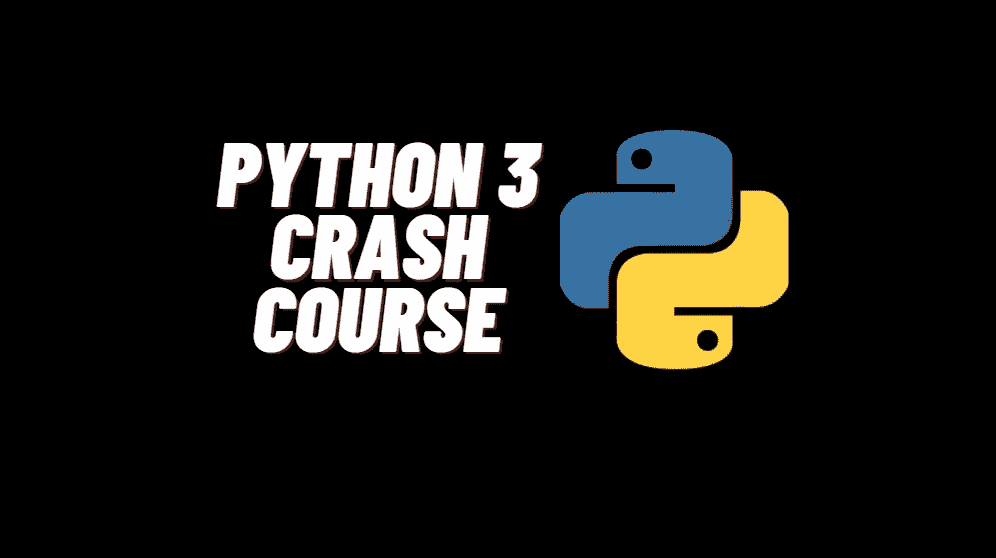

# 一天学会 Python

> 原文：<https://medium.com/geekculture/python-3-crash-course-fd39f81f6543?source=collection_archive---------10----------------------->

# 你将学到什么

1.  如何下载安装 Python 3？
2.  变量和字符串
3.  用户输入
4.  列表
5.  元组
6.  字典
7.  If 语句
8.  While 循环
9.  对于循环
10.  功能