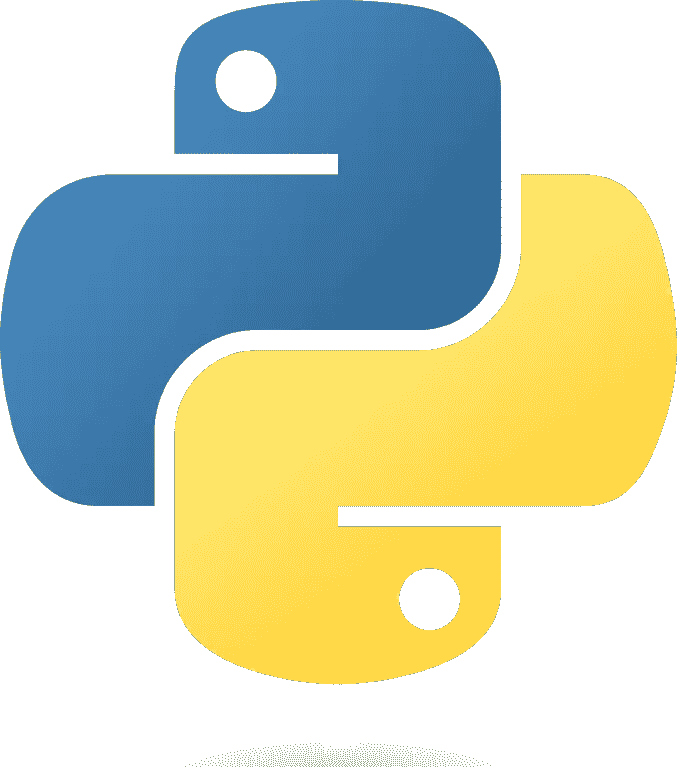

# Python:通向中级水平的捷径

> 原文：<https://medium.com/geekculture/python-a-fast-way-to-intermediate-level-4aa63161376a?source=collection_archive---------18----------------------->

你不需要安装任何软件或下载任何数据。你现在就可以开始学习真正的函数式 Python。

关于如何学习 Python 的教程有数百万种，每一种都采用了不同的方法，但大多数都花了很多时间在基础上，就像语言老师重复字母表，而不是教授一些真正好的语言用法