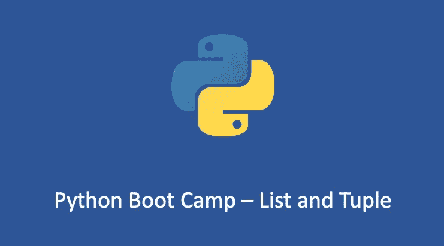

# Python Boot Camp 2 —列表和元组

> 原文：<https://medium.com/geekculture/python-boot-camp-2-list-and-tuple-30a6bf67913?source=collection_archive---------9----------------------->

## 列表和元组的区别

数据结构是每一种编程语言的基础。理解和掌握 Python 的基本数据结构对于学好这门语言至关重要。

今天我们将学习 Python 中最常见的两种数据结构:`lists`和`tuples`。

# 列表和元组基础