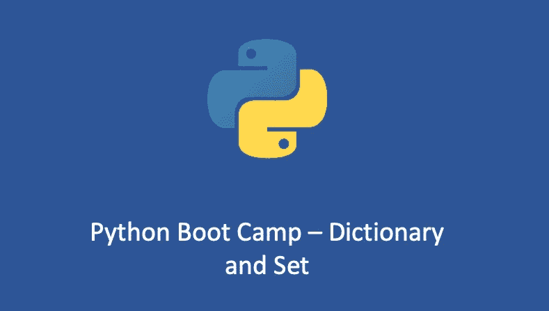

# Python Boot Camp 3 —字典和集合

> 原文：<https://medium.com/geekculture/python-boot-camp-3-dictionary-and-set-e7392d878f47?source=collection_archive---------5----------------------->

## 你真的懂 Python 字典和 Set 吗？



# Python 字典和 Set 基础知识

在 Python 中，字典是由成对的键和值组成的元素集合。例如:

```
dict_1 = {
    'name': 'Tony',
    'location': 'earth',
    'work': 'DevOps'
}
```