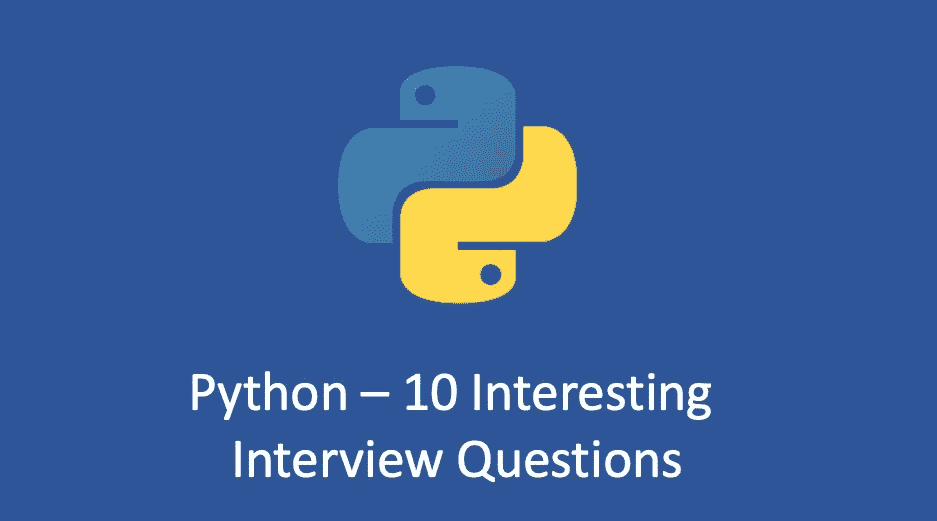

# Python —你能正确回答这 10 个问题吗？

> 原文：<https://medium.com/geekculture/python-can-you-answer-these-10-questions-correctly-2d363e73e78?source=collection_archive---------6----------------------->

## 10 个有趣的 Python 面试问题



# 1.下面哪个单词不是 Python3 中的关键字

```
a) eval
b) assert
c) nonlocal
d) pass
```

答案是`a`。所谓关键字，就是 Python 提前预留的标识符。每个关键字都有一个特殊的…