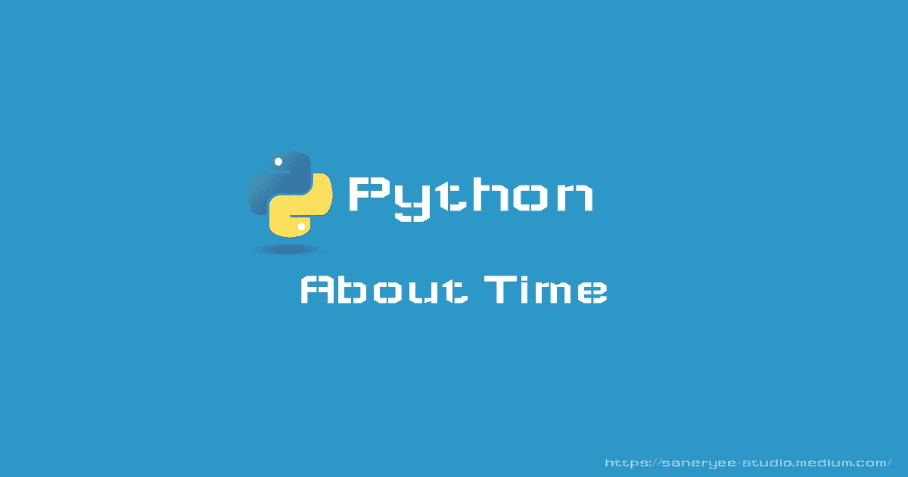

# Python 代码提示:关于时间

> 原文：<https://medium.com/geekculture/python-code-tips-about-time-6afde125df0d?source=collection_archive---------24----------------------->

## 如何在 Python 中处理时间、日期时间、日历

当我们使用 Python 语言开发机器学习、深度学习、量化交易、web 应用时，经常需要处理时间:时间转换、时间计算等。本文将详细解释 Python 语言中与时间和日期相关的函数和提示。