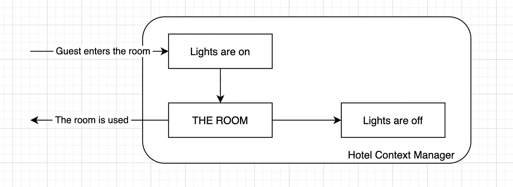

# Python:上下文管理器很简单

> 原文：<https://medium.com/geekculture/python-context-managers-are-simple-6bce2e9dcd38?source=collection_archive---------7----------------------->

## 何时应该使用它们

假设你拥有一家酒店。你要确保房间空着的时候没有灯亮着。你告诉你的客人:请在离开房间时关灯。但是他们总是忘记这一点。

所以，你雇了一个负责这个的经理。一旦这位经理发现这个房间不再被使用，他/她就会关灯…