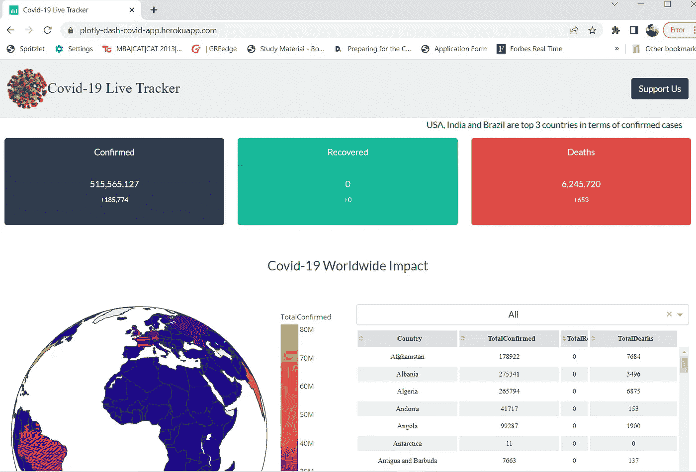

# 使用 Plotly Dash 的 Python Dashboard:示例 1

> 原文：<https://medium.com/geekculture/python-dashboard-using-plotly-dash-example-1-b9cc94039b5e?source=collection_archive---------1----------------------->

## 使用 Plotly Dash 构建新冠肺炎仪表板

Pic Credit: Unsplash

在这篇博客中，我将带你浏览我用 Plotly dash 创建的新冠肺炎仪表盘。

## 什么是 Plotly Dash？

Dash 是 Plotly 开发的一个 python 框架，用于创建基于 web 的交互式应用程序。Dash 写在 Flask，Plotly.js，React.js 上面，有了 Dash，我们就不用学 HTML，CSS，Javascript，只需要懂 python 语言就可以了。使用 Dash 构建的应用程序可以在 web 浏览器上查看。

## 新冠肺炎仪表板！

以下是使用 plotly dash 创建的 Covid 19 仪表盘的快照。

Covid 19 dashboard (Pic Credit: Author)

以下是 Covid 19 Plotly dash 仪表盘的链接:[https://plotly-dash-covid-app.herokuapp.com/](https://plotly-dash-covid-app.herokuapp.com/)

> **想学 Plotly Dash？**您可以在 Udemy 上查看我的课程，我将带您一步一步地创建一个成熟的交互式仪表盘。使用以下链接获得高达 70%的折扣:【https://bit.ly/3kcAYx9】

## *阴谋破折号的代码！*

*以下是使用 Plotly dash 创建基本 Covid 19 仪表板的代码。*

*该代码分为以下几个部分:*

1.  *创建绘图和数据卡内容的功能。*
2.  *仪表板的布局。*
3.  *仪表板的导航栏。*
4.  *用于向仪表板添加交互性的回调。*

# ***谢谢！***

*点击此处了解更多关于 Plotly Dash 的信息:*

* [## Dash for 初学者:创建交互式 Python 仪表盘

### Dash 是什么？

towardsdatascience.com](https://towardsdatascience.com/dash-for-beginners-create-interactive-python-dashboards-338bfcb6ffa4) 

点击此处了解更多关于回访的信息:

 [## Plotly 回调:创建令人兴奋的互动情节

### 在 Plotly Dash 中开始回调

towardsdatascience.com](https://towardsdatascience.com/are-you-still-creating-boring-static-plots-its-time-to-move-on-384f49b60d16)*