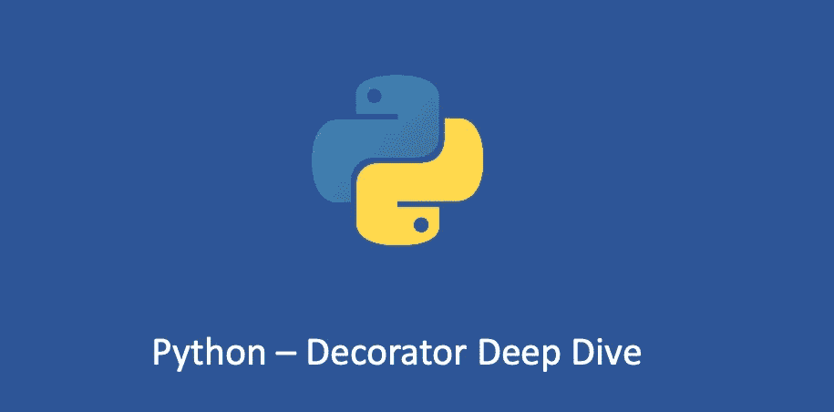

# python——装饰者深潜二

> 原文：<https://medium.com/geekculture/python-decorator-deep-dive-two-1d84a36680df?source=collection_archive---------4----------------------->

## 掌握 Python 装饰器

在我的上一篇文章“[Python-Decorator Deep Dive One](/geekculture/python-decorator-deep-dive-one-56c6770e9080)”中，我谈到了“可变范围”和“装饰原则”()。让我们继续探索 Python decorators！

# 用参数修饰函数

前一篇文章实现了一个装饰器，它监视函数的执行时间…