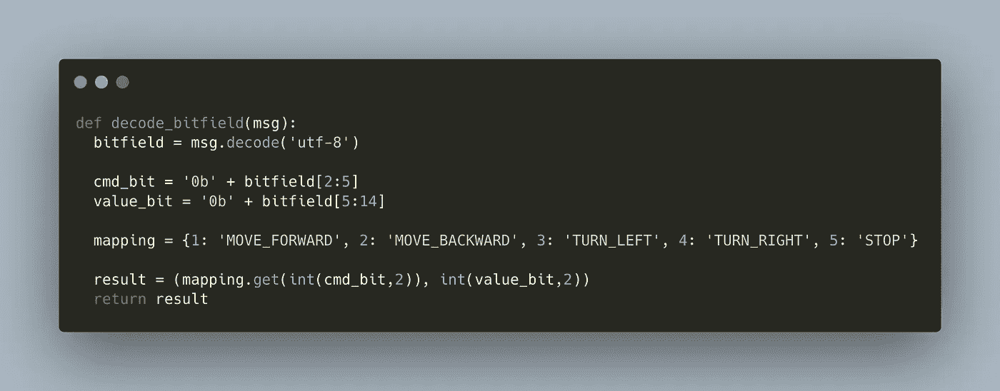

# Python:有效的串行数据处理

> 原文：<https://medium.com/geekculture/python-effective-serial-data-processing-53711432509b?source=collection_archive---------6----------------------->



在微控制器和单板计算机之间发送串行数据是一种简单的信息交换方式。在上一篇文章中，我展示了如何将 Raspberry Pi 连接到 Raspberry Pico 的三个选项。在撰写本文时，最好的方法是在 Pi 上使用 USB-FTL 连接器，然后直接连接到 TX/RX。这样，您不需要在您的 Pi 上配置任何特殊的东西，并且有一个可靠的连接。

设置是一回事。但是如何有效地使用串行连接呢？最佳实践是什么？在本文中，我将描述如何使用位字段、文本、Python 对象和 JSON 等可互换的数据格式。此外，我们还对所有这些方法进行了全面的性能测试，以找出哪种方法最适合时间关键型应用。

*本文原载于我的博客*[*admantium.com*](https://admantium.com/blog/micro17_micropython_serial_communication_best_practices/)*。*

# 序列化的数据格式

选择合适的数据结构在多个 python 程序之间发送很简单:任何传输的数据都是字符串。这个字符串代表什么，由你决定。您可以只传输映射到接收方数据或状态的数字，例如位掩码。你可以发明自己的迷你语言来表示文本命令。或者使用具体的 python 可变或不可变对象，将它们解析为字符串表示并传输它们。最后，你可以使用定义良好的、可互换的数据格式，比如 JSON 或 YAML。

有很多选择。你应该使用哪一种，为什么？序列化和反序列化数据的算法开销是多少？下面几节将简要解释这些格式中的每一种，并给出一个小例子:向一个机器人发送移动命令，像向前或向后移动，以一定的速度，向左或向右转弯。最后，我将对每种方法进行性能测量并讨论结果。

# 文本

当您使用纯文本时，格式由您决定。您需要定义自己的语言来表示您正在传输的数据。

在我们的机器人示例的上下文中，让我们定义这些语句来表示机器人的运动:

*   `MOVE_FORWARD=1`
*   `MOVE_BACKWARD=2`
*   `TURN_LEFT=45`
*   `TURN_RIGHT=90`
*   `STOP`

速度值是从 1 到 10 的绝对值。转弯值表示弧度。

这种形式的命令将一次传送一次。接收者需要解析文本，提取命令和值，并指示机器人。

# 比特字段

位字段将数据编码为二进制，因此您需要做的就是将命令编码为合适的二进制表示。发送方编码，接收方解码数据。

继续我们的示例，我们需要通过以下步骤创建一个位掩码:

*   确定命令编码:每个命令是如何用二进制表示的？
*   确定值编码:值是如何用二进制表示的？
*   确定字段长度:要传输的最大整数是多少？

让我们一步步来回答这些问题。

```
# Command Encoding
MOVE_FORWARD  = 1
MOVE_BACKWARD = 2
TURN_LEFT     = 3
TURN_RIGHT    = 4
STOP          = 5# Command Encoding Field Length
BIGEST_INTEGER_VALUE           = 5
BIGEST_INTEGER_VALUE_IN_BINARY = 101
BITFIELD_LENGTH                = 3# Value Encoding
MOVEMENTS     = Integer
TURNS         = Integer# Value Encoding Field Length
BIGEST_INTEGER_VALUE           = 360
BIGEST_INTEGER_VALUE_IN_BINARY = 101101000
BITFIELD_LENGTH                 = 9
```

因此，我们的位域格式由一个 3 位命令和 9 位值组成。命令示例:

```
# Command Encoding
MOVE_FORWARD_SPEED_7  = 0b001000000111
TURN_RIGHT_242        = 0b100011110010
```

# Python 数据结构

在 Python 中，任何内置的不可变数据类型(整数、浮点、元组)或可变数据类型(列表、字典、集合)都可以用`repr`函数转换成字符串。请参见以下示例:

```
>>> f = 3.12345245
>>> repr(f)
'3.12345245'>>> lst = ["hello", "from", "Pi", 4]
>>> repr(lst)
"['hello', 'from', 'Pi', 4]">>> components = set()
>>> components.add("Pi4")
>>> components.add("Pico")
>>> components.add("D435")
>>> repr(components)
"{'Pico', 'Pi4', 'D435'}"
```

也可以在类和实例上定义`__repr__`函数，将它们表示为一个字符串，但是这只有在发送方和接收方有相同的类定义时才有意义。对于交换小消息，这是不必要的开销。

考虑我们的机器人示例，提交命令的合适数据结构应该是一个列表，其中键-值对彼此跟随，甚至是一个具有固定键-值对的字典。

```
list = ['MOVE_FORWARD', '7', 'TURN_RIGHT', '242']
repr(list)
"['MOVE_FORWARD', '7', 'TURN_RIGHT', '242']"dict = {'MOVE_FORWARD': 7, 'TURN_RIGHT': 242}
repr(dict)
"{'MOVE_FORWARD': 7, 'TURN_RIGHT': 242}"
```

使用这些数据结构给编程带来了额外的好处:修改(如重命名命令或更改类型化的值)和将来的添加更容易实现。此外，消息可以包括任意数量的命令和元数据。字典在这方面特别强大，因为可以用迭代器遍历、操作和遍历它们。这使得它们在串行通信中用途广泛，无论如何都要处理字符串数据。

# 可互换的数据格式

最后一个选择是选择一种可互换的数据格式。一种非常常见的格式是 JSON，它是 Java Script 对象符号的缩写。JSON 可以用来序列化文字(整数、字符串、布尔值)和结构(列表)。YAML 是 JSON 的一个超集，旨在让人类可读。

以我们的例子为例，传输机器人命令的简单 YAML 数据结构如下:

在 yaml 中:

```
MOVE_FORWARD: 7
TURN_RIGHT: 242
```

JSON 和 YAML 提供了与 Python 数据结构相同的好处:修改和扩展更简单。此外，其他编程语言也可以读取这些数据结构。然而，在我们示例的上下文中，我们将坚持使用 Python 进行序列化和反序列化。

# 性能比较

为了比较这些不同方法的性能，我们可以使用 Pythons 内置的`timeit`函数。正如[所记载的](https://docs.python.org/3/library/timeit.html)，这个函数接收提供的一串语句，该语句应该执行的次数，以及重复的次数。简单的例子:

```
import timeitcontext = """
def plus(a,b):
  return a+b
"""results = timeit.repeat(stmt='plus(6,36)', setup=context, repeat=5, number=1000000)
print("Average Time:", sum(results)/5, "\nMeasurements:", results, )
```

调用这个函数会产生以下输出。如我们所见，平均时间为 0.25 秒。

```
AVG Time: 0.2519046256085858
Measurements: [0.25533306901343167, 0.25123326701577753, 0.2510213520145044, 0.2509820369887166, 0.25095340301049873]
```

有了这个工具，我们可以测量文本、位域和 python 对象的编码和解码。

# 完整示例:测量文本解码性能

我们举一个具体的例子来做一个具体的解码。

对文本进行编码很简单:它是一个需要转换成字节数组的字符串。

```
def encode(text):
  return text.encode('utf-8')
```

解码包括几个步骤。首先，我们将字节数组解码回一个字符串。其次，我们在字符串上执行一个正则表达式。第三，我们将匹配转换成一个元组。

```
from re import matchdef decode_text(text):
  decoded_text = text.decode('utf-8') reg_exp = r'(\w+)=(\d+)'
  matches = match(reg_exp, decoded_text)
  result = matches.groups() return(result)
```

为了测量该代码，我们采用以下步骤:

*   定义要执行的语句:`t = encode("MOVE_FORWARD=1"); decode_text(t)`
*   将完整的编码和解码代码定义为名为`context`的多行字符串
*   用执行的`statement`、`context`、`number`和`repeat`周期调用`timeit`功能

```
text_decoding_measurements = timeit.repeat(
    statement='t = encode("MOVE_FORWARD=1"); decode_text(t)',
    setup=text_context,
    repeat=20,
    number=10_000)
```

同样，我们可以对所有情况进行测试。

# 性能测量

# 解码位域

## 源代码

```
def encode(bitfield):
  return bitfield.encode('utf-8')def decode_bitfield(msg):
  bitfield = msg.decode('utf-8') cmd_bit = '0b' + bitfield[2:5]
  value_bit = '0b' + bitfield[5:14] mapping = {1: 'MOVE_FORWARD', 2: 'MOVE_BACKWARD', 3: 'TURN_LEFT', 4: 'TURN_RIGHT', 5: 'STOP'} result = (mapping.get(int(cmd_bit,2)), int(value_bit,2))
  return result
```

## 性能测量

```
Bitfield Decoding of 'encode("0b00100000011")'
++++++++++++++++++++++++++++++++++++++++++++++++++++++++++Average Time: 0.05363158800173551
Measurements:  [0.027031786972656846, 0.02717018499970436, 0.026509653020184487, 0.026926272024866194, 0.0266216280288063, 0.027101150946691632, 0.026846155989915133, 0.02704080700641498, 0.026566963992081583, 0.02656059304717928, 0.026734582032077014, 0.026688970043323934, 0.02639739098958671, 0.0269411489716731, 0.026987641002051532, 0.026755536964628845, 0.02668587298830971, 0.026785144000314176, 0.026891918969340622, 0.02707247802754864]
```

# 解码文本

来源

```
from re import matchdef encode(text):
  return text.encode('utf-8')def decode_text(text):
  decoded_text = text.decode('utf-8') reg_exp = r'(\w+)=(\d+)'
  matches = match(reg_exp, decoded_text) result = matches.groups()
  return(result)
```

## 性能测量

```
Text Decoding of 'encode("MOVE_FORWARD=1")'
++++++++++++++++++++++++++++++++++++++++++++++++++++++++++Average Time: 0.08896405659033917
Measurements:  [0.04545394500019029, 0.044554901018273085, 0.04442428599577397, 0.0443288889946416, 0.04432642401661724, 0.043912817956879735, 0.04431018000468612, 0.04420615697745234, 0.044510716979857534, 0.044194838963449, 0.04418196598999202, 0.0441048729699105, 0.044894682010635734, 0.044447703985497355, 0.0445377750438638, 0.044568741985131055, 0.0446226799977012, 0.045044841011986136, 0.04473581199999899, 0.044278335000853986]
```

# 解码 Python 对象

来源

```
def encode(text):
  return text.encode('utf-8')def decode_python_objects(text):
  decoded_text = text.decode('utf-8') result = eval(decoded_text)
  return(result)
```

## 性能测量

```
Python Objects Decoding of 'encode("('MOVE_FORWARD’, 1)")'
++++++++++++++++++++++++++++++++++++++++++++++++++++++++++Average Time: 0.5119784157956019
Measurements:  [0.25575865199789405, 0.2549030850059353, 0.2579314360045828, 0.25870296999346465, 0.2604327359586023, 0.2600087499595247, 0.2584023640374653, 0.2558257740456611, 0.25510250200750306, 0.2583176919724792, 0.2549058750155382, 0.255189977993723, 0.25448778801364824, 0.2551257850136608, 0.2546310239704326, 0.25484405900351703, 0.25408411998068914, 0.25427312596002594, 0.2534371940419078, 0.2534192479797639]
```

# 解码 YAML 物体

来源

```
from yaml import safe_loaddef encode(yml):
  return yml.encode('utf-8')def decode_yml(msg):
  yml = safe_load(msg) result = tuple(yml)
  return result
```

## 性能测量

```
YAML Decoding of 'encode("['MOVE_FORWARD’, 7")'
++++++++++++++++++++++++++++++++++++++++++++++++++++++++++Average Time: 9.058417272800579
Measurements:  [4.193098113988526, 4.122215965995565, 4.285432767006569, 4.330240387003869, 4.076146796985995, 4.159796627995092, 4.560074345965404, 4.498862796986941, 4.709009921003599, 4.322364090010524, 4.69364814698929, 4.772696384985466, 4.7846884350292385, 4.738021294993814, 4.648917622980662, 4.780966740043368, 4.605022739968263, 4.846610993030481, 4.693909451016225, 4.7624491060269065]
```

# 比较

简而言之，以下是每种解码类型的运行时间:

总时间相对性能位字段 0.053631588001736 100%文本 0.088964056590339 166% python 对象 0.511978415795602 955% YAML 9.051727280058 16890%

传递和解释位是性能最有效的方法，但是如果不进行重构，您需要编写更多的代码，而且命令也不太全面。处理纯文本要慢 60%,你应该坚定地使用正则表达式，但是这种方法是通用的，可互换的，并使你的语言设计可扩展。第三种方法是发送字符串化的 Python 对象并对其进行评估，这种方法对性能有很大影响。尽管 implement 是最简单的方法，并且可扩展性很高，但是您不应该在微秒级操作或提供大量数据的应用程序中使用这种方法。最后的方法，嗯，不用。

# 结论

当处理串行数据时，您可以使用不同的方法来设计数据格式，即您希望通过网络传输的语言。这些方法是:a)将所有内容编码为位字段，b)发送表示命令的文本，c)序列化和评估完整的 Python 对象，以及 d)使用像 YAML 或 JSON 这样的数据交换格式。但是这些方法的表现如何呢？为了揭示这一点，本文展示了如何使用内置的`timeit`函数进行简单有效的测量。比较所有的方法，有两个赢家:位域是目前为止性能最好的，但是需要更多的编码，可扩展性较差，其次是易于编程和可扩展的文本。