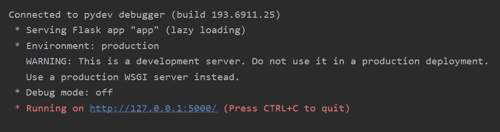
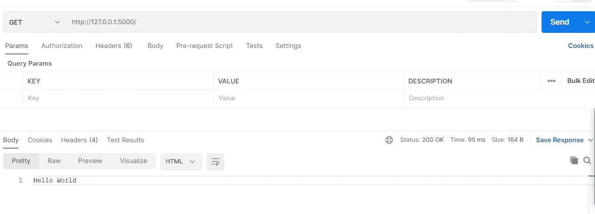
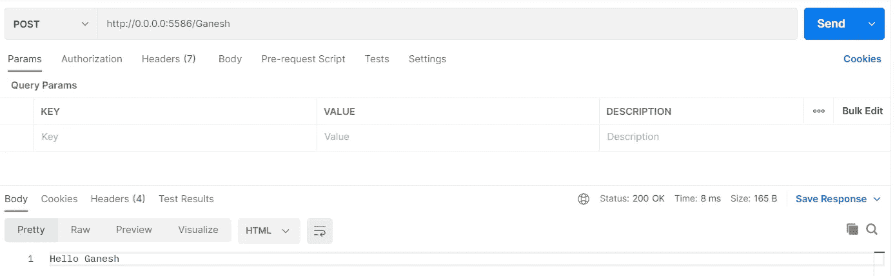
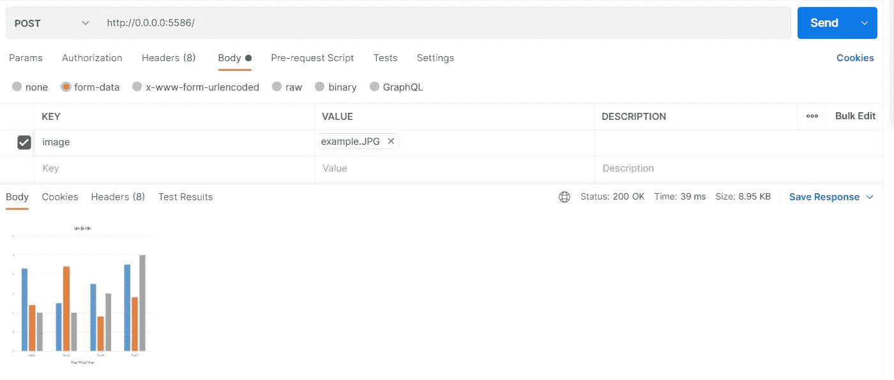
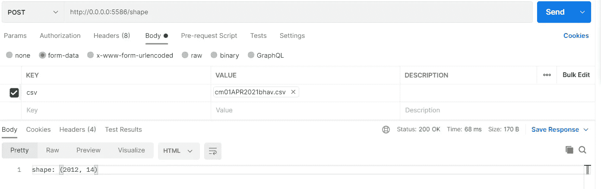

# 蟒蛇皮烧瓶

> 原文：<https://medium.com/geekculture/python-flask-d06ca67be51b?source=collection_archive---------11----------------------->

托管自己的 API。

**Flask** 是一个 web 应用框架。它有时也被称为微框架，因为它保持 API 核心非常简单。

这篇文章将主要关注 Flask 框架的应用。如果你想了解更多，这里是烧瓶文档的 [***链接***](https://flask.palletsprojects.com/en/1.1.x/) 。

我将使用 **Postman** 来测试 API。了解更多**邮差**点击 [***这里***](https://learning.postman.com/docs/getting-started/introduction/) 。

1.  让我们从 Python 中一个函数的“hello world”示例开始:

```
def hello_world():
   return "Hello World"
```

我们可以使用 Flask 通过网络访问该功能:

```
from flask import Flask
app = Flask(__name__)

@app.route('/')
def hello_world():
   return "Hello World"

if __name__ == '__main__':
   app.run()
```

*   在上面的代码中，我们创建了一个 Flask 对象“app”。“__name__”是 Flask 所需的输入，它只是编写代码的 python 脚本的名称。示例:如果脚本的名称是“app.py”，那么我们也可以将 Flask 对象初始化为:
    ***app = Flask(" app ")***
*   @app.route('/')是 decorator，它将函数绑定到服务器 URL。参数“/”规定了服务器上函数的路径，即根目录。“**方法**”参数可以限制对特定方法的请求。我们可以通过将代码从@app.route('/')更改为@app.route('/'，methods=["GET "，" POST"])来做到这一点
*   app.run()该方法在本地开发服务器上运行应用程序。它有“ ***主机*** ”和“ ***端口*** ”作为其参数，分别默认为“127.0.0.1”和 5000。
*   如果我们运行这个 python 脚本，我们将能够通过 URL "***http://127 . 0 . 0 . 1:5000/***"访问这个函数，这是 Flask 中的默认设置。(如果希望将功能暴露给外部网络“ ***”主机*** ”应改为“0.0.0.0”，反映外部网络上的机器 IP)



我们可以看到 Flask 服务器已经启动并正在运行。现在让我们试着从**邮递员**那里 ping 服务器。



我们可以看到，在 ping 到服务器 URL 后，我们得到了“Hello World”作为我们的响应。这意味着我们的 API 运行良好。

2.让我们检查另一个用例，例如，如果用户 ping URL“http://127 . 0 . 0 . 1:5000/Chuck”，它应该返回“Hello Chuck”。URL 应该只接受“POST”方法，函数应该通过网络对外公开。

```
from flask import Flask
app = Flask("app")

@app.route('/<name>',methods=['POST'])
def hello_name(name):
   return "Hello {}".format(name)

if __name__ == '__main__':
   app.run(host="0.0.0.0",port=5586)
```


*   我们可以看到' **GET** 方法对于这个 API 是被阻塞的，因为我们已经特别提到“ **POST** 方法是唯一有效的方法。



*   在**邮递员**中，将方法改为 **POST** ，我们就可以访问这个函数，它会按照预期返回一个响应 ***。***
*   这段代码是动态 URL 的经典例子。@app.route("/ <name>")中的"<name>"表示代替"<name>"的字符串成为" hello_name "函数的参数" name "的值。</name></name></name>

3.我们现在将创建一个 API 来上传一个图像，并得到调整大小的图像作为回报。

```
from flask import Flask,request,send_file
import numpy as np
import cv2
app = Flask("app")

@app.route('/',methods=['GET','POST'])
def resize():
    if 'image' in request.files:
        img = request.files['image']
        img = img.read()
        img = np.fromstring(img,np.uint16)
        img = cv2.imdecode(img,cv2.IMREAD_COLOR)
        img = cv2.resize(img,(200,200))
        cv2.imwrite('tmp.jpg',img)
        return send_file('tmp.jpg')
    else:
        return {'error':'image not found'}

if __name__ == '__main__':
   app.run(host="0.0.0.0",port=5586)
```

*   为了完成这个任务，我们从 flask 模块中导入" ***request"*** ，" **send_file** "对象。 **request** 对象帮助我们读取输入文件，“ **send_file** 对象用于返回一个**文件**作为响应。
*   当我们从对服务器的请求中接收到一个文件时，它的类型是:" ***<文件存储:'例如。“‘JPG’(‘图片/JPEG’)>***”
*   ”**。read()** "方法将文件类型改为 bytes:"**b ' \ xff \ xd8 \ xff \ xe0 \ x00 \ X10 jfif \ x00 \ x01 \ x00 \ x00x \ x00 \ xff \ xe1 \ X10 \ xf4 EXIF \ x00 \ x00 mm \ x00 * \ x00 \ x00 \ x08 \ x00 \ x04 \ x01；\ x00 \ x02 \ x00 \ x00 \ x00 \ x0e \ x00 \ x08J \ x87i \ x00 \ x04 \ x00 ' "**
*   " **np.fromstring()** "将字节更改为一维 numpy 数组:"**[5551 57599 4096 17994 17993 256 257 30720 30720 0 0 57855 62480，30789 26217 0 19789 10752 0 2048 1024 15105 512 0 3580** “
*   "**cv2 . im decode()**"(opencv)从一维 numpy 数组中解码原始图像。
*   当我们将一幅图像转换成合适的格式时，我们可以对它应用“**resize”**功能或任何其他图像功能。
*   调整图像大小后，我们将它保存为一个临时文件，然后将该文件作为 API 响应发送。

我们的输入图像:


输出响应:



4.让我们探索另一个用例，我们有一个输入 csv 文件，输出应该是它的维度。

```
from flask import Flask,request,send_file
import pandas as pd
app = Flask("app")

@app.route('/shape',methods=['GET','POST'])
def shape():
    if 'csv' in request.files:
        csv = request.files['csv']
        csv = pd.read_csv(csv)
        return "shape: {}".format(csv.shape)
    else:
        return {'error':'csv not found'}

if __name__ == '__main__':
   app.run(host="0.0.0.0",port=5586)
```

*   pandas 库的“read_csv”方法管理 csv 文件从“ ***【文件存储】*** 类型到数据帧的转换。
*   我在装饰路径中添加了“ **shape** ”，所以现在要向这个 API 发送请求，URL 应该是“**http://0 . 0 . 0:5586/shape**”。



我希望这篇文章能帮助你学习 **Flask web 应用框架**的基本概念。

这是所有的乡亲。