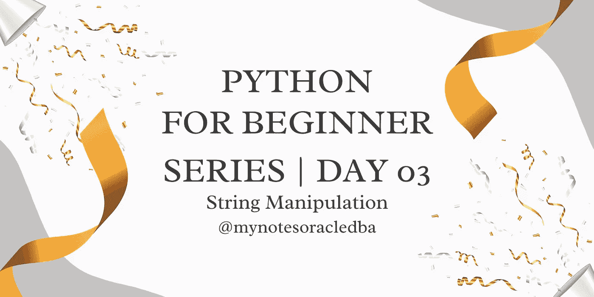

# Python 初学者系列| Day-03

> 原文：<https://medium.com/geekculture/python-for-beginner-series-day-03-6ee9f28412e?source=collection_archive---------9----------------------->

在这里，我们将了解字符串操作



*   在第 03 天，我们将详细讨论字符串操作

**字符串操作:**

*   字符串是字符的集合，值也用双引号或单引号定义。
*   下面给出了一些示例函数

1.  **len()** —用于找出字符串长度的详细信息

```
name = input("Enter Your name")#mynotesoracledbaprint(len(name)) #16 
```

*   在上面的例子中，我们将输入名称作为输入，然后输出特定的字符串长度。

**2。upper()** —用于将字符串转换成大写

```
name="mynotesoracledba"
print(name.upper()) #MYNOTESORACLEDBA
```

*   这里，upper 函数用于将字符串转换成大写字母

**3。大写()** —用于将字符串大写

```
name="mynotesoracledba"
print(name.capitalize()) #Mynotesoracledba
```

*   在上面的例子中，即使我们使用小写的字符串作为输入，用于将它转换成第一个字母的大写函数也是大写的

**4。lower()** —用于将字符串转换成更小的

```
name="MYNOTESORACLEDBA"
print(name.lower()) #mynotesoracledba
```

*   在上面的例子中，我们已经传递了将转换成小写的大写值输入。

**5。concat** —用于组合两个字符串

```
a=('Put several strings within parentheses '
        'to have them joined together.')
print(a)#Put several strings within parentheses to have them joined together.
```

*   在这个例子中，我们将两个句子打印成一行，这需要大量的手工工作，以便我们可以使用" **concat "。**

```
name="MYNOTESORACLEDBA"
print("Hello "+name)#Hello MYNOTESORACLEDBA
```

*   name 是一个单独的变量，它必须显示或与" **hello** "组合，所以我们在 print 函数中使用一个加号来组合 hello 和 name。

**6。多行数据:**

```
data="""
Hi
How are you?
what's up?
I am travelling
"""
print(data)#Hi
#How are you?
#what's up?
#I am travelling
```

*   这里有一个**数据**变量，它已经用三重引号存储了多行。当我们打印变量时，它显示的结果与输入相同。

7。打印样式格式

```
print("Please enter your name")
name=input()
print("Enter your percentage")
percentage=input()
print("Enter your exam name")
exam=input()print("This is to certify "+name+" has scored "+percentage+" percentage in "+exam+" Exam")
print("This is to certify {0} has scored {1} percentage in {2} Exam".format(name,percentage,exam))
print("This is to certify %(name)s has scored %(perc)s percentage in %(exam)s Exam" %
      {"name":name,"perc":percentage,"exam":exam})
```

*   在本例中，我们通过输入函数处理值，并显示到打印函数中，其中值的序列在位置上，即
*   {0} —姓名，{1} —百分比，{2} —考试
*   另一种获取变量值并使用%(variable)显示出来的方法是

8。转义引号

*   它用于打印结果中显示的一些字符
*   **" \ "** 可以用来转义引号

```
print('doesn\'t'  )# use \' to escape the single quote...
print( "doesn't" ) # ...or use double quotes insteadprint( '"Yes," he said.' )
print( "\"Yes, he said." )
```

*   如果您不希望以\开头的字符被解释为特殊字符

```
print('C:\some\name')#here \n means newline!
```

9。子集

*   它用于从字符串中获取特定的字母

```
word = 'Python'
print(len(word))
print  (word[0] ) # character in position 0
print (word[5] ) # character in position 5#print (word[50] ) #exceptionprint ( word[-1] ) # last character
print( word[-2] ) # second-last character
print (word[-6] )print( word[:2] + word[2:] )
#'Python'
print( word[:4] + word[4:] )
#’Python'print( word[4:42] )
#'on'
print( word[42:] )
#''
```

10.**字符串方法:**

*   **count —** 返回子字符串非重叠出现的次数

```
name="mynotesoracledba"#count(sub[, start[, end]])

print (name.count("a"))
```

*   **endswith —** 如果字符串以指定的后缀结尾，则返回 True

```
#endswith(suffix[, start[, end]])

print (name.endswith("a"))
```

*   **查找—** 返回字符串中最低的索引

```
#find(sub[, start[, end]])

print (name.find("y"))
```

*   **index** —类似于 find()，但是在找不到子字符串时引发 ValueError。

```
#index(sub[, start[, end]])

print( name.index("t"))
```

*   **isalnum()** —如果字符串中的所有字符都是字母数字
    并且至少有一个字符，则返回 true，否则返回 false

```
print( name.isalnum() )
```

*   **isidentifier()** -如果根据语言定义，字符串是有效的标识符，则返回 true，

```
print("if".isidentifier())
```

*   **isdigit()** —如果值是有效整数，则返回 true

```
print( "34".isdigit() )
```