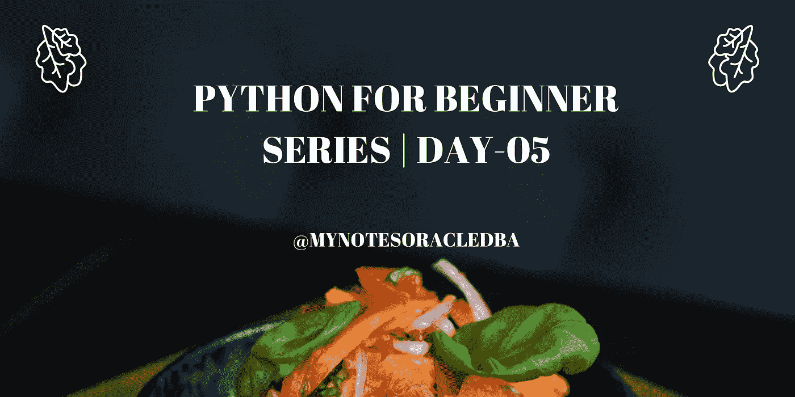
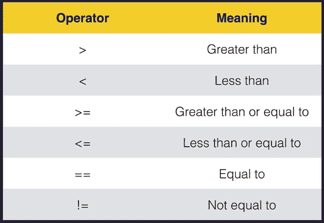

# Python 初学者系列| Day-05

> 原文：<https://medium.com/geekculture/python-for-beginner-series-day-05-2ea52969fe77?source=collection_archive---------8----------------------->

在这里，我们将理解控制流语句的概念



*   在第 05 天，我们将详细了解控制流语句

**控制流语句:**

*   它定义了程序代码必须执行的顺序。
*   Python 程序的控制流由条件语句、循环和函数调用来控制。
*   **顺序** —默认模式
*   **选择** —用于决策和分支
*   **重复** —用于循环，即将一段代码重复多次。

**连续:**

*   这是一种默认模式，一组语句的执行过程按顺序发生。
*   这就是问题所在，如果逻辑中的任何一行被破坏，那么整个代码都会被破坏。

```
a=1
b=3
c=a+bprint("The additional value is" , c)
```

**选择:**

*   它被称为 ***决策控制语句*或*分支语句*。**
*   它允许程序测试几个条件，并根据哪个条件为真来执行指令。
*   我们可以详细讨论每个决策控制语句
*   最重要的决策控制语句是:

**1。如果**

**2。if-else**

**3。嵌套 if**

**4。if-elif-else**

**If 语句:**

*   它帮助我们在特定代码满足条件或标准时运行它
*   语法如下所示:

```
"""if condition:do this """
```

*   在下面的例子中，一个人将在他的组织中申请休假，他的 approve_leave_bal=20，因此他的请求休假应该少于 approve_leave_bal，也需要批准。

```
requestedLeave=10
availableLeave=20
hasPermission="Y"if requestedLeave<=availableLeave and hasPermission=="Y":
    print("Leave Granted")
```

*   此处，用户请求的假期少于可用假期，并且他有权限，因此满足条件，因此代码成功执行。
*   我们在同一个 if 语句中使用了双重条件，这些条件被称为比较运算符



*   pic 中显示了一些比较运算符列表。
*   让我们再举一个例子，在游乐园乘坐过山车的合格标准是身高——170 厘米

```
Print ("Welcome to AAA Amusement park")
Height = int("Enter your height in cm:  ")if hegiht > 120:
   Print ("You are eligible for the ride")
```

*   在这个例子中，在 if 语句之后，我们应该更加关注显示消息或代码执行，因为 python 不允许不必要的空格，所以这会导致缩进问题。
*   这里的人提到的身高是 100 厘米，那么条件不是真的，所以这里没有显示任何东西。在相同程序的情况下，用户具有 125 的身高，他们有资格乘坐。
*   管理层决定允许身高等于或高于 120 厘米，那么我们必须在条件中使用大于等于

```
Print ("Welcome to AAA Amusement park")
Height = int("Enter your height in cm:  ")if hegiht >= 120:
   Print ("You are eligible for the ride")
```

*   即使我们可以用等号“==”来表示，我们可能会怀疑单个等号和两个等号之间的区别
*   单个等号用于给变量值赋值
*   双等号用于验证值。