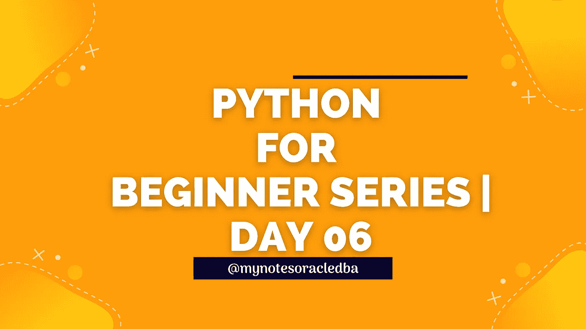
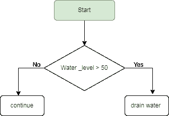

# Python 初学者系列|Day-06

> 原文：<https://medium.com/geekculture/python-for-beginner-series-day-06-c1a9df7c93d9?source=collection_archive---------13----------------------->

这里我们要理解控制流语句(if-else)



*   在第 6 天，我们将继续详细讨论控制流语句(if-else)
*   到目前为止，我们已经讨论了**顺序**和**选择(if 语句)**
*   让我们举个例子，为什么水槽或者浴缸从来不溢水？因为它有一个机制，当它达到最高水位时，它就开始排水，否则它将继续水流。
*   在这个例子中，我们不能只使用 if 条件，因为我们有两个条件，以防第一个条件失败，第二个条件语句将被显示。
*   条件语句被称为 **if/else** 语句，根据特定的条件，我们可以选择 A 或 b



*   if-else 的语法:

```
if condition:
  do this
else :
  do this
```

*   根据流程图，我们可以编写如下代码

```
Water_level = 50
if Water_level >=80:
   print("Drain Water)
else
   print("Continue")
```

*   此处水位为 50，因此如果语句不满足条件，则**执行 else 块，并显示“**继续**的结果**
*   另一个例子，让我们讨论一下请假制度

```
requestedLeave=10
availableLeave=20
hasPermission="Y"if requestedLeave<=availableLeave and hasPermission=="Y":
    print("Leave Granted")else:
    print("Leave not granted")
```

*   这里，用户提供了输入值 requestedLeave=10，available leave = 20 & has permission = " Y "
*   它将验证所请求休假的条件是否总是少于可用休假，并且在用户满足这些条件的情况下还需要许可。他可以得到许可或不许可。