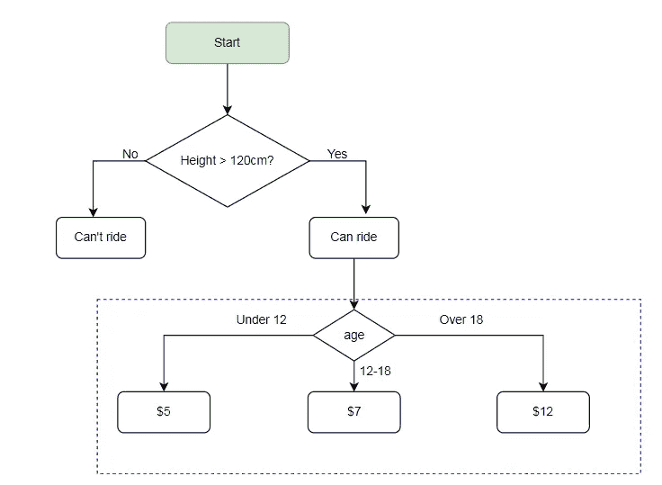

# Python 初学者系列| Day-07

> 原文：<https://medium.com/geekculture/python-for-beginner-series-day-07-6208271288ee?source=collection_archive---------8----------------------->

这里我们将理解嵌套的 if-else 语句


*   在第 7 天，我们继续详细讨论控制流语句(嵌套的 if-else 语句)
*   在前一篇文章中，我们已经讨论了 if-else 语句
*   让我们举个例子，我们要去游乐园。对于过山车乘坐资格身高= 120 厘米强制性的年龄类别，乘坐费用会有所不同
*   如果年龄在 12 岁以下，票价为 5 美元
*   如果年龄在 12-18 岁之间，票价为 7 美元
*   如果年龄超过 18 岁，那么票价是 12 美元。



Flow chart -nested if-else statements

*   语法是

```
**if** condition:
  #statement
**elif** condition:
  #statement
**elif** condition:
  #statement
**else**:
  #statement
```

*   根据流程图，我们可以编写如下代码

```
#amusment park programprint("Welcome to AAA amusement park")height = int(input("Enter Your height in cm: "))
age = int(input("Enter Your age: "))if height > 120:
  if age < 12:
     print ("Pay for the ride $5")
  elif  age > 12 and age < 18:
     print ("Pay for the ride $7")
  elif age >= 18:
     print("Pay for the ride $12")else:
   print("Sorry, you have to grown up tall")
```

*   在上面的例子中，我们需要获取用户的身高和年龄作为输入
*   如果身高超过 120 厘米，那么他们有资格乘坐过山车，否则用户没有资格乘坐过山车，那么下一步我们必须根据他们的年龄收取票价。
*   在里面，如果一个街区的高度大于 120 厘米，我们将根据他们的年龄来定义门票条件，因此如果用户的年龄低于 12 岁，那么门票价格为 5 美元，所以我们检查年龄小于 12 岁的条件。
*   如果用户的年龄在 12 岁到 18 岁之间，那么票价是 7 美元，因为我们制定了 elif 条件年龄大于 12 岁小于 18 岁。
*   如果用户的年龄在 18 岁以上，那么票价是 12 美元。为此，我们在 else 块上创建一个条件，条件年龄大于 18 岁
*   让我们再举一个例子，学生百分比计划
*   所需的输入细节

1.学生姓名

2.学生百分比

3.Hasarrears(是/否)

*   让我们看看代码

```
print("Enter student name")
name=input()print("Enter student percentage in numbers(Ex 70.5, 89)")
percentage=float(input())if percentage>=70:

    print("Do u have any arrear(s)(y/n)?")
    hasArrears = input()
    if hasArrears=="y":
        print("The student",name," has secured first class")
    else:
        print("The student",name," has secured first class with distinction")elif percentage>=60 and percentage<70:
        print("The student",name," has secured second class")elif percentage>=50 and percentage<60:
    print("The student",name," has secured third class")else:
    print("Failed")
```

*   在这个节目中，我们将根据学生的分数和欠款来找出他们的毕业班。
*   在这里，我们将获得学生的姓名，分数百分比和欠款的输入。
*   我们将根据他们的分数百分比计算他们的百分比和班级。第一步，我们将检查学生是否获得了超过 70%的分数，如果是，那么我们需要核实他们在毕业期间是否有任何欠款。如果他们有欠款，那么他们保证一流的，否则他们保证一流的区别。
*   如果学生获得了 60%到 70%的分数，他们就可以获得二等奖。
*   在某些情况下，学生比例在 50%到 60%之间，然后他们获得了三等奖。
*   获得分数的学生从未满足上述条件，那么他们是失败的。