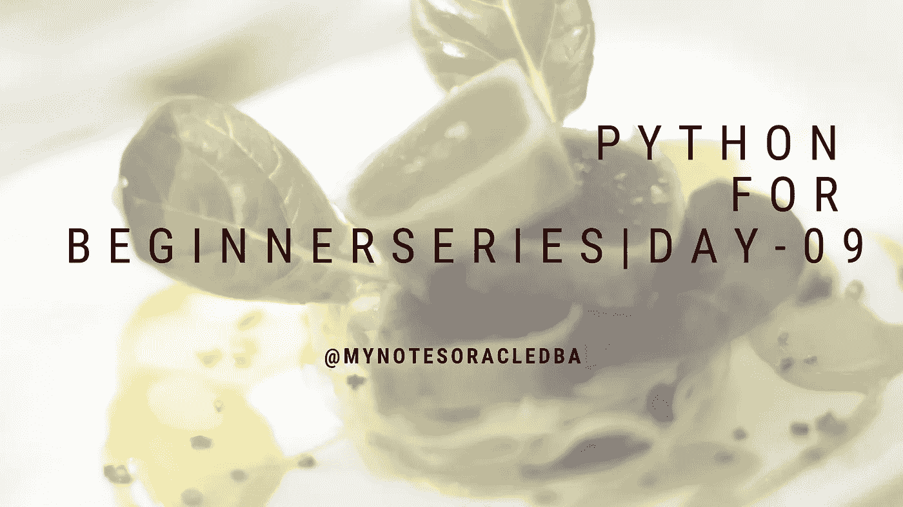
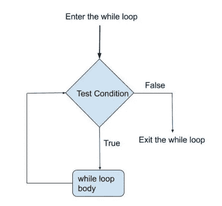

# Python 初学者系列| Day-09

> 原文：<https://medium.com/geekculture/python-for-beginner-series-day-09-8a6f02061b31?source=collection_archive---------15----------------------->

## 这里我们将详细了解 while 循环



*   在第 9 天，我们将详细讨论循环的概念

**什么是循环？**

*   循环是一件必须反复发生的事情。

Source: [https://giphy.com/](https://giphy.com/)

*   它有两种类型

1.  在…期间
2.  为

**While loops:**

*   While 循环重复执行语句块，直到满足给定的条件。
*   此外，当条件为假时，循环会自动退出。

**语法:**

```
**while condition:
       statements**
```

**流程图:**



While Flow chart

*   让我们以 while 循环为例。我想打印一个 1 到 5 之间的值。

```
a=1
while a<=5:
    print(a)
    a+=1
```

*   在这里，我为“a”变量赋值 5，下一步我检查条件 a 是否小于或等于 5。条件为真，因此它打印值“a =1”，然后我们增加值“ **a=a+1** ”。现在 a 的值为 2，同样，它将增加，直到下一次迭代的值为“5”时，a 的值变为 6。条件为假。因此循环 get 存在。
*   在同一个示例中，我只是删除了一个增量的值，即" **a=a+1** "让我们执行并查看结果。

```
a=1
while a<=5:
    print(a)
```

*   现在 a 的值小于 5，所以条件为真，所以它继续打印 a 的值，因此程序变得无限，因为我们的条件无论如何都不会为假。
*   让我们看看这个无限循环的另一个例子

```
a=1
while True:
    print(a)
    a+=1
```

*   在这里，我们刚刚改变了 while 循环中的条件，即 True，即使我们增加了 a 的值，它也继续打印 a 的值，因为我们的条件，while 循环不存在。