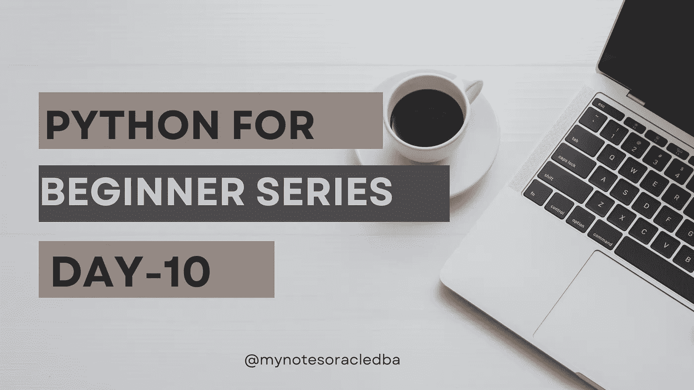
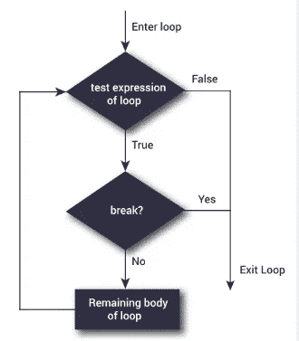

# Python 初学者系列|第 10 天

> 原文：<https://medium.com/geekculture/python-for-beginner-series-day-10-23f2b849b964?source=collection_archive---------9----------------------->

这里我们将理解 while 循环编码活动& break



*   在第 10 天，我们将了解一个使用 while 循环和 break 语句的编码练习
*   今天的编码活动将涵盖 while 循环概念
*   让我们为学生总分程序编写代码

**指令:**

*   获取主题的数量作为输入
*   显示总分

```
print("Enter no of inputs")
subjects_count=int(input())
```

*   在这一步中，我们将主题数量作为输入

```
start=0
total=0
```

*   让我们声明两个变量，一个是主题分数，另一个是主题分数的汇总值，即总分

```
while start<subjects_count:
    print("Enter a Subject ",start+1)
    value=float(input())
    total=total+value
    print("Total is",total)
    start+=1
    print("-------------")
```

*   这里我们检查起始值是否小于主题计数的条件。现在我们知道我们的起始值是 0。while 循环条件为真，因此它打印“输入主题”以及增量值 1。
*   它将在这里获得每个主题标记的值，然后将该值添加到总值变量中
*   总值已显示在此处，然后我们将初始值增加 1。
*   这个代码块循环执行相同的操作，直到满足退出程序的条件

**突围:**

*   在某些条件下退出 while 循环是一个关键字。

**流程图:**



```
a=1
while a<=5:
    print(a)
    a=a+1
    break
```

*   在本例中，值 a =1 小于 5，因此 while 循环条件为真，它显示 a 的值，然后递增 1。
*   在下一行中，我们使用了 break 语句，尽管这里不满足循环条件，但是 break 语句存在循环。

```
print("start")

print("Enter start number")
start=int(input())

print("Enter end number")
end=int(input())

print("Enter max value")
max_value=int(input())

print("Printing started......")
while True:
    print(start)

    if(start==max_value):
        print("Max value reached... Exiting from loop")
        break
    start+=1

print("end")
```

*   只需在您的本地机器上执行这个演示并查看结果。