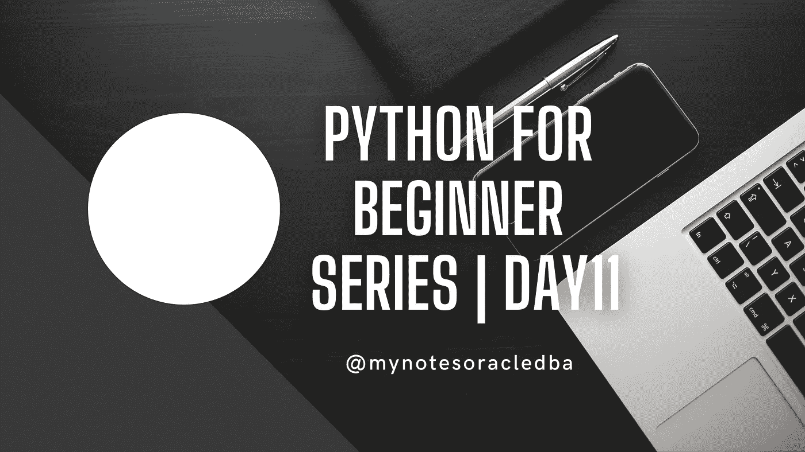
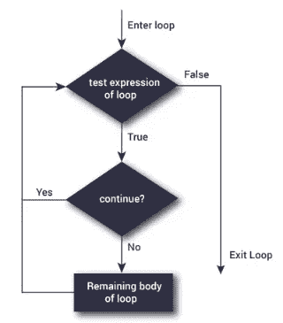

# Python 初学者系列|第 11 天

> 原文：<https://medium.com/geekculture/python-for-beginner-series-day-11-931e9f63710d?source=collection_archive---------11----------------------->

这里我们要理解 continue 语句



*   在第 11 天，我们将理解“ **continue** 语句和 while 循环编码活动。
*   在之前的博客中，我们覆盖了关于“ [**破**](/@mynotesoracledba/python-for-beginner-series-day-10-23f2b849b964)**的说法**

****继续有什么用？****

*   **它是一个关键字，用于仅在当前迭代中跳过或结束循环中的剩余代码，但循环不会终止，仍然会继续到下一次迭代。**

****语法:****

```
continue
```

****流程图:****

****

**Flow chart of continue**

*   **让我们看一个循环中 continue 语句的例子**

****指令:****

*   **获取开始和结束值作为输入**
*   **获得状态确认以显示值的范围 y/n**
*   **用户输入" y "来显示该范围之间的值，如果是" n "则退出代码。**

```
while True:

    print("Start prog")

    print("Enter start value")
    start=input()
    start=int(start)
```

*   **在 while 循环中，我们只是打印 start 程序，我们还将获得 start 的输入值**
*   **一旦我们得到默认的输入，它将被认为是字符串数据类型，所以我们应该把它改为 int。**

```
 print("Enter end value")
    end=input()
    end=int(end)
```

*   **在上面的步骤中，我们将获得结束范围的输入值**

```
 print("Do you want to print from",start,"to",end,"(y/n)?")
    status=input()
```

*   **从用户处获得状态确认(y/n)并将其保存为可变状态**

```
 if status=="y":
        while start<=end:
            print(start)
            start+=1
 else:
        print("Printing cancelled by user......")
        continue

  print("End prog")
```

*   **在这里，我们检查用户输入的状态是否等于“y ”,然后它将验证循环起始值是否小于等于结束值，然后它将打印起始值，之后递增 1，循环将继续，直到条件为假或退出。**
*   **如果用户选择了“n”，将显示“**用户取消打印”****
*   **这里已经显示了结束程序。**

```
 print("Continue(y/n)?")
    c=input()
    if c=="n":
        break
```

*   **如果您想继续运行程序，只需显示“继续 y/n”并将用户输入保存到变量中。**
*   **让我们定义条件语句变量等于“n ”,那么它将中断程序。**
*   **只需在您的本地机器上执行这个演示并查看结果。**

****整体代码在这里:****

```
while True:

    print("Start prog")

    print("Enter start value")
    start=input()
    start=int(start)

    print("Enter end value")
    end=input()
    end=int(end)

    print("Do you want to print from",start,"to",end,"(y/n)?")
    status=input()
    if status=="y":
        while start<=end:
            print(start)
            start+=1
    else:
        print("Printing cancelled by user......")
        continue

    print("End prog")

    print("Continue(y/n)?")
    c=input()
    if c=="n":
        break
```