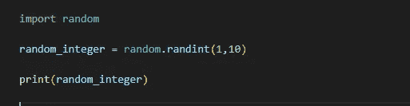

# Python 初学者系列|第 12 天

> 原文：<https://medium.com/geekculture/python-for-beginner-series-day-12-b32cd872090f?source=collection_archive---------14----------------------->

在这里，我们将了解随机模块


*   在第 12 天，我们将详细学习随机模块

什么是随机化？

*   它是任何一种编程语言，对于创建游戏或者我们想要随机得到结果都非常有用。
*   随机化有助于创建具有一定程度不可预测性的计算机程序，尤其是在游戏中
*   为了访问我们程序中的随机性，我们可以在代码中导入随机模块
*   通过使用随机模块，我们可以为各个方面生成伪随机数。

**进入随机模块:**

```
import random
```

[**随机模块**](https://www.askpython.com/python-modules/python-random-module-generate-random-numbers-sequences) 方法

1.  种子()

2.getstate()

3.setstate(state_obj)

4.getrandbits(k)

5.randomrange(开始、停止、步进)

6.randint(a，b)

7.随机(a，b)

*   有时大代码被分割成小的模块，每个模块负责我们程序的不同功能。
*   让我们看一下示例



*   在上面的例子中，我用 python 代码导入了随机模块
*   有一个名为 **randint** 的函数返回随机整数
*   关于 randint(a，b)这里 a 是初值，b 是终值

**可能的输出:**

*   它显示 1 到 10 之间的结果。

```
7

9

3

7 
```

*   与生成整数类似，还有生成随机浮点序列的函数。
*   这里有一个例子

```
import random

 """first random is a module after a dot is float random generation function """
random_float=random.random()

#it returns the interval 0 to 1 

print(random_float) 
```

**可能的输出:**

*   它返回 0 到 1 之间的值，这意味着 0.999 甚至不是 1。

```
0.6392451910852722
0.09553498185562392
0.5446452971298421
0.7535909981144928
```

**如何创建一个 0 到 5 之间的随机小数？**

*   这没那么复杂
*   正如我们所知，我们可以得到 0.00000–0.9999 之间的随机浮点数。因此，我们是如何生成 0.0000-4.9999 之间的随机数的呢
*   这里有一个例子

```
import random

random_float=random.random()

c=random_float * 5

print(c) 
```

**可能的输出:**

*   我们刚刚将随机浮点值乘以 5，因此我们得到的值在 0.000–4.999 之间

```
1.19688541978746
2.0290389423081967
3.514735688934367
2.246457203434934
3.7127092896879237
```

*   我们可以用这个随机数来实现 [**爱情计**](/geekculture/python-for-beginner-series-day-08-ecefaa800e9d) 程序

这是我们的代码:

```
import random

lover_meter=random.randint(0,100)

print(f"your love score is {lover_meter}")
```

*   在我们的爱情量表程序中，我们需要将用户名作为输入，并用“真爱”验证字母计数，基于结果计数，我们将获得**爱情量表**的分数。但是使用随机数我们可以很容易地得到 0 到 100 之间的情人分数。

**可能的输出:**

```
your love score is 95
your love score is 1
your love score is 5
your love score is 44
```

*   从今天起，我们将为博客的结尾分配一些小任务，这将非常有助于动手操作。
*   写一个程序**掷硬币**程序，随机显示结果“正面/反面”

**说明:**

*   导入随机模块
*   有许多方法可以做到这一点。但是为了练习我们在上节课中学到的内容，你应该生成一个随机数，0 或 1。然后用这个数字打印出正面或反面。
*   例如，1 表示正面，0 表示反面
*   在评论中分享你的结果。