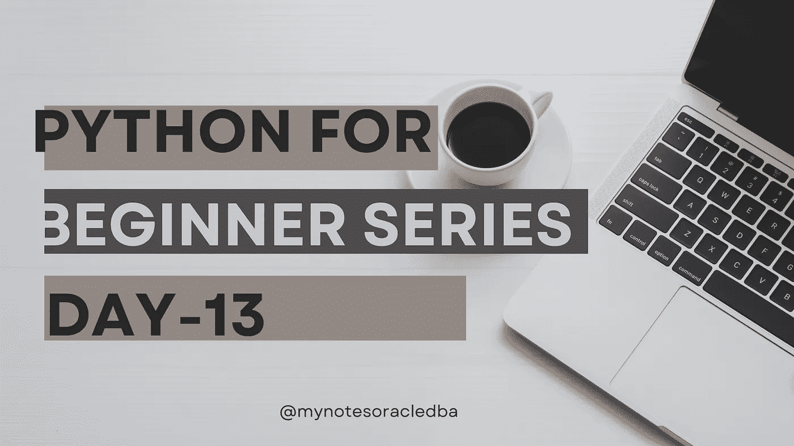

# Python 初学者系列|第 13 天

> 原文：<https://medium.com/geekculture/python-for-beginner-series-day-13-39363cddf65b?source=collection_archive---------9----------------------->

在这里，我们将理解列表概念



*   在第 13 天，今天我们将了解一些重要的主题，我们将在未来多次使用。名为 python **的概念列表**
*   我们可以称之为数据结构，即组织和存储数据的方式
*   我们已经看到了存储单个数据，这是通过简单的变量 to (a=1 b = "hello ")来完成的，即用于存储单个数据
*   让我们假设，如果我们必须将一组数据存储在与示例印度相关的存储中
*   为了实现这一点，我们可以使用列表，在 python 中，列表可以通过开方括号定义，列表值可以是任何数据类型，即每个项目都有逗号分隔，并以闭方括号结束。

```
states_of_india=["Tamil Nadu"," Karnataka"," Andra"," Kerala"]

print(states_of_india)
```

**可能输出:**

```
['Tamil Nadu', ' Karnataka', ' Andra', ' Kerala']
```

*   在列表中，它维护顺序，这意味着存储在列表中的数据可以被认为是列表的顺序。
*   这可能会让我们觉得奇怪，为什么第一个项目在位置 0，但如果你想想那个索引号，0 或 1，而不是位置，实际上是从列表开始的偏移或移动。
*   让我们再举一个例子

```
fruits ["Cherry" , "Apple" ,"Pear"]
```

*   在这个例子中，cherry 在列表的最右边，所以它的偏移量为 0。但是苹果从开始移动 1，梨从开始移动 2。

```
print(fruits[0])
```

**可能输出:**

```
Cherry 
```

```
print(fruits[1])
```

*   在上面，我已经调用了位置为 1 的列表。

**可能的输出:**

```
Apple
```

```
print(fruits[2])
```

*   在上面，我已经调用了位置为 2 的列表。

**可能的输出:**

```
Pear
```

*   即使它将从逆序以及负数的位置工作

```
print(fruits[-2])
```

**可能的输出:**

```
Apple
```

**基本操作:**

*   让我们看一个在列表中执行一些基本操作的例子
*   要查找列表的长度

```
a=len([1, 2, 3])
print(a)
```

**可能的输出:**

```
3
```

*   联系他们列出物品

```
b=[1, 2, 3] + [4, 5, 6] #concat
print(b)
```

**可能的输出:**

```
[1, 2, 3, 4, 5, 6]
```

*   要重复列表项

```
c=2*['Hi!'] * 4 #repeat
print(c)
```

**可能的输出:**

```
['Hi!', 'Hi!', 'Hi!', 'Hi!', 'Hi!', 'Hi!', 'Hi!', 'Hi!']
```

*   从列表中删除项目

```
a=[10,29,30]
del a[0]
print(a)
```

*   在这个例子中，我们将使用 del 函数删除列表中索引 0 位置的项目。

**可能的输出:**

```
[29, 30]
```

*   从列表中查找最小值和最大值

```
 a=[10,20,4,-1]
print( min(a) ) 
```

**可能的输出:**

```
-1
```

```
a=[10,20,4,-1]

print( max(a) )
```

**可能的输出:**

```
20
```