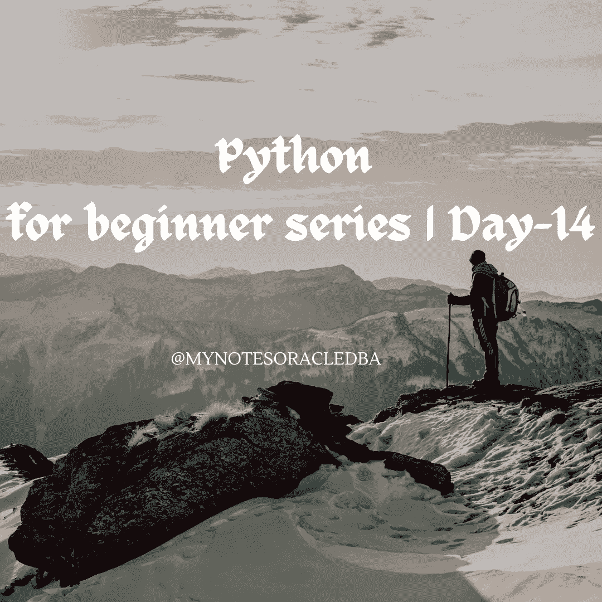

# Python 初学者系列|第 14 天

> 原文：<https://medium.com/geekculture/python-for-beginner-series-day-14-50b6ca1ce543?source=collection_archive---------14----------------------->

在这里，我们将了解列表函数



*   在第 14 天，今天我们将了解一些重要的主题，我们将在未来多次使用。这个叫做 python 的概念**列出了函数**
*   这些功能可以帮助我们添加、删除或修改列表中的项目
*   让我们一个一个地详细看看

1.  **追加:**

*   它用于在列表末尾添加一个项目。

```
a=[10,20,30,10]
a.append(12) #appends a value
print(a)
```

*   在上面的例子中，我们有一个包含值 10，20，30 和 10 的示例列表，我想将项目 12 添加到同一个列表中，所以我使用 append 函数可以将项目添加到列表的末尾。

**可能的输出:**

```
[10, 20, 30, 10, 12]
```

**2。计数:**

*   它返回列表中的项目数
*   在上面的例子中，我使用 count 函数来识别数字 10，它在列表中出现了多少次

```
a=[10,20,30,10]
a.append(12) #appends a value
print(a)
print(a.count(10)) #counts the occurrence
```

**可能的输出:**

```
2
```

**3。扩展:**

*   通过追加 iterable 中的所有项目来扩展列表

```
aList = [123, 'xyz', 'zara', 'abc', 123];
bList = [2009, 'manni'];
aList.extend(bList) #combine another list
print(aList)
```

*   在这个例子中，我们有两个列表，通过使用 extend 函数，我只是合并了这些列表项。

**可能的输出:**

```
[123, 'xyz', 'zara', 'abc', 123, 2009, 'manni']
```

**4。索引**

*   返回列表中 obj 出现的最低索引

```
aList = [123, 'xyz', 'zara', 'abc', 123];

print( aList.index( 123 ))
```

*   在这个例子中，我们将找出列表项的索引位置。

**可能的输出:**

```
0
```

*   即使项目 123 在列表中出现两次，索引函数也将取第一个项目的索引位置

**5。插入**

*   将对象 obj 插入列表中的偏移索引处

```
aList = [123, 'xyz', 'zara', 'abc', 123];

aList.insert( 3, 2009)
```

*   在本例中，我将在索引位置 3 插入 2009 项，如果您看到结果 2009 将位于索引位置 3，而之前的值“abc”已移到位置 4。

**可能的输出:**

```
[123, 'xyz', 'zara', 2009, 'abc', 123]
```

6。波普

*   移除列表中给定位置的项目，并将其返回。如果没有指定索引，`a.pop()`删除并返回列表中的最后一项。

```
aList = [123, 'xyz', 'zara', 'abc', 123];

aList.pop() 

print( aList)
```

**可能的输出:**

```
[123, 'xyz', 'zara', 'abc']
```

*   在这个结果输出中，最后一个索引项已经被删除。
*   如果我想删除列表中的特定项目

```
aList = [123, 'xyz', 'zara', 'abc', 123];

aList.pop(2)
print( aList)
```

**可能的输出:**

```
[123, 'xyz', 'abc', 123];
```

*   结果显示索引位置项 2 将被删除

7。拆下

*   此方法不返回任何值，但从列表中移除给定的对象。
*   它直接从列表中删除该值

```
 aList = [123, 'xyz', 'zara', 'abc', 123];
aList.remove('xyz');
print(aList)
```

**可能的输出:**

```
[123, 'zara', 'abc', 123]
```

**8。反向**

*   它将在适当的位置反转列表中的对象

```
 aList = [123, 'xyz', 'zara', 'abc', 123];
aList.reverse()
print(aList)
```

**可能的输出:**

```
[123, 'abc', 'zara', 'xyz', 123]
```

*   输出结果显示整个项目已被逆转一

**9。分类**

*   让我们看另一个使用排序的例子

```
a=[10,20.3,4]
a.sort(reverse=False)
print(a)
```

**可能的输出:**

```
[4, 10, 20.3]
```

*   这里我们有 10，20.3 和 4 的列表函数。
*   当我们使用函数 sort (reverse=False)时，它将以升序显示结果。
*   在同一个例子中，如果我们想得到降序排列的列表结果

```
 a=[10,20.3,4]

print( sorted(a,reverse=True) )
```

**可能的输出:**

```
 [20.3, 10, 4]
```

*   这里我们可以通过使用**排序得到降序结果(a reverse=True)**