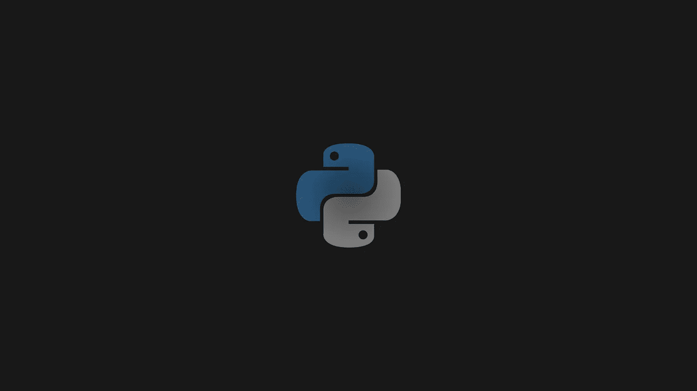
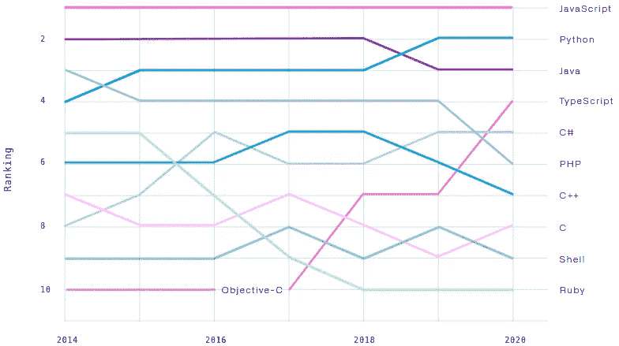
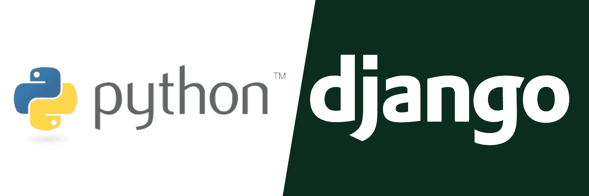
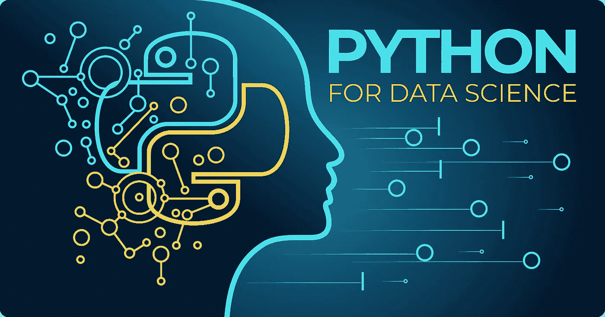
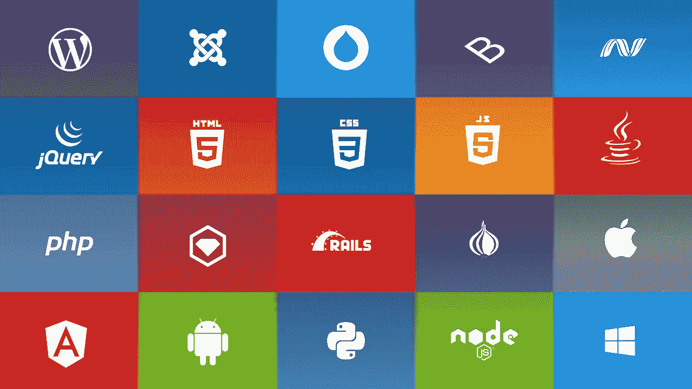

# Python 用于 Web 开发？

> 原文：<https://medium.com/geekculture/python-for-web-development-9ece410a1c2?source=collection_archive---------45----------------------->

这篇文章假设你对 web 开发有一个非常基本的了解——前端和后端，诸如此类的东西——并且作为这个主题问题的一个总体的高层次的概述。

# 涵盖的主题:

*   [Python](https://www.python.org/) 是 web 开发的热门选择吗？
*   Python web 开发中使用了哪些框架？
*   使用 Python 进行 web 开发有什么好处和坏处？
*   Python 还能用来做什么，以什么著称？
*   使用 Python 进行 Web 开发的替代方法有哪些？

由于 JavaScript 在 web 开发领域占据主导地位，在选择构建 web 应用程序的“技术堆栈”时，坚持使用 JavaScript 似乎是一个简单的选择。

从有[节点](https://nodejs.org/en/)的后端，可能是 express，到有 [jQuery](https://jquery.com/) 或 [React](https://reactjs.org/) 等框架和库的前端，一个 web app 可以全部用 JavaScript 编写。这是不是意味着一切都结束了？web 开发还有其他同样好的选择吗？

# Python 是 web 开发的热门选择吗？

Python web 开发可能是使用 JavaScript 进行 web 开发的一个很好的替代方案。Python 创建于 1991 年，长期以来一直是一种广泛使用的语言，并继续受到欢迎。根据 Github 的“2020 年 OCTO 状况”出版物，在过去的两年中，Python 已经巩固了其作为第二大流行编程语言的地位。虽然它的流行可能主要归功于它的许多其他应用程序(我们将在后面讨论)，但很明显 python 是 web 开发的流行选择。

[*The 2020 State of the OCTO-VERSE*](https://octoverse.github.com/) *by Github*

# 用于 Web 开发的 Python 框架

进入框架；各种不同的库和框架使得 Python web 开发成为可能。

当使用 Python 进行 web 编程时，开发人员利用库中现有的代码，并使用现有的框架来简化开发，因此与其他语言相比，开发人员可以用更少的时间来开发应用程序。

Python 是如此受欢迎的语言，这意味着这些框架和库拥有巨大的支持，并不断更新新特性以保持最新。

我不会详细介绍各个框架，但这里有两个最流行的框架的一些摘要。

## 姜戈

Django 是一个用 Python 编写的高级 web 框架，它简化了为数据库驱动的网站构建 web 应用程序的过程。Django 功能丰富，为开发人员提供了一个很好的起点，这样就不用从头开始构建，开发人员也不用太关注应用程序的结构。欲了解更多信息，请查看[为什么 Django 对 web 开发 2021 有好处？](https://www.bytestechnolab.com/blog/why-django-is-good-for-web-development-2021/)

## 瓶

Flask 有一点不同，它被认为是一个微框架，因为它不需要特定的工具或库，也不包括对象关系管理器(这有助于项目的结构)。这意味着 Flask 比 Django 简单得多，感觉更像是在编写 Python，而许多决定都留给了开发人员。代价是开箱即用的特性较少，对于没有经验的开发人员来说，开发之路可能不太清晰。更多信息请访问 [Python Flask:利与弊](https://dev.to/detimo/python-flask-pros-and-cons-1mlo)

# 使用 Python 进行 Web 开发有什么好处和坏处？

## 优点:

*   Python 以其易于阅读的语法而闻名，这意味着与其他语言相比，Python web 开发的学习曲线非常短
*   正如前面提到的，随着 Python 的流行，人们在 web 开发中学习和使用 Python 获得了巨大的支持
*   上面还提到，Python web 开发人员可以使用大量的资源、框架和库。[在线知识库包含超过 140，000 个定制的 Python 软件包。](https://steelkiwi.com/blog/python-for-ai-and-machine-learning/)
*   Python 还有许多其他可以与 web 开发协同工作的应用程序。

## 缺点:

*   Python 需要一个解释器才能在浏览器中运行。因为 JavaScript 在浏览器中本地运行，所以它不需要浏览器。当使用 Python 进行 web 开发时，这可能会导致性能问题，并增加生产流程开发的复杂性。
*   根据框架的不同，可能会有一些设计限制，这是在选择 Python 框架来开发 web 应用程序时应该考虑和研究的事情。例如，如果一个有经验的开发人员想从头开始构建一切；Django 不是一个好的选择，因为它在初始化过程中设置了很多结构。

# Python 还有什么用途/用途？

正如我前面提到的，Python 的流行主要来自于 web 开发之外的应用程序。Python 大量用于网络安全、机器学习、深度学习、人工智能和机器人以及数据科学的无数其他类别和子类别。[截至 2018 年，83%的数据科学家使用 Python](https://businessoverbroadway.com/2019/01/13/programming-languages-most-used-and-recommended-by-data-scientists/) 。

虽然这些主题超出了本文的范围(查看参考资料)，但值得注意的是，数据科学是另一个像 web 开发一样蓬勃发展的行业。如果一个 web 开发人员学会了用 Python 来构建 web 应用程序，他们就可以更容易地进入数据科学的世界，因为他们已经熟悉 Python 了(如果有需要的话)。

# 用于 Web 开发的 Python 替代方案

当开发 web 应用程序时，Python 显然是一个可能的选择，但是留给我们的问题是:其他的是什么？除了使用 JavaScript 或 Python 及其框架和库，还有其他选择吗？

事实证明，几乎每种流行语言都有自己的一组框架和库，就像 Python 一样，用于帮助 web 开发。下面是一些语言的简短列表，其中包含一两个最流行的 web 开发框架。

*   [Java](https://www.oracle.com/java/) web 开发用 [Spring](https://spring.io/) 或 [Hibernate](https://hibernate.org/)
*   [C#](https://docs.microsoft.com/en-us/dotnet/csharp/) 带 [Blazor](https://dotnet.microsoft.com/apps/aspnet/web-apps/blazor)
*   [C++](http://www.cplusplus.org/) 与 [Oat++](https://oatpp.io/)
*   [红宝石](https://www.ruby-lang.org/en/)在[轨道上](https://rubyonrails.org/)

上面的列表包含了许多 web 开发的好选择中的一些，每一个都有自己的优点和缺点，就像我展示的 Python 的优点和缺点一样。

# 摘要

很明显，使用普通 JavaScript 构建或使用众多使用 JavaScript 的框架之一(如 React)有其好处，同样明显的是，选择 Python 进行 web 开发还有其他好处。

作为一个没有使用过 Python 的人，我喜欢通过为用 React/JavaScript 前端构建的应用程序构建一些后端来学习这种语言。作为一名网站开发人员，这将让我接触到我感兴趣的新语言，并让我能够将它应用到我已经知道的东西上，同时也让我能够将技能转移到另一个行业或技术领域。

# 其他值得注意的资源

[为什么 Django 对 web 开发 2021 有好处？](https://www.bytestechnolab.com/blog/why-django-is-good-for-web-development-2021/)

[蟒蛇烧瓶:利弊](https://dev.to/detimo/python-flask-pros-and-cons-1mlo)

[为什么用 Python 做人工智能和机器学习？](https://steelkiwi.com/blog/python-for-ai-and-machine-learning/)