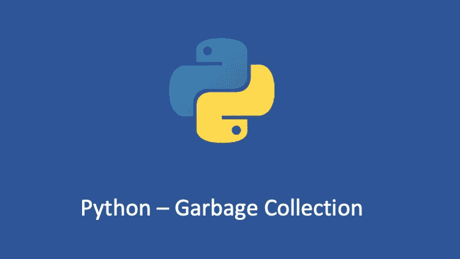

# Python 基础—垃圾收集

> 原文：<https://medium.com/geekculture/python-fundamentals-garbage-collection-d485cde7ded?source=collection_archive---------8----------------------->

## 了解 Python 垃圾收集机制

Python 的垃圾收集机制以引用计数为主，删除标记和分代回收为辅。

# 引用计数

引用计数是 Python 中主要的垃圾收集策略。“参考…