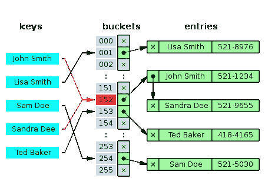

# Python:字典和列表的速度有多快？

> 原文：<https://medium.com/geekculture/python-how-fast-are-dicts-vs-lists-e034c61bb6cd?source=collection_archive---------5----------------------->

因此，您有一个带有 id 的对象列表，您需要通过 id 找到一个对象。你如何保存你的物品？在列表中还是字典中？

虽然这对于有经验的开发人员来说是显而易见的，但是为什么 dicts 性能更好却不那么清楚。

对于学习 Python 编程的人来说，这是另一个实验。