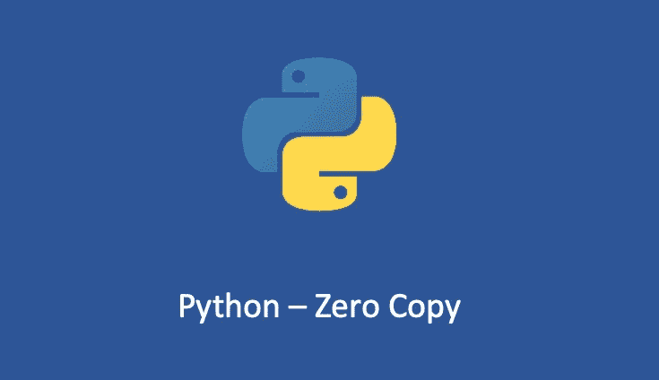

# Python —如何实现零拷贝

> 原文：<https://medium.com/geekculture/python-how-to-implement-zero-copy-1fce69a73706?source=collection_archive---------6----------------------->

## Python 中的零拷贝实现

我在上一篇文章中详细介绍了零拷贝，“[Linux——零拷贝](https://blog.devgenius.io/linux-zero-copy-d61d712813fe)”。今天让我们用 Python 实现零拷贝，并进行一些实验。

# 快速回顾

传统的复制过程可以总结如下:

*   应用程序调用`read` …