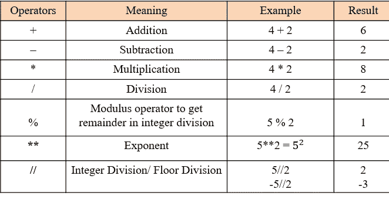
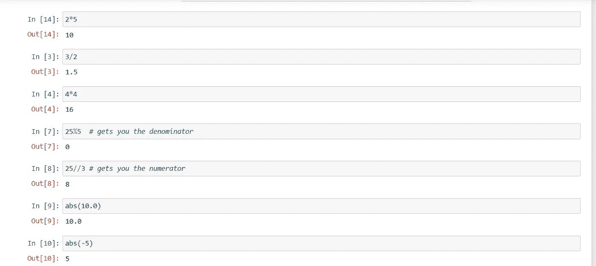
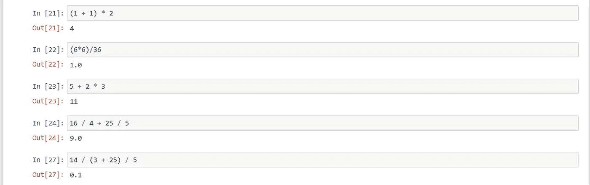
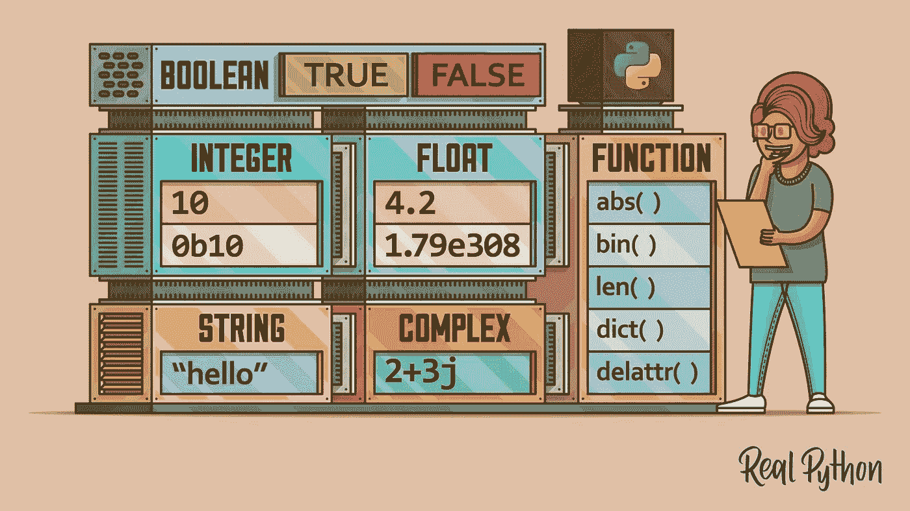
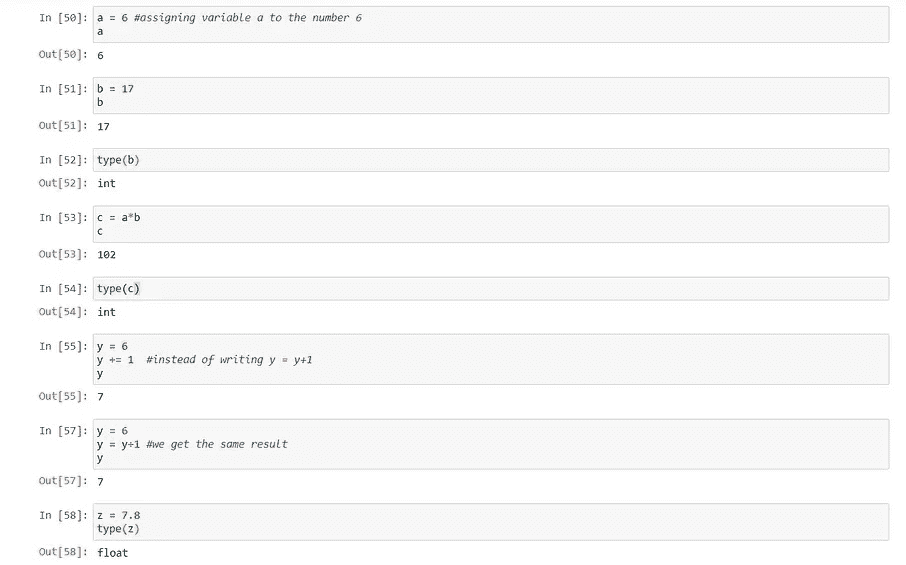
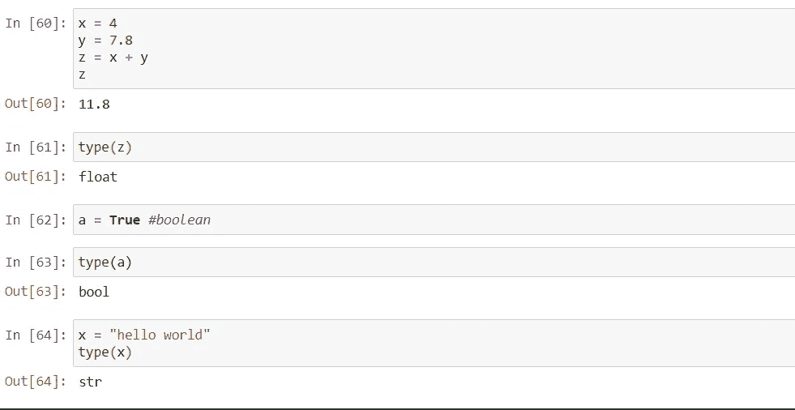

# Python 简介和变量赋值(快速代码-Python)

> 原文：<https://medium.com/geekculture/python-introduction-and-variable-assignment-quick-code-python-4611cc1df224?source=collection_archive---------27----------------------->

(credit:wallpaperflare)

这是**快码-Python** 系列的**第一章**。我很兴奋开始这个系列。本系列的章节中有很多有趣的代码和概念。希望你能从这个系列中学到一些新的有价值的东西。

> 注意:我已经以线性方式编写了**快速代码-Python** 系列，这样即使是新手也可以按照这个系列来理解 Python 实际上能做什么。对于擅长基础知识的人来说，你可以跟随这个系列来更新你的概念，或者选择这个系列中你想了解更多的章节。

Python 是一种易于理解的编程语言，您可以使用它来编写各种项目的代码，如构建 web scrapper 和构建自动化汽车(模拟)。Python 因其易于理解和编码而广受欢迎。我的意思是它太简单了，一旦你掌握了它，你会更喜欢使用 python 而不是计算器。

(credit:datacamp)

我在哪里编码 Python？

您可以使用 IDE(集成开发环境)来编写 python 代码。有各种各样的 IDE 可用于 python，如 Pycharm、Spyder、Jupyter 等。[我已经写了一篇详细的博客来指导你使用 ide 的](/@Shreedharvellay/anaconda-jupyter-spyder-things-you-need-to-know-3c808d824739)安装和运行你的第一个代码。如果你还没有在你的 PC/Mac 上安装任何 python 相关的软件，请检查一下。

记得我告诉过你你更喜欢使用 python 而不是计算器，所以我们将从理解你可以在 python 中做的基本数学运算开始

python 的基本算术运算如下:

使用 jupyter IDE 在 python 代码中实现了相同的操作

basic arithmetic operations

**使用 jupyter 笔记本的快速提示:**

1.  **按住 shift+enter 运行一个单元格**
2.  **按“b”在当前单元格下方创建一个新单元格**
3.  **按“a”在当前单元格上方创建一个新单元格**
4.  **按‘DD’删除当前单元格**

基本的数学运算顺序在这里同样适用于 python，记住 **BODMAS** 规则:

BODMAS operation on python

现在，我们需要保存从我们的基本 python 计算器中得到的答案，以便我们可以在程序中的任何地方访问它们。这就是变量发挥作用的地方，这些变量基本上可以是任何类型的数据，如数字、字符串，甚至布尔型，这就是为什么我们在它们周围有一个数据类型来告诉它们我们期望什么类型的数据。

different data types in python (credit: RealPython)

现在，我将在 jupyter 中编写代码片段，为变量分配不同的值

variable assignment using python

注意:python 中有一些特定的关键字不能用来给变量赋值。

Keywords in Python (credit: educba)

这些在 python 中有自己的功能，比如使用`for`创建循环或者使用`if`创建条件语句，等等。

在这篇博客中，我们已经了解了 python 可以做什么，我们也做了一些快速的数学运算，并用 python 将它们存储在一个变量中。

在**快速代码-Python** 系列的下一篇博客中，我们将利用所有这些知识来解决问题，比如求矩形/正方形的面积，使用代数运算，将摄氏温度转换成华氏温度，以及更多有趣的事情。

查看**快速代码的下一章——Python**系列[这里](/geekculture/solving-math-problems-using-python-quick-code-python-52b1b37a79d5)和**快速代码的介绍** [这里](/@Shreedharvellay/quick-code-introduction-2f64cdd7a392)

敬请期待:)