# 熊猫对 Python 列表理解的介绍

> 原文：<https://medium.com/geekculture/python-list-comprehension-with-pandas-6514557babc6?source=collection_archive---------2----------------------->

## 什么是列表理解？

Photo by [GDJ](https://pixabay.com/users/gdj-1086657/) from [pixabay](https://pixabay.com/)

List comprehension 是 Python 中一个强大的工具，使用它，以一种令人难以置信的简洁方式，我们可以把来自其他 iterables 的列表放在一起，如果需要的话，可以应用复杂的逻辑。对我们来说幸运的是，这个工具也可以很好地用于我们的数据项目，因为大多数时候熊猫系列对象的基本构建块之一是 NumPy 数组。

现在，理解数组、NumPy 数组和 Python 列表只是相似，而不是完全相同的东西是非常重要的。与传统数组相比，列表提供了更大的灵活性(在许多情况下，您需要预先声明大小和存储的数据类型)，NumPy 数组包含了有助于数据处理和数据科学的功能。和往常一样，我强烈建议您浏览一下关于 [NumPy 数组](https://numpy.org/doc/stable/reference/generated/numpy.ndarray.html)的文档，并作为一般的计算机科学学习练习，熟悉一下低级语言中数组的经典结构[。](https://www.geeksforgeeks.org/arrays-in-c-cpp/)

然而，幸运的是，在 pandas 中工作时，一个系列中的数据存储在一个 NumPy 数组中，我们可以非常灵活地在列表和数组之间来回转换，使得数据操作变得非常容易。

让我们来看看最基本的数据帧创建:我们使用一个字典，其中键是未来的列名，值是我们将用作数据本身的元素列表:

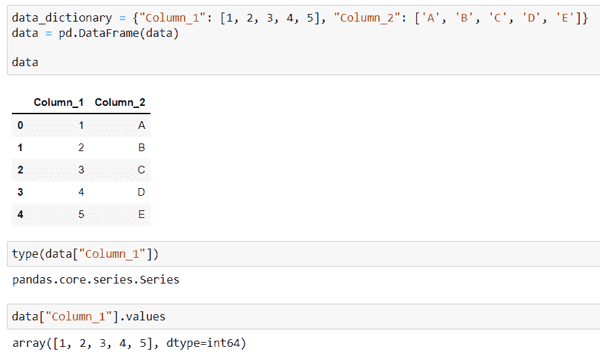

Screenshot by Author

我们也可以插入一个新列，在列表中提供新数据:

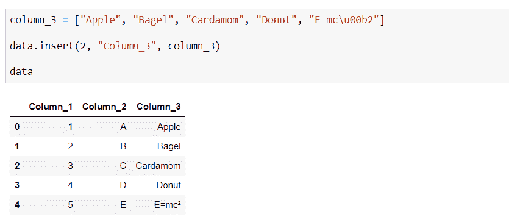

Screenshot by Author

如果我们需要一个序列中的数据作为一个列表，调用 Python 的 list 方法来处理这个序列将会给我们一个列表，没有问题:

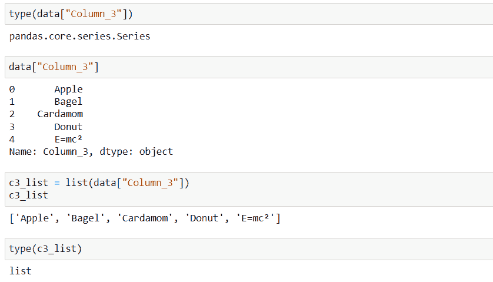

Screenshot by Author

## **列表理解**

Python 的列表理解本质上是一种更短的，你可能会说更 python 化的语法，用于从 iterable 创建列表。举个最基本的例子，假设你有一个整数列表(L1 ),你想有一个 L1 整数平方值的新列表(L2)。最基本的解决方案是使用一个循环来完成这项工作:

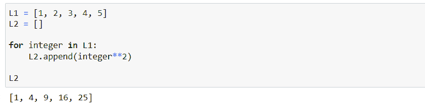

Screenshot by Author

在我看来，列表理解提供了一种更优雅的方式来做到这一点:

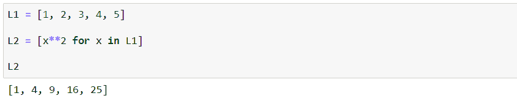

Screenshot by Author

语法一开始可能有点模糊，但是相当简单:

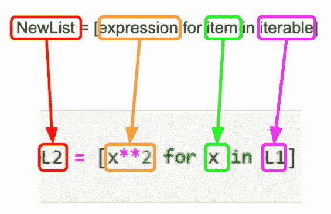

Picture by Author

当你在表达式中应用 condition 时，它会变得有点粗糙，但并不太糟糕:

Screenshot by Author

这一细分更清楚地表明:

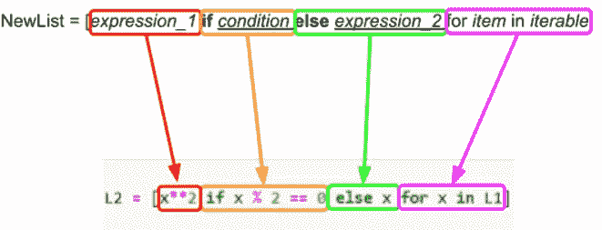

Picture by Author

现在我们已经掌握了 list comprehension 语法是如何构造的，是时候看看数据框架的一些应用了！

> 如果你想让我保持咖啡因创造更多这样的内容，请考虑支持我，只要一杯咖啡。

## **重命名列**

在 Pandas 中更改列名很容易——无论是在数据加载期间还是稍后使用 rename()方法。当你有很多问题时，问题就来了。

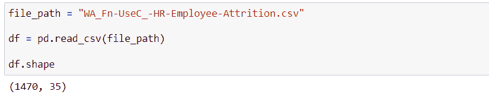

Screenshot by Author

例如，这是来自 Kaggle 的 IBM HR Analytics 员工流失&性能数据集，35 列并不多，但是如果您想要重命名全部或大部分列，那么编写包含所有 old_name:new_name 对的字典肯定会很乏味。

假设您特别不喜欢长列名，并决定所有列名的最大字符数应为 10，如果原来的名称比这短，它们应该保持不变:

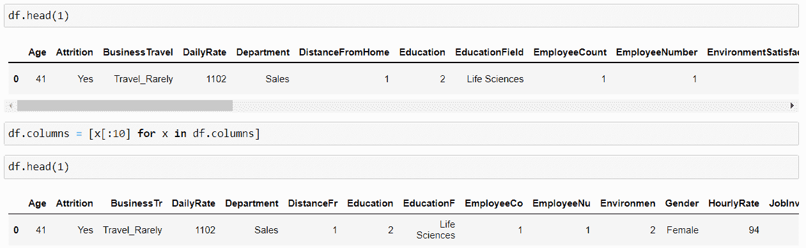

Screenshot by Author

这确实不是一个特别明智的修改，但是很好地说明了这一点:通过一行简单的代码和理解的使用，我们修改了长度要求所必需的所有列名。

要在实践中看到条件语句，假设我们决定，如果字符数是偶数，我们只需要任何列名的前 10 个字符:否则，我们用列名的长度替换列名:

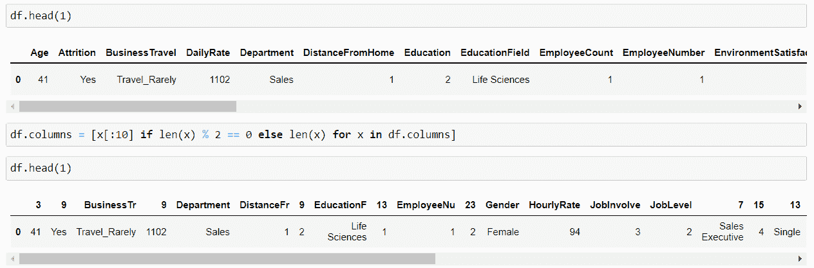

Screenshot by Author

这里需要注意的是，我们必须确保为新列名生成的新列表必须与旧名称列表的长度相匹配:如果我们在上面的示例中只返回偶数长度的列，我们会得到一个错误:

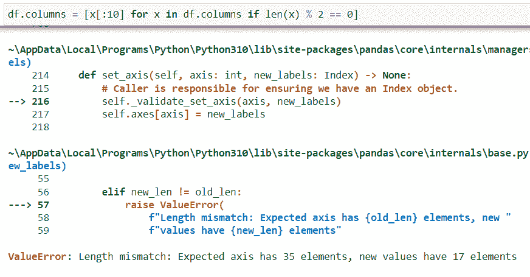

Screenshot by Author

还要注意，如果不想在条件语句中包含 else 子句，可以将 if 语句放在 iterable 子句中 item 的“*之后，而不是之前。*

## **修改列值**

更改系列中的数据与更改列名的方式非常相似，您可能希望采取的唯一额外预防措施是考虑系列中的数据类型:尽管这不是必须的，但在大多数情况下，您最有可能使用字符串列名，但对于数据框架中的实际数据，类型可能无处不在。

让我们继续使用 IBM 的流失数据，让我重复使用基于 *EducationField* 添加额外列的示例—如果我们有“技术学位”，我们希望返回“工程师”，否则返回“不是工程师”:

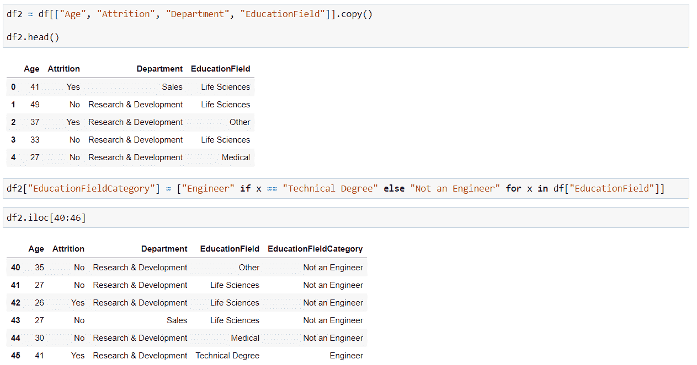

Screenshot by Author

我们也可以重用 *is_engineer* 函数:如果你想应用复杂的逻辑，调用理解中的函数是完全可以的，甚至是实用的:

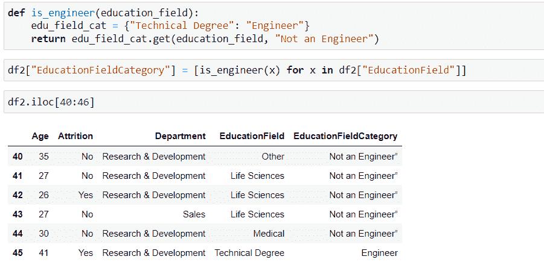

Screenshot by Author

当然，这不是一个超级复杂的逻辑，但是很容易看到，列表理解行变得更加清晰，并且对逻辑的任何维护都可以在函数定义本身中与数据更改命令分开进行。

列表理解是任何 Python 开发人员的武器库中的一个强大工具，在您的数据项目中使用时，它也同样强大。如果您想了解更多，请查看[文档](https://docs.python.org/3/tutorial/datastructures.html#list-comprehensions)——我相信您会的！否则你为什么会读这篇文章？