# 使用 SerpAPI 改善您的购物决策—第 2 部分

> 原文：<https://medium.com/geekculture/python-mining-reviews-964809cb5ad3?source=collection_archive---------15----------------------->

## 使用 Python、SerpAPI 和 Google Shopping 获得强大的购物洞察力

免责声明:我没有试图在这里推广/销售任何产品。

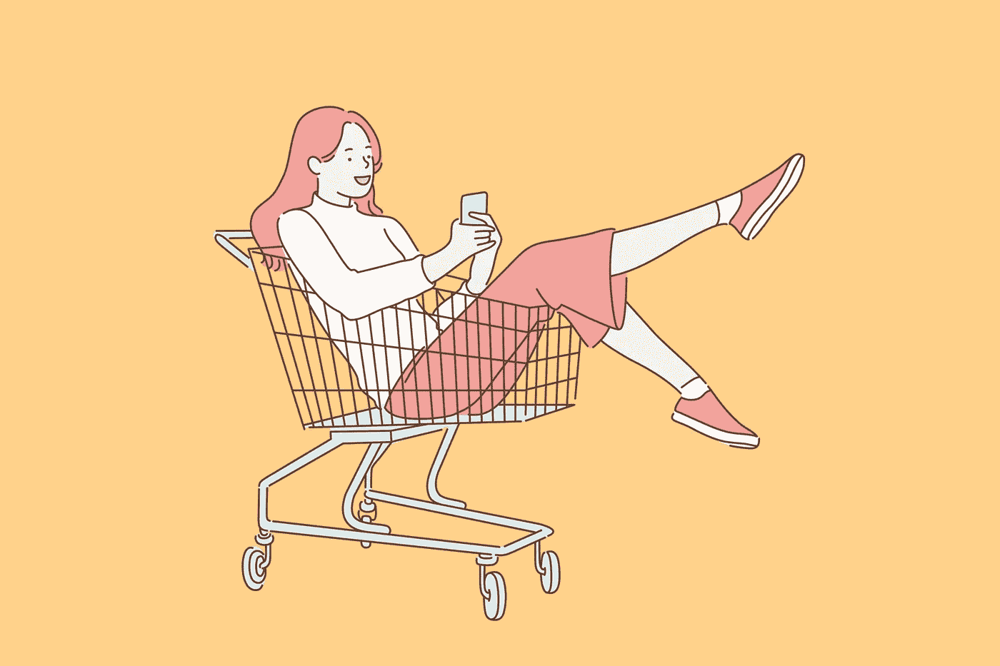

Image by [Eman Hamden](https://www.vecteezy.com/members/eman-hamden836574) on [Vecteezy](https://www.vecteezy.com/members/eman-hamden836574)

# 介绍

这是前一篇文章的延续，前一篇文章讲述了使用 SerpAPI 从 Google 购物结果中收集数据，解析数据并将其存储在 DataFrame 中。点击了解更多[。无论是送给心爱的人的礼物，还是自己在为自己选购的商品，难道你不觉得自己值得拥有最好的吗？这篇文章可以帮助你做出更有效的购物决定，同时获得有价值的见解。](https://mg-subha.medium.com/how-to-find-the-perfect-gift-the-nerdy-way-938dd8390cc2)

在这种情况下，我目前正在努力购买**最好的网球鞋**。我想确定我选择的是最好的。

我们收集了前一篇文章中分析所需的所有数据。我们现在拥有的数据是-

**购物结果数据-**

**这包括使用 SerpAPI 从 Google、Yahoo、Bing 等热门搜索引擎收集的数据。**

以下是数据帧“Shopping_Results_Data”中解析和存储的数据的局部视图

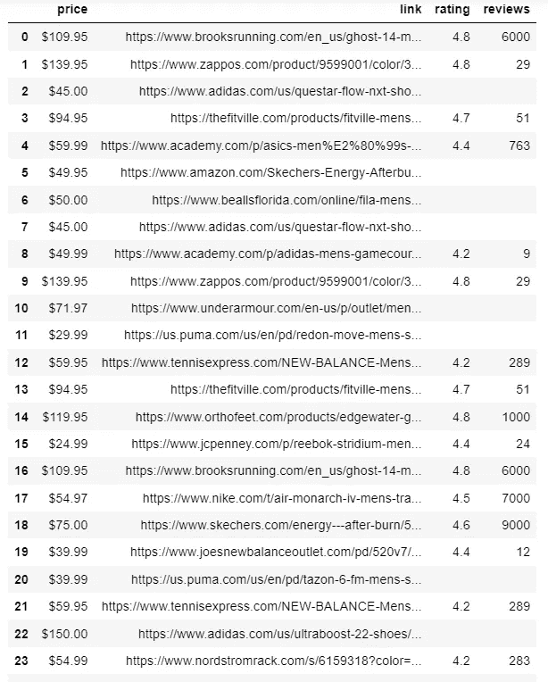

**相关问题-**

这包括关于网球鞋的问题。

以下是数据框“相关问题”的局部视图

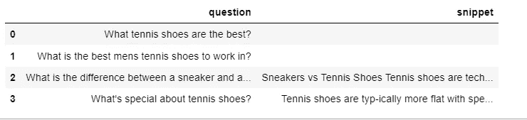

**内嵌图像数据**

最后，我有内联图像数据，这些数据链接到实际的产品和相关的产品名称。下面是数据帧“inline_image_data”的局部视图

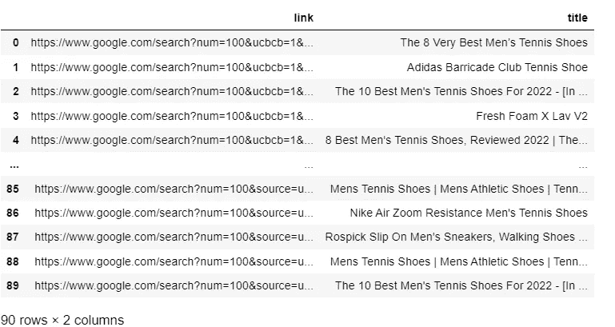

# 分析

让我们开始读“相关问题”中的课文。当文本被削减时，我们使用' max_colwidth '选项来显示完整的文本。

```
**pd.set_option(‘display.max_colwidth’, None)
related_questions**
```


看到上面的内容，找出一个人打球的具体场地是有意义的。

接下来说下一个——shopping _ results。

## 价格最高的 10 种产品

“价格”列是一个对象，因为它旁边有“$”货币符号。因此，需要一个 regex 替换，然后转换为 float。一旦这样做了，就可以从最高到最低的价格获得前 10 名的产品。

```
**Shopping_Results_Data['price'] = Shopping_Results_Data['price'].replace('[\$,]', '', regex=True).astype(float)****Shopping_Results_Data.nlargest(15, 'price', keep='first')**
```

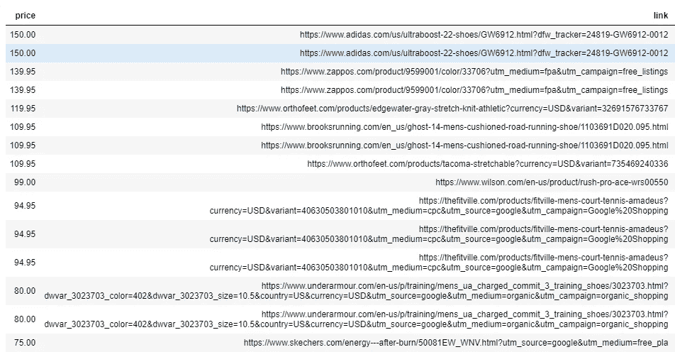

请注意，有多行具有相同的产品链接。这可能是因为 SerpAPI 从多个搜索引擎(如谷歌、雅虎等)收集结果。让我们去掉重复的，重新得到前 15 名。

```
Shopping_Results_Data = Shopping_Results_Data.drop_duplicates()
```

在某种条形图中绘制如此冗长的 URL 是没有意义的。相反，我们可以使用 IPython 库(IPython.display)中的 HTML 模块将链接呈现为可点击的 URL。

```
from IPython.display import HTML
Top15_by_price = Shopping_Results_Data.nlargest(15, 'price', keep='first')
HTML(Top15_by_price.to_html(render_links=True, escape=False, classes='table table-striped text-center', justify='left'))
Shopping_Results_Data.nlargest(15, 'price', keep='first')
```

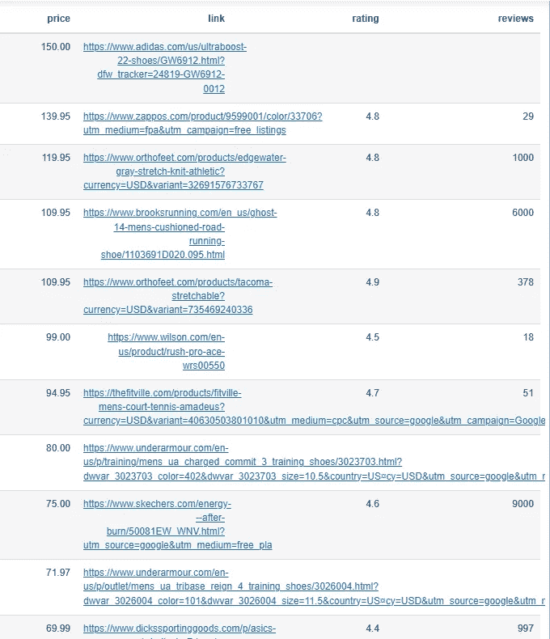

Partial View of the DataFrame with clickable URLs

让我们快速绘制一个箱线图，看看价格的范围。

```
**fig = plt.figure(figsize =(10, 7))

# Creating plot
plt.boxplot(Top15_by_price['price'])

# show plot
plt.show()**
```

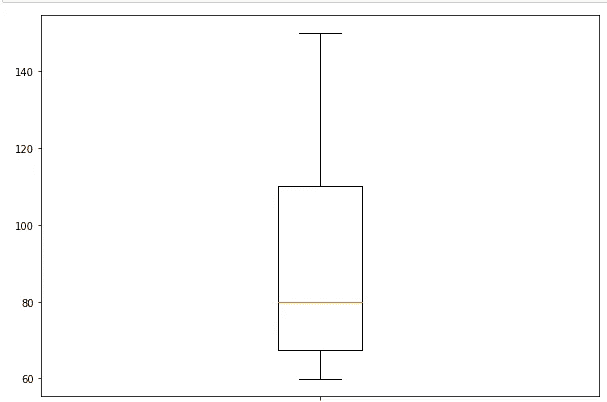

Box Plot showing the price ranges and median

一双网球鞋平均售价约 80 美元，有些高达 150 美元，有些低至 60 美元。

## 高价商品的评价总是很高吗？

这里，我们将使用一个简单的散点图来检查价格和评级之间的相关性。

```
**import matplotlib.pyplot as plt
plt.scatter(Shopping_Results_Data['rating'].astype(float), Shopping_Results_Data['price'])
plt.show()**
```

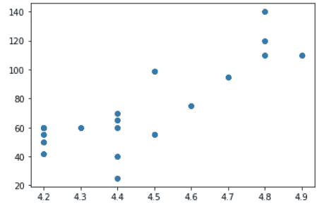

Scatter Plot

我们看到这里有一个模式——**高评级的商品确实有更高的价格。**

## 产品是如何评级的？

让我们看看有多少中等价位的鞋(70-80 美元)和高价鞋(100 美元)的评分高于 4.7 分(满分 5 分)。

```
query1 = Shopping_Results_Data.query('rating >=4.7 & price > 100')
query1
```

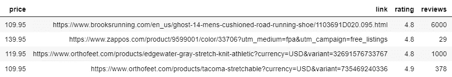

如上所述，100 美元范围内的大多数鞋子都有 4.8 及以上的评分。其中一些也有很多评论。

```
**query2 = Shopping_Results_Data.query('rating_float >=4.7 & ((price >= 70) and (price <= 80))')
query2**
```

没有评级高于 4.7 的平均价格产品。

唯一评分为 4.6 的平均价格产品似乎是-

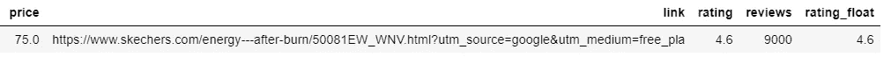

**我们对不同的产品有多少评论？**

```
**query3 = Shopping_Results_Data.query('reviews>=1000')
query3**
```

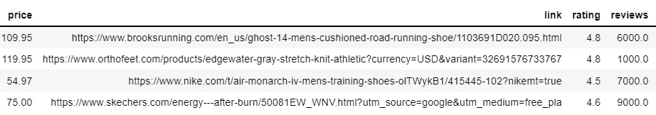

上述产品似乎有一吨的评论。

## 最终购物见解

*   寻找价格超过 100 美元、评分超过 4.7 分的鞋子。
*   这些超过 100 条评论的产品的链接可以被进一步抓取，以得出更有趣的见解。