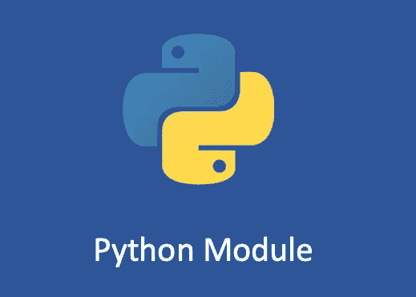

# Python 模块

> 原文：<https://medium.com/geekculture/python-module-6bf956ba299c?source=collection_archive---------13----------------------->

## 学习 Python 模块的基础知识

Python 模块用于简化开发复杂度，模块化和文档化功能，使不同的功能和组件可以像搭建乐高积木一样构建在大型项目中。

# Python 模块

说到模块化最简单的方法，你可以把函数、类和常量分成不同的…