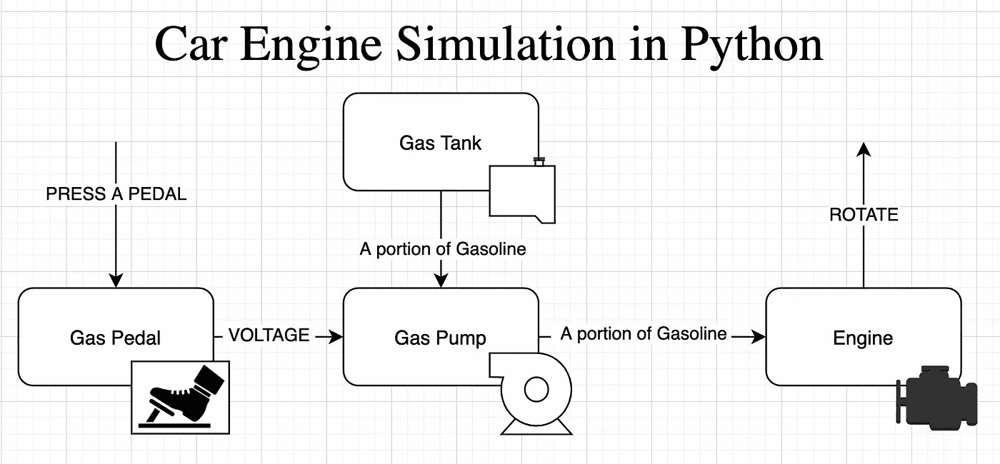

# Python OOP 示例:汽车引擎模拟，适合初学者

> 原文：<https://medium.com/geekculture/python-oop-example-car-engine-simulation-for-beginners-23211ee2b0d7?source=collection_archive---------1----------------------->

严格的类型、数据类、单元测试和你需要的一切

在本文中，我将展示一个结构良好且经过测试的 Python 项目的例子。这对于开始编程的人和从另一种语言转向 Python 的人来说可能是有用的。