# Python 操作符——当然不是很有趣，但是非常重要

> 原文：<https://medium.com/geekculture/python-operators-certainly-not-very-interesting-but-very-important-dac777c21c59?source=collection_archive---------6----------------------->

## 乍一看，它们似乎微不足道，但是相信我，它们真的很快变得至关重要

在我的上一篇[文章](/codestory/how-to-start-coding-with-python-aa84534305d9)中，我们介绍了基础知识，如何开始用 Python 编码。我们学习了如何建立一个编程环境。此外，我们还遇到了数据类型、变量和数据结构。通过这篇文章我们将继续我们的旅程，今天我们将学习我们可以用变量或数据结构做什么有用的事情。

Photo by [Antoine Dautry](https://unsplash.com/@antoine1003?utm_source=medium&utm_medium=referral) on [Unsplash](https://unsplash.com?utm_source=medium&utm_medium=referral)

这篇文章的结构如下:

*   介绍
*   算术运算符
*   比较(关系)运算符
*   赋值运算符
*   逻辑运算符
*   按位运算符
*   成员运算符
*   标识运算符
*   结论

享受阅读吧！

# 介绍

就像我们刚开始学数学的时候，我们学习数字，然后，我们开始用那些数字做一些事情，所谓的运算，像加法，乘法，或者比较。同样，为了全面利用 Python 和上一篇文章中的知识，我们今天将介绍操作符。

在 Python 中，**操作符**是特殊字符，看起来会很熟悉。此外，定义**操作数**也很重要，即进行运算的数字或变量。

基本上，我们有两个操作数，变量，数字，字符串在左边和右边，运算符在中间。

在我们开始之前，让我们打开一个 Jupyter 笔记本。如果你忘了怎么做，[查看上一篇文章](/codestory/how-to-start-coding-with-python-aa84534305d9)。🙂

# 算术运算符

算术运算符用于基本的数学运算，即加、减、乘、除、模运算(模数)、取幂和除法。

先说加法。它的运算符是**加号** **+** 。它将符号两边的数字相加。

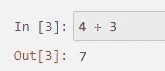

by author

使用**减号-** 进行减法运算。它从左操作数中减去右操作数。

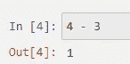

by author

使用**星号*** 完成乘法运算。它将运算符两边的值相乘。

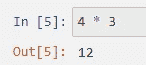

by author

使用**正斜杠** **/** 完成除法。它将左操作数除以右操作数。值得注意的是，即使两个整数被除，操作也返回一个**浮点数**。

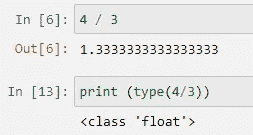

by author

模运算或模数将左操作数除以右操作数，然后返回余数。使用**百分号** **%** 完成。

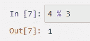

by author

取幂或幂运算对运算符执行指数(幂)计算。可以认为是重复乘法。这是使用**两个星号**符号 ****** 完成的。

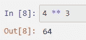

by author

最后但并非最不重要的是，我们有地板分工。它是操作数的除法，结果是去掉小数点后的数字后的商。

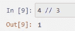

by author

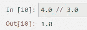

by author

如果我们输入两个整数，输出也是一个整数，而使用 floats 返回一个 float。

所有这些例子也可以使用变量来完成。这里有一个乘法的例子。

by author

现在我们已经介绍了算术运算符的基础知识，稍后我们将在更复杂的运算中遇到它们。但是现在让我们看看另一组重要的操作符。

# 比较运算符

顾名思义，它们比较两边的值并决定它们之间的关系。它们也被称为关系运算符。它们返回一个**布尔值**，或者换句话说，**真**或**假**。让我们来看一些例子。我们现在将使用变量， **a** 将保存 14， **b** 将保存 23。

等号运算符检查两个变量(或数字)是否相等。用**两个**等号 **==** 检查。

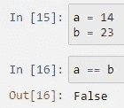

by author

如果两个操作数的值相等，则条件为真。由于 a 和 b 不相等，它返回布尔值**假**。这意味着**不等于**操作符应该返回**真值**。用感叹号和等号**来勾选！=** 。

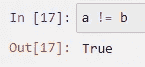

by author

为了检查 a 是否大于 b，我们使用了**大于运算符>** 。它检查左操作数的值是否大于右操作数的值，然后条件变为**真**。

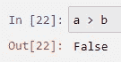

by author

因为 a 小于 b，所以返回 False。

为了证明 **a** 小于 **b** ，我们用**小于**运算符 **<** 。如果左操作数的值小于右操作数的值，则条件变为**真**。

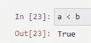

by author

由于 14 小于 23，它返回**真值**。

除了大于和小于之外，还有大于等于的**和小于等于**的**运算符，分别用 **> =** 或 **< =** 符号进行检查。**大于或等于**如果左操作数的值大于或等于右操作数的值，则返回 **True** 。**

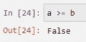

by author

如果左侧操作数小于右侧操作数小于或等于，则返回 true。

by author

比较运算符通常用于检查是否满足某些条件，例如在循环中，我们将在后面介绍。

# 赋值运算符

赋值操作符用在我们想给一个变量赋值的时候。我们已经遇到了第一个赋值操作符，**等号=** 。当一个常量(值)被赋给一个变量时使用。

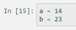

by author

或者我们想把两个变量 a 和 b 的和赋给一个新的变量 c。

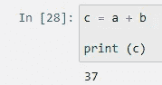

by author

或者，写得更短。

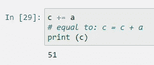

by author

类似地，我们可以结合赋值、减法、乘法、除法、取模、取幂和/或取底除法，进行上述任何其他算术运算。只给出了乘法，但是任何其他的都可以按照例子来做。

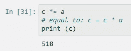

by author

首先，c 乘以 a，然后将新值 518 赋给 c。

对于上面提到的所有运算，取左操作数，与右操作数进行加、减、乘…运算，然后将结果赋给左操作数。

# 逻辑运算符

逻辑运算符用于我们想要组合条件语句的情况。即，我们想要检查是否满足两个或更多条件。有三个逻辑运算符，**和**，**或**和**而不是**。

如果所有检查的条件都为**真**，则 and 运算符返回**真**。如果仅**一个条件不满足**，则返回**假**。

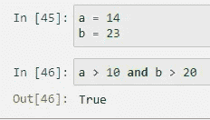

by author

如果至少**一个检查条件**为**真**，则**或**操作器将返回**真**。只有当**无**条件满足时，才会返回**假**。

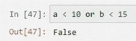

by author

这里，两个条件都是**假**，因此 or 运算符返回**假**。

**非**操作符如果所有条件都为**假**则返回**真**，或者如果所有条件都为**真**则返回**假**。或者，我们可以很容易地想到，如果我们希望**与**运算符相反。

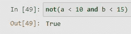

by author

可能的组合还有很多，我强烈建议你自己尝试一下，因为有时候会让人困惑，最好的方法就是尝试一下。

# 按位运算符

当我们想要在二进制水平上比较数字时，使用按位运算符。首先将整数转换为二进制格式，然后逐位执行所选操作。结果以十进制格式返回。按位运算符有 **&【与】****|(或)****【^(异或)****~(非)**、 **< <(补零左移)**和 **> >(有符号右移)**。

如果两位都为 1，按位**和** ( **&** )将该位设置为 1。我知道这有点令人困惑，但当我们看到一个例子时就会明白了。

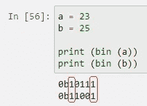

by author

二进制值 23 是 10111，而二进制值 25 是 11001。因此，如果我们将这两个二进制值一个放在另一个上面，我们会看到第一位和最后一位都是 1。也就是说，按位 and 将返回 10001，或十进制数 17。

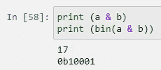

by author

请注意，位运算返回结果的十进制值，这一点很重要。为了方便起见，我们使用 **bin()** 来检查二进制值。

与逻辑**或**类似，如果至少有一个值为 1，则按位**或(|)** 返回 1。同样，如果我们分别查看二进制值 23 和 25、10111 和 11001，我们会看到每个位置(每个位)至少出现一个 1。二进制 11111 的十进制值是 31。

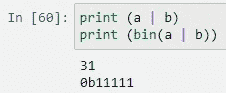

by author

逻辑 **XOR** 运算符( **^** )复制仅在一个操作数中设置的位，而不是两个都设置。它有点类似于按位或，但在两位都为 1 的情况下，它不会激活并将结果设置为 1。

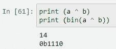

by author

第一位不打印，因为它是零(0)。所以结果基本是 01110。

# 成员运算符

成员资格运算符测试序列中的成员资格，如字符串、列表或元组。即，如果我们的目标是测试一个元素是否包含在一个列表、元组或字符串中。有两个恒等运算符，中的**和**中的**。**

中的**评估变量是否包含在所需的序列、字符串、列表、字典…**

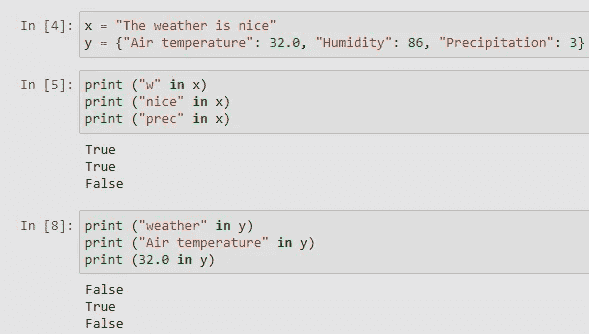

by author

同样，我们在中使用 **not，如果变量**不在**序列中，则返回 **True** ，如果变量**在**序列中，则返回 **False** 。**

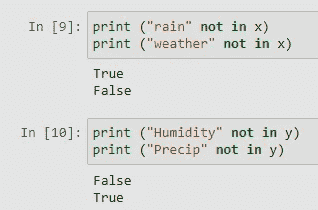

by author

# 标识运算符

恒等运算符比较某些对象的内存位置，这意味着它们不测试两个对象的值或大小是否相等，而且它们测试两个对象在内存中的位置是否相同。身份符是**是**而**不是**。

**IS** 如果运算符左右两边的对象指向内存中的同一个对象，则返回 True。

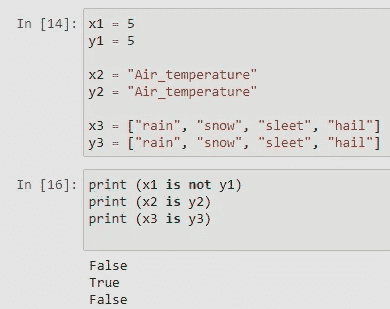

by author

由于**列表**是**可变**对象，这意味着，可以使用赋值语句添加元素，或者从列表中删除元素。示例 x1、y1 和 x2、y2 分别包含**整数**和**字符串**，它们是**不可变的**，这意味着它们一旦被赋值，就不能被更改，因此它们也共享内存中的相同位置。

# 结论

对于这篇短文，我的目标是阐明我们编写的每个脚本或程序的一个非常重要的构件，即操作符。它们当然不像深度学习中的一些很酷的任务或脚本那样壮观，但它们是每个深度学习算法或我们在 Python 中执行的任何其他任务的关键部分。

我认为，我们都应该在开始做一些新的事情时投入一些时间来理解基本概念，因为，以后，这将使我们的生活变得容易得多。

关于这篇文章或我在[媒体](/@Karlo_Leskovar)上的其他文章的任何问题或建议，请随时通过 [LinkedIn](https://www.linkedin.com/mwlite/in/karlo-leskovar-a8612b105) 联系我。

感谢您抽出时间，干杯！🙂