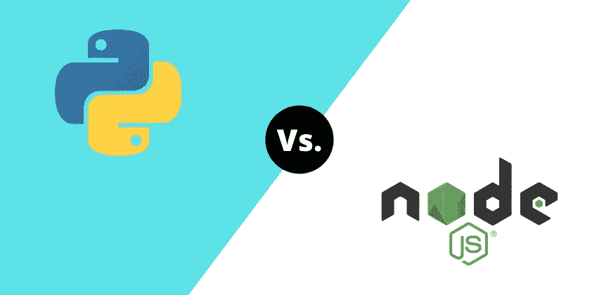

# Python 和 Node.js:哪个最适合你的 Web 应用？

> 原文：<https://medium.com/geekculture/python-or-node-js-which-is-best-for-your-web-application-b2f001fba2e0?source=collection_archive---------10----------------------->

正确的技术对您的 web 应用程序至关重要。它使您的期望与技术能力相匹配。当决定 web 开发的技术栈时，理解它们的特性对于结果交付是很重要的。在本文中，我们将重点讨论 Node.js 和 Python 作为构建 web 应用程序的技术。

识别正确的技术有助于您识别功能开发潜力、预算、可伸缩性以及其他属性。Python 和 Node.js 既相关又强大。它们提供了构建动态 web 应用程序的能力。

85%的 [Nodejs 开发者](https://www.botreetechnologies.com/hire-nodejs-developers)将其用于 web 应用开发。另一方面，根据 TIOBE 的说法，Python 现在是最流行的编程语言。现在，有什么区别吗？

> **结帐**[**10 大真实 Python 用例及应用**](https://www.botreetechnologies.com/blog/top-10-python-use-cases-and-applications/)

# **什么是 Python，什么是 Node.js？**

在了解它们的用途之前，我们先来看看它们是什么。Python 和 Node.js 对于同样的功能——web 应用开发——很有用。然而，两者的定义和特征是不同的。

Python 是一种开源的面向对象编程语言，用于构建 web 应用程序。它使用 Javascript 并在 Django、Flask、Web2Py 等框架中工作。Python 也是机器学习的一种有价值的语言。谷歌、微软、Instagram、Spotify 等公司用它来开发基于人工智能的算法。

Node.js 是一个用于 web 开发的**服务器端运行时环境**。它基于谷歌 Chrome 的高性能 V8 Javascript 引擎。它使用 Javascript 编程语言来创建 web 应用程序的前端和后端。Linkedin、网飞、优步、Paypal 都是在他们的技术堆栈中使用 Node.js 的公司的几个例子。

Python 和 Node.js 在本质特征上是不同的——一个是编程语言，而另一个不是。要用 Python 开发 web 应用程序，了解语法是必不可少的。web 开发的 Node.js 需要 Javascript 编程语言的语法知识。

Python 开发人员和 Nodejs 开发人员都可以使用机器学习。虽然 Python 对 AI 很有用，但 Node.js 可以开发聊天机器人和实时应用程序。

**让我们来详细了解一下每项技术。**

# **为什么使用 Python 进行 Web 开发？**

Python 是一个改变游戏规则的技术栈。它支持开发功能强大、可伸缩的企业级 web 应用程序，并提供多种集成。Python 在数据科学、游戏开发、CMS 门户、桌面 GUI、科学应用程序、DevOps、软件测试等领域非常有用。

Python 原则在动态的以客户为中心的企业应用程序中非常有用。让我们看看 Python 的优势，这些优势使它非常适合 web 开发。

*   **开发者友好的** Python 有一个简单的学习曲线。它是一种初学者友好的语言，在世界各地的大学里作为入门编程语言教授。Python 中的大多数错误都是可管理的——它不会因为微小的代码问题而阻碍整个过程。它们的语法类似于英语，可以快速开发。
*   **强大的** 编程语言以强大的开发性著称。Python 库和语法本身结合起来开发了一些最健壮的应用程序。这些应用程序不会滞后。这种语言文档丰富，用途广泛。当用 Python 编写时，后端变得非常动态，支持更多的定制。
*   **灵活** [Python 开发服务](https://www.botreetechnologies.com/python-development)提供了最大的灵活性。这种语言不遵循惯例。当与 Django 一起使用时，开发人员可以随时定制环境。Python 确实遵循 DRY 原则，使开发人员能够重用代码。它最大限度地减少了开发 web 应用程序的时间。
*   **快速原型** 由于上述 Python 特性，编程语言有助于构建快速原型。创业公司可以在更短的时间内快速获得适销产品。也降低了产品开发成本。通过快速迭代，您可以用最新版本更新产品并对其进行改进。

> **阅读更多:**[**Python 的优缺点**](https://www.botreetechnologies.com/blog/pros-and-cons-of-python/) **:权威的 Python Web 开发指南**

# **为什么使用 Node.js 进行 Web 开发？**

Node.js 对于构建支持多种操作系统的应用程序非常有用。这对构建实时服务器应用程序很有价值。[node . js for web development](https://www.botreetechnologies.com/blog/differences-between-javascript-nodejs-for-web-application-development/)因其惊人的性能成为公司的选择。它使结果驱动的 web 开发变得容易。

让我们看看 Node.js 在构建 web 应用程序时的一些优势。

*   **基于 Javascript 的环境** node . js 最大的好处就是使用了 Javascript。编程语言构成了各种 web 应用程序的核心。它是构建 web 应用程序后端和前端的强大语言。构建 Node.js 应用程序不需要很多技术。Javascript 的知识对于 web 开发来说已经足够了。
*   **灵活开发** 因为 node.js 使用了 Javascript，所以提供了类似 Python 项目的灵活性。Node.js 开发人员可以随时随地构建应用程序特性。他们可以用简单的包来试验环境。Javascript 在前端和后端的使用使得它足够灵活，可以有效地理解每个特性。
*   **全栈开发** Node.js 对前端和后端开发非常有用。在聘请软件开发公司时，全栈功能使其非常完美。它降低了为这两种功能分别雇用开发人员的成本。它还缩短了开发周期，实现了快速产品开发。

现在我们已经了解了使用 Python 和 Node.js 的优势，让我们来看看两者之间的比较。它基于几个因素。我们将了解每项技术如何与特定参数保持一致。

> **阅读更多:** [**Node JS 开发:IBM、Paypal、SAP 为什么用它**](https://www.botreetechnologies.com/blog/why-where-and-how-do-companies-like-paypal-sap-and-ibm-use-node-js/)

# **Node.js 与 Python 的比较**

就开发能力而言，比较编程语言(Python)和运行时环境(Node.js)是很困难的。大多数人可能会认为 Python 是后端和机器学习的重型语言。另一方面，Node.js 被认为是服务器端应用程序的框架。我们将根据以下参数对它们进行比较:

*   发展速度
*   产品可扩展性
*   学习曲线
*   库和工具
*   易于开发

**让我们来看看这些因素以及 Python 和 Node.js 在这些参数上的表现。**

**开发速度
这导致开发速度相对较慢，性能较低。对其他功能的关注可能会导致你意想不到的滞后。**

Python 非常适合多任务处理。它支持重用代码以加快开发速度。Python 框架有内置的解决方案，可以一次处理太多的函数。Python 开发人员需要满足的技术期望较少。

**产品可扩展性** Node.js 在单线程中构建异步架构。该结构减少了开发 web 应用程序时的错误数量。它支持同时处理多个请求，并有助于构建可伸缩的应用程序。

Python 不支持异步架构。但是，它对于构建可伸缩的企业级应用程序非常有用。它的可扩展性可能不如 node . js。Python 在构建具有繁重算法的机器学习应用程序时提供了健壮性。

**学习曲线** Python 被普遍认为是初学者友好的语言。它有一个简单的语法，不需要太多的理解。语法类似于英语。除此之外，Python 特性允许编写更少的代码来获得更多的结果。

Node.js 提供了事件驱动的编程概念。如果你有 Javascript 的知识，应该不难理解。然而，设置和安装可能会很棘手。新的 node.js 开发人员需要一些时间来熟悉编程概念。

**库&工具
节点包管理器有超过 350，000 个用于在 web 应用程序中添加特性和功能的包。开发人员可能需要的几乎每个函数都有一个库。这些库使得开发变得快速而简单。Node.js 拥有编程领域最大的库仓库。**

Python 库由“Pip 安装包”很好地记录和管理。这些库功能强大，支持从企业 web 应用到重型机器学习算法的一切开发。Python 中的大多数库都很容易在应用程序中部署。

**易于开发** Node.js 提供了更快的应用部署。由于[全栈开发人员](https://www.botreetechnologies.com/hire-full-stack-developers)可以轻松地在框架上工作，开发过程变得更加简单。虽然安装很复杂，但 Node.js 对于有服务器端需求的应用程序很有用。除此之外，它支持所有应用程序的快速开发。

Python 易于学习、实现和运行。Django 、Flask 等基于 Python 的框架通过其固有特性简化了这一过程。开发人员不必担心安装框架，因为它可以一键完成。由于 Django 的能力和工具，当 Python 与 Django 一起用于 web 开发时，它的性能得到了提高。检查 Django 和 Flask 之间的[差异](https://www.botreetechnologies.com/blog/flask-vs-django-comparison/)。

## **Python 和 Node.js:选哪个？**

Node.js 和 Python 对于构建 web 应用程序都非常相关和有用。他们有广泛的社区，成员每天都在增长。Node.js 适用于 I/O 应用程序、基于 JSON-API 的应用程序、数据流应用程序和单页应用程序(spa)。

另一方面，Python 的能力在于构建商业应用、数据科学、web 应用、GUI 和科学计算。Python 今天比以往任何时候都更有用，因为它将人工智能能力与 web 开发相结合，以提供世界级的应用程序。

选择技术堆栈的决定权仍在您手中。Python 和 Node.js 在不同的行业中都有应用。当技术不合适时，构建 web 应用程序是一项挑战。首先确定您的需求，然后决定 Python 是最适合还是最适合 Node.js web 开发。