# Python 和 Node.js 哪个更好学

> 原文：<https://medium.com/geekculture/python-or-node-js-which-is-better-to-learn-1f9320497f9a?source=collection_archive---------10----------------------->

每个项目都有自己的一套需求和标准。在创建应用程序时，使用正确的技术编写应用程序也很重要。我们将对 Python 和 Node.js 进行比较，以了解它们的优点、缺点和用例，这样您就可以做出明智的决定，确定哪一种最适合您的项目。

# **为什么您的技术选择很重要**

你可以向你的同事寻求建议，进行谷歌搜索，或者询问开发者他们更喜欢哪种技术。每个来源都有不同的观点，但是这些可能性都不能肯定地告诉你哪种技术最适合你的项目。

编程语言和框架是为了实现某些项目目标而创建的，这应该是您的首要考虑。不要仅仅根据受欢迎程度来做决定。一些技术，如 Python 和 R，更适合大数据应用，但其他技术，如 Java 和 C/++/#更常用于开发大规模桌面应用。

应根据您的需求和技能具体选择技术，例如:

*   项目类型:商业应用、游戏、支付软件
*   产品类型:动态信使，或数据分析平台
*   应用地理:本地、全国或全球
*   预算:从长远来看，为了构建和支持你的项目，你可以在技术和开发人员工资上花多少钱

这个清单还可以继续，但是在选择你要用来创造产品的技术时，考虑你未来产品的每个方面是很重要的。我将通过比较 Python 和 Node.js 的后端开发，向您展示好的技术在优势和使用领域上的不同。

## **Python:利弊& Python 用例**

Python 是经典，但仍然是好东西。由于其不断发展的库、出色的文档和前沿的实现，这种可追溯到 20 世纪 90 年代早期的编程语言仍然是最具创造性、适应性和通用性的技术之一。例如，Python 是数据科学、机器学习和人工智能应用的首选语言。根据 JetBrains 的分析，这种情况将会持续五年。

如图所示，Python 还有一个最大的社区，致力于改进这种语言，使其能够处理现代编程任务。

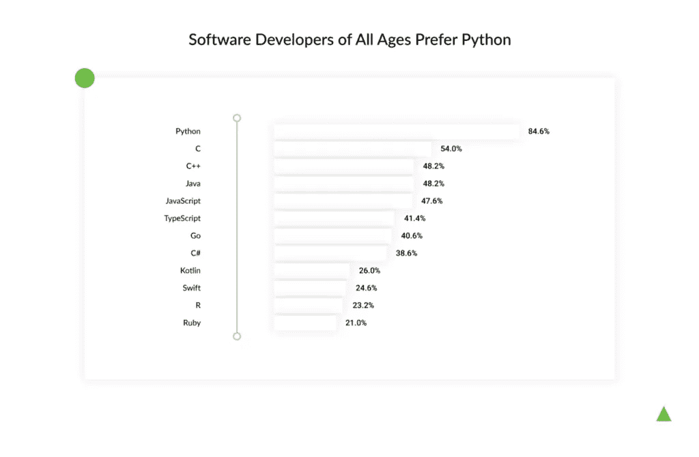

Python 和任何其他技术一样，有它的优点、缺点和应用领域。Python 已被用于各种应用，包括监控和支付平台、房地产和安全解决方案、金融科技(ClearMinds)、旅游(Padi Travel、Diviac)和医疗保健(Haystack Intelligence)。它经常被证明是一种有效的技术，可以管理客户分配给我们的所有责任。

## **Python 的优点**

Python 有许多优势，使得创建从小初创公司到大型商业平台的项目变得更加容易。以下是几个最值得注意的例子:

*   **Python 缩短了上市时间** Python 使你能够在短时间内创建最小可行产品(MVP)或原型，从而缩短上市时间(TTM)。Python 的快速开发过程使您能够同时维护多个迭代，以及 DRY(不要重复自己)概念，这允许您重用代码的各个部分。

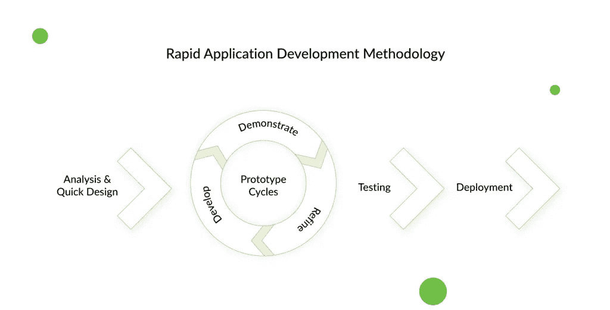

这些 Python 特性为您的项目提供了很大的灵活性，因为您可以与客户交流、提供解决方案、收集反馈、进行改进，以及将您的原型扩展为功能齐全的 web 应用程序。

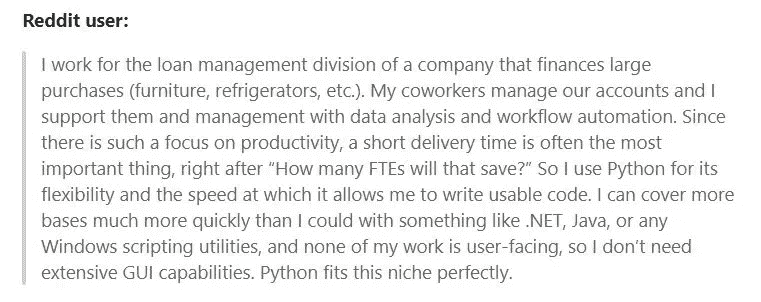

*   **Python 拥有简单的语法**
    Python 在开发者中如此受欢迎的一个主要原因是，它拥有简单的语法，允许他们用几行代码表达概念，并且更容易调试和解决错误。Python 中的可读性至关重要。对于客户来说，这也是足够基本的理解，使得交流更加直接。
*   **Python 拥有广泛的开发工具和框架**
    Python 编码受到 Sublime Text 的支持，Sublime Text 是一个流行的代码编辑器，具有额外的编辑功能和语法扩展。Web 框架使这一过程变得更容易，并允许开发人员专注于他们的应用程序的逻辑。我们使用 Django，这是一个全栈框架，用于开发所有类型的应用程序(简单的或复杂的)并减少项目完成时间(由于它的 DRY 哲学)。
*   与 Node.js 相比，Python 是一种更成熟的开源语言，拥有最大的用户群体之一。它拥有大量的作者，从没有经验的到有经验的都有。这至少意味着两件事:找到编码人员很简单，你会发现一个充满活力、乐于助人的社区，渴望贡献想法和改进语言。

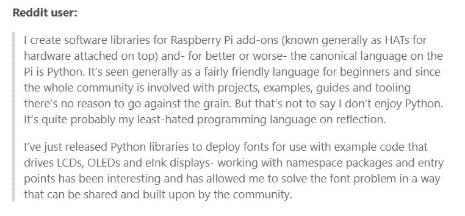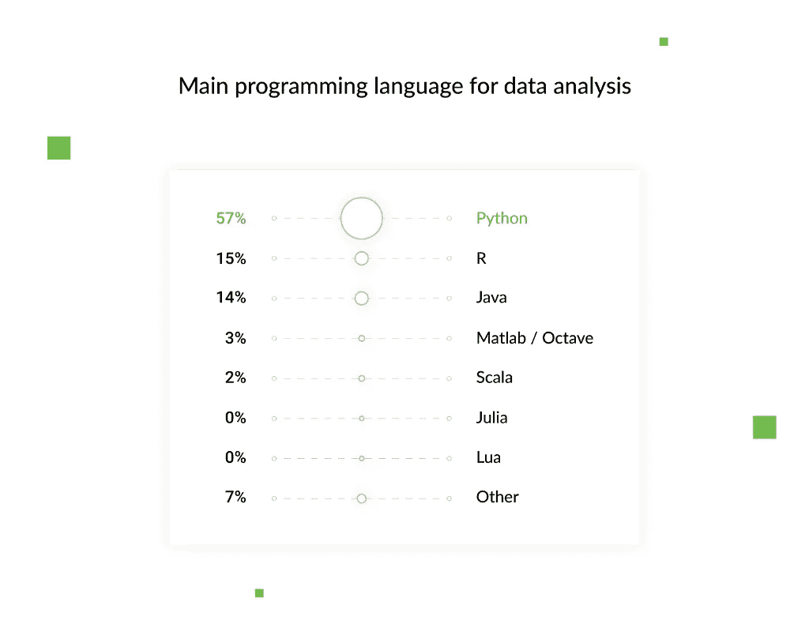

## **Python 缺点**

Python 是大多数任务的最佳选择，尽管它也有一些限制:

*   **Python 是单流的**
    Python 和其他任何解释型语言一样，执行起来都比编译型语言(比如 C 或 Swift)慢。对于需要大量复杂计算的应用程序或任何重视执行速度的项目(例如，在高频交易中)，它可能不是理想的选择。
*   **移动计算能力弱** Python 在创建服务器和桌面平台方面表现出色，但在移动计算方面却有所欠缺。因此，只有少数智能手机应用程序是用 Python 编写的。

## **什么时候用 Python**

Python 是各种项目的首选语言，无论大小，简单还是复杂。这包括商业应用、桌面用户界面、教育平台、游戏和科学应用。至于应用领域，Python 主要用于:

*   **数据科学**，包括数据分析(Apache Spark)、机器学习(Tensorflow)、数据可视化(Matplotlib):部分脸书系统使用 Python 的数据分析工具熊猫库；人脸和声音识别系统；神经网络和深度学习系统
*   **Web 开发** : web 开发框架(Django，Flask，CherryPy，Bottle)
*   **桌面 GUI** : 2D 图像处理软件 Scribus、GIMP 以及 3D 动画软件，如 4D 影院、Maya 和 Blender
*   **科学应用** : 3D 建模软件如 FreeCAD，有限元软件如 Abaqus
*   **游戏** : 3D 游戏引擎(PySoy)和真实游戏，如《文明 4》和《织女星打击》
*   **商业应用** : Reddit 是 2005 年用 Python 重写的，网飞的引擎就写在里面
*   **DevOps、系统管理和自动化脚本**:用于自动化简单任务的小应用
*   **解析器、抓取器和爬虫**:一个解析器，用于编译来自不同网站的预测数据并显示结果
*   **软件测试**(包括自动化测试):像 Pytest 这样的单元测试工具，或者像 PAMIE 和 Selenium 这样的 web 测试工具

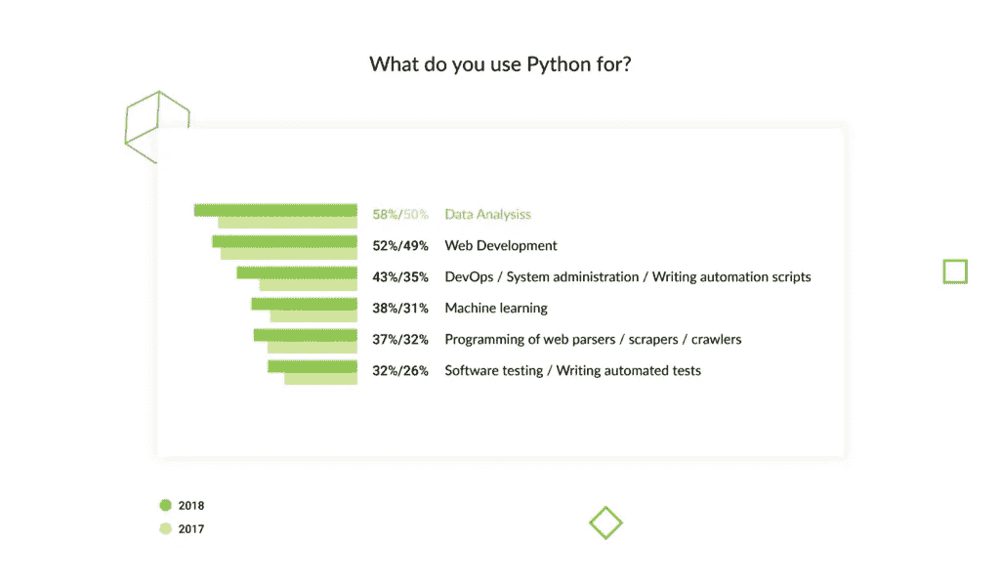

Python 是一种简单但功能强大的编程语言，附带大量文档和高级开发工具。它是大数据应用、商业解决方案、教育平台、科学和医疗保健应用的首选语言。

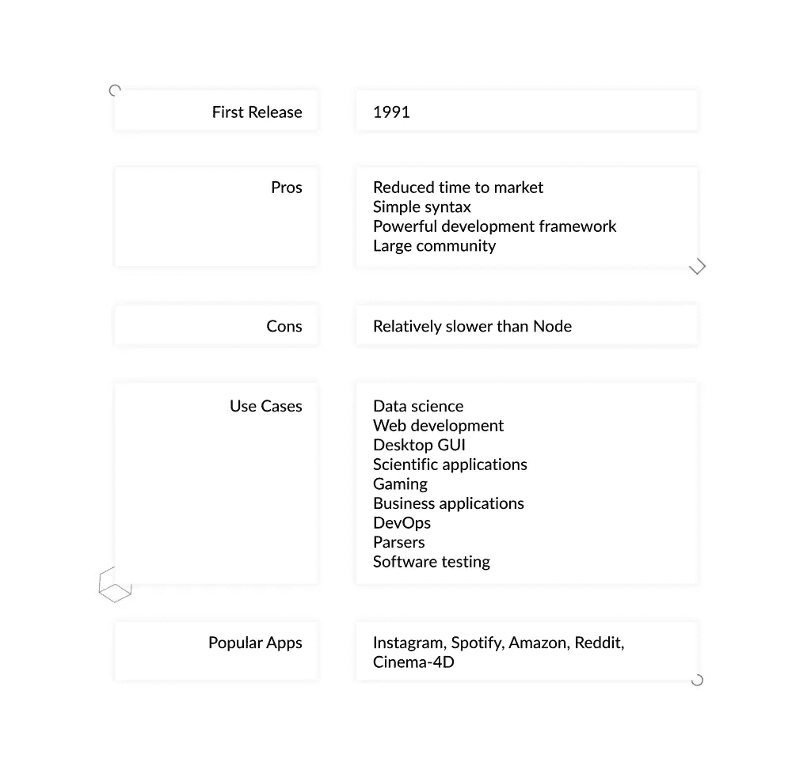

# **Node.js:利弊& Node.js 用例**

Node.js 是一个编程环境，支持使用 JavaScript 进行后端和前端开发，以及解决兼容性问题。它也被称为服务器端的脚本语言。它是 2009 年发布的，所以它没有那么老，而且越来越受欢迎。

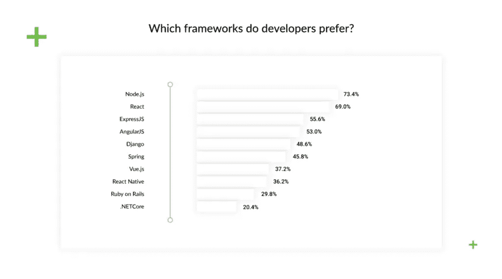

## **Node.js 赞成**

就 web 开发而言，Node.js 比 Python 有几个优势:

*   **Node.js 实现快速性能**
    当您比较 Node.js 和 Python 的速度时，您会注意到前者更快。因为 Node.js 是基于 Google V8 引擎构建的，所以它非常适合创建聊天机器人和其他实时应用程序。

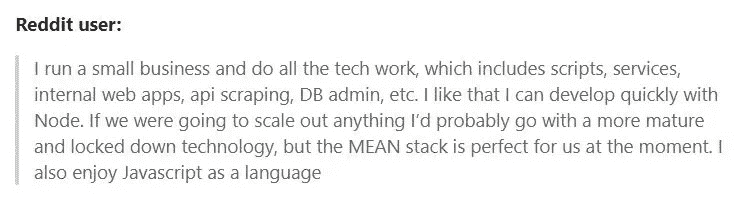

*   它支持全栈开发你需要一个 JavaScript 工程师团队，他们可以处理应用程序的前端和后端。这是降低成本的一种方式，考虑到很容易找到 JavaScript 开发人员，而且你不需要那么多。
*   非常适合开发实时应用
    你可以使用它的事件驱动架构构建聊天应用和网页游戏。

## **Node.js Cons**

*   Node.js 需要清晰的架构
    它是一个事件驱动的环境，这意味着如果正确指定了事件之间的关系，它可以同时运行多个事件。
*   **它无法维持 CPU 密集型任务**
    如果大量计算请求阻塞了所有其他作业的处理，在 Node 中设计的应用程序将会变慢。因此，它不适合数据科学项目。
*   **不发达的文档**
    Node.js 文档在 Python 的后面，提供全面最新的文档。此外，没有核心库或工具；有太多的选择，很难决定使用哪一个。

## **何时使用 Node.js**

对于设计广告服务、游戏平台或论坛等应用，Node.js 是必不可少的技术。它非常适合涉及大量同时连接的项目或需要高速和密集型 I/O(输入/输出)的应用程序，以及生产力平台(如内容管理系统)、P2P 市场和电子商务平台。节点用于各种 web 应用程序，包括:

*   社交和生产力平台:LinkedIn、Trello
*   商业应用:易贝、沃尔玛；
*   支付系统:贝宝；
*   网飞娱乐平台。

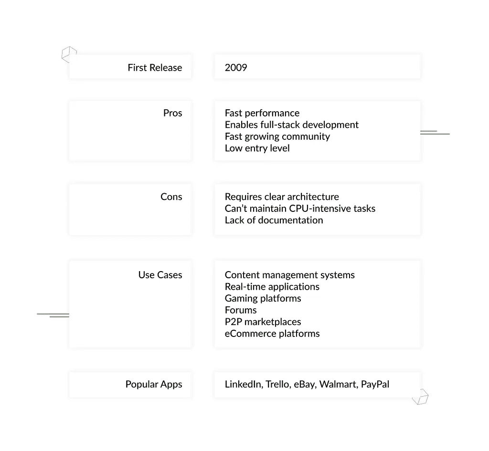

当比较 Python 和 Node.js 的性能和用例时，我们可以观察到它们迎合了不同的需求。Node.js 用于通常不使用 Python 的情况，例如需要更快速度的实时应用程序，或者当您希望同一团队同时进行前端和后端开发时。

# 结论

如你所见，Python 和 Node.js 各有利弊，它们用于不同类型的项目。因此，在选择 Node.js 还是 Python 时，要考虑所有的优缺点，选择最适合您的项目应用程序的。

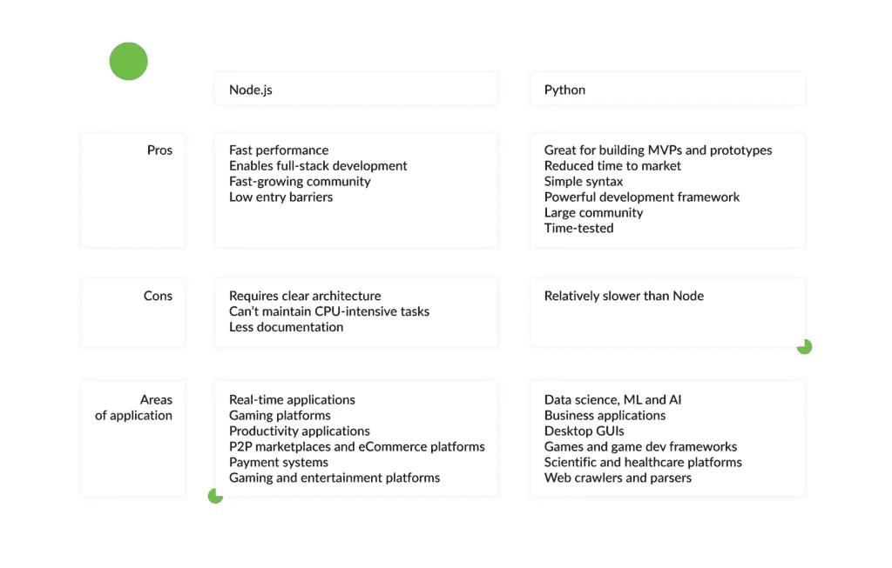

我使用 Python 已经有很长时间了，从高质量的中型 web 应用程序到复杂的企业级解决方案，我都用它构建过。而且每个项目都说服了我(并继续说服我)Python 使开发变得更容易，节省了时间和金钱，并允许我快速轻松地扩展项目。

如果你想深入学习 Python 或 Node JS，我强烈推荐 Mosh 课程。所有课程的链接如下:

*   [**完成节点 JS 课程**](https://bit.ly/2UXJg2F)
*   [**完整 Python 编程**](https://bit.ly/3qEX6mi)