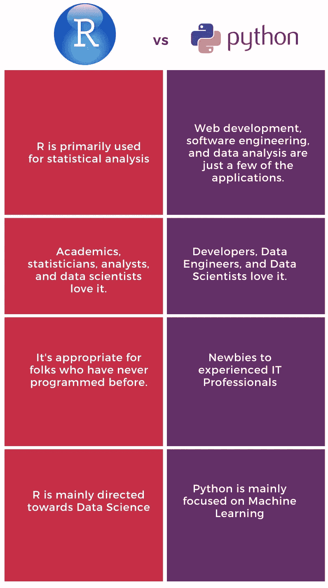
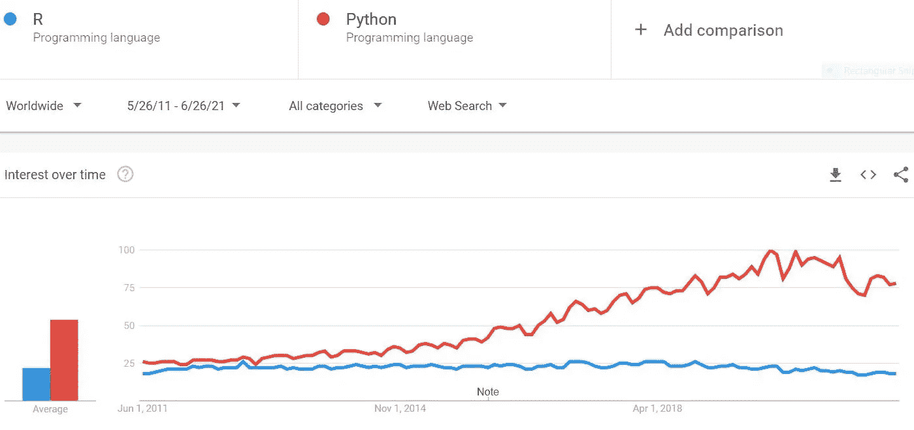
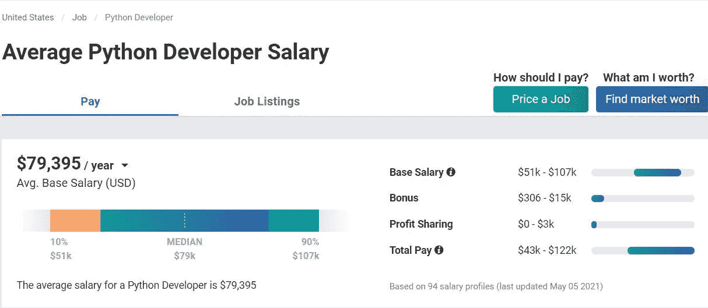
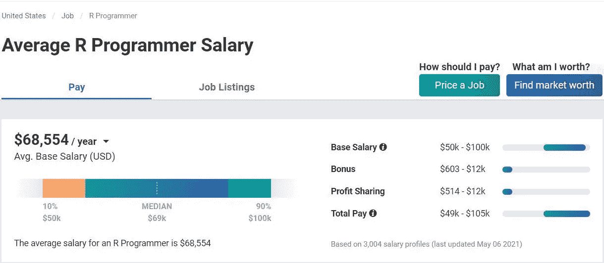

# Python 和 R，哪种编程语言更适合数据科学？

> 原文：<https://medium.com/geekculture/python-or-r-which-programming-language-is-better-for-data-science-e230f34cfc91?source=collection_archive---------41----------------------->

Image Created by Author

关于 Python 和 r 哪种编程语言更好的讨论已经持续了很长时间，尽管它们都很流行，但是它们有很大的不同。在某些情况下，一种可能比另一种更好。

# 关于 R 的一点背景知识

R 是一种编程语言和分析工具，于 1993 年首次推出。[罗斯·伊哈卡](https://en.wikipedia.org/wiki/Ross_Ihaka)和[罗伯特·绅士](https://en.wikipedia.org/wiki/Robert_Gentleman_%28statistician%29)开发了它。这是一个免费的开源软件，拥有丰富的统计和图形技术库。

它是分析师、统计学家和研究人员最广泛使用的工具之一，用于检索、清理、分析、可视化和呈现数据——IT、银行、医疗保健、金融等各个行业都使用它。

**用途:**

*   数据科学家可以使用 R 编程来收集、执行统计分析和创建可视化。
*   它用于图形表示。
*   r 既用于机器，也用于深度学习。
*   它还通过为所有金融操作和计算提供复杂的统计工具来帮助金融部门。R 及其库使得移动平均线、股票市场建模和金融 [**KDD**](https://en.wikipedia.org/?title=Knowledge_discovery_in_databases&redirect=no) 更容易访问。
*   它还实现了统计方法，如线性和非线性建模。

**统计计算**:在统计人员中，R 是使用最广泛的编程语言。它帮助它们操纵、收集、清理和分析。它还包括图表功能，并从任何记录中生成有趣的视觉效果。

**机器学习**:它包括几个用于基本机器学习任务的库，比如线性和非线性回归、决策树等等。在金融、零售、营销和医疗保健领域，每个人都使用 R 来创建 ML 算法

# Python 的一点背景知识

它是一种众所周知的计算机语言。它是一种广泛使用的、解释性的、面向对象的编程。[吉多·范·罗苏姆](https://gvanrossum.github.io/)发明，并于 1991 年 2 月 20 日首次发表。除了 web 开发，它还可以用于不同类型的编程和软件开发。它与其他软件组件有效地交互，使其成为一种通用语言，可用于创建全面的端到端流程。

**用途:**

*   它可以用来管理**以及进行复杂的数学计算。**
*   **它可以连接到数据库系统，也可以读取和编辑文件。**
*   **用于软件开发、业务应用程序、音频、视频应用程序、后端 web 和移动应用程序开发等。**
*   **它使分析师能够在更短的时间内生成 Excel 报告。**

****分析** : Python 对于分析来说很方便。例如，如果一个数据库包含数百万行和列，那么它的大小使得提取信息既困难又耗时。这就是像 [Pandas](https://pandas.pydata.org/) 、 [NumPy](https://numpy.org/) 和 [SciPy](https://www.scipy.org/) 这样的库的用武之地，它们可以快速完成工作。**

****提取**:由于数据并不总是可用的，我们需要从网络中提取。在这种情况下，图书馆 [Scrapy](https://scrapy.org/) 和 [Beautiful Soup](https://pypi.org/project/beautifulsoup4/) 可以用来从互联网上提取信息。**

****图形表示** : [Seaborn](https://seaborn.pydata.org/) 和 [Matplotlib](https://matplotlib.org/) 库创建图表、饼图和其他可视化。**

****机器学习:**它也有一个 ML 库。 [Scikit-Learn](https://scikit-learn.org/) 和 [PyBrain](http://pybrain.org/) 是其中一个库，通过一个接口提供了几种快速的机器学习和统计建模工具，比如分类、回归和聚类。**

# ****Python 利弊****

*   ****可用性**:运行于各种系统(Windows、Mac、Linux、Raspberry Pi 等。)**
*   ****使用起来有效而简单**:计算机程序运行所需的语法，或者说单词和符号，直观而简单。它们实际上是英语术语，所以很容易辨认。与 C、Java 和 C #等其他技术相比，代码实现时间减少了，因此开发人员和软件工程师可以花更多时间工作。**
*   ****库**:它们是一组预先组合好的代码，可以重复使用以最小化编码时间。它消除了您从头编写代码的需要。**
*   **灵活性:与其他语言如 Java 相比，它提供了解决问题的灵活性，否则是不可能解决的。它已被证明是可扩展的。**

**既然我们已经从各个角度探讨了这两种编程，那么“*哪种语言更适合数据科学*”这个问题就来了出现了。**

# ****你想学什么——Python 还是 R？****

**这两者的显著区别在于他们如何处理情况。这两种开源语言都得到了大量社区的支持，这些社区正在不断扩展它们的库和工具。**

****

**Credit: Image Created by Author**

**然而，你应该问自己的一个问题是，“*你更想关注*的什么？”机器学习还是统计学习？**

**ML 是人工智能学科，而统计学习是统计学子领域。r 非常适合于统计目的，因为它是一种统计语言。任何有正规统计学背景的人都可以采用 R 编程，因为他们很容易理解。另一方面，Python 最适合 ML。大规模应用是机器学习的重点。Python 似乎是理想的选择，因为它对于生产使用具有灵活性和可伸缩性，特别是当分析必须与 web 应用程序相联系时。**

# **趋势分析和薪资比较**

**Python 或 R 是全世界流行的搜索短语，如下图所示。如果我们看一下趋势，在过去的十年中，Python 变得比 R 更受欢迎。**

****

**Source: Google Trend , June 2011 — June 2021**

**根据[**PayScale.com**](https://www.payscale.com/)的数据，美国 [**Python 开发者**](https://www.payscale.com/research/US/Job=Python_Developer/Salary) 的平均年薪为****一个**R 程序员的平均年薪为**68554(发布时)。**********

************

******Source: PayScale.com******

************

******Source: PayScale.com******

# ******包裹******

******Python 是一种健壮且适应性强的编程语言，可用于广泛的计算机科学应用。另一方面，R 是一个流行的分析工具。实际上，这两者在数据科学领域都有着不可思议的优势和意义。然而，如果你想学习一门语言，你的决定会受到你想从事的工作的影响。******

******以下是你在选择其中任何一个之前应该问自己的一些问题:******

*   ******你对机器和人工智能还是统计学习和
    分析感兴趣？******
*   ******你所在领域最流行的工具是什么？******
*   ******你是想成为一名对数据可视化有更深理解的分析师，还是想将 web 应用与它整合？******
*   ******你需要花多少时间来掌握一个程序？******

******最后，学习这两种语言从来都不是一个坏主意，因为它只会让你作为一名计算机科学工程师受益。******

******如果你觉得这篇文章有帮助，那么请把它发给其他人。******

******https://youtu.be/OSwuhYfMwWY ✅learn 过着社交焦虑的生活⇾******